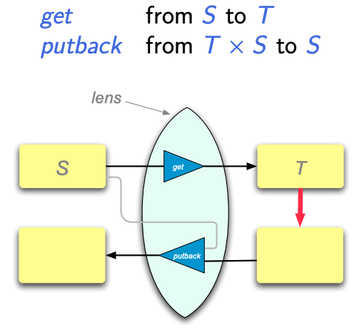

# Forward AD in PyTorch

The goal of this RFC is to discuss the design and choice linked to adding forward AD to PyTorch.
Most of the content here comes from the discussions in the corresponding github [issue](https://github.com/pytorch/pytorch/issues/10223).

This RFC will cover:
- Timeline
- Goals for this feature
- Quick theoretical introduction
- End user API
- Implementation
    - Dual Tensors
    - View and inplace handling
- Testing
- Appendix: View semantic definition


## Timeline

- Done: Implementation for single level in core
- Done: Add codegen mechanisms for adding more formulas
- Add gradcheck tools to test both real and complex valued functions
- Add a limited set of formulas that enable basic use cases
- Add it as backend for high level autograd API
- Update OpInfo to natively test forward mode
- Update custom Function API to allows overwriting forward AD

Follow ups
- Long running issue to add remaining formulas
- Decide and implement multi-level version


## Goal of this feature

The main goal is to provide a way to compute Jacobian vector products efficiently by leveraging the forward AD approach.
This will be achieved by:
- Use the new engine to compute quantities such as `jvp`, `hvp` and `hessian` within the high level API.
- Provide an easy to use, python-centric API for users to compute forward AD quantities.

## Quick theorerical introduction

The simple definition for forward AD is that it is computing a Jacobian vector product.
Indeed, if we define backward mode AD for a function `f` with Jacobian `J`, it is computing the quantity `v^T J` for an arbitrary `v` in an efficient manner.
Forward mode will allow to compute the quantity `J u` for an arbitrary `u` in an efficient manner as well.
In both cases, we mean by efficient that the complexity is the same order as evaluating the function `f`.

The AD implementation is done very similarly in both cases where the Jacobian matrix for the full function is re-written as the product of Jacobian matrices for each elementary function used within the function. For example `J = J_3 J_2 J_1` if `f` is composed of 3 component functions: `f(x) = f3(f2(f1(x)))`

The computation done by forward AD is then `J v = (J_3 (J_2 (J_1 u)))`. As you can see, each sub-product is done in the same order as the forward functions and thus the forward mode AD can run at the same time as the forward pass.

A good way to model this is to introduce dual numbers where the imaginary dimension represent the partial Jacobian vector product while the real part represent the function value.

You can find more details about this in [this blog post for example](https://towardsdatascience.com/forward-mode-automatic-differentiation-dual-numbers-8f47351064bf).

The design choice that was made in the discussion is to build such dual objects based on Tensors and build our forward AD engine on top of that.

## End user API

### High level autograd API

In the end state, this will be used transparently by the high level API to provide best performance.
Since we might not be able to have full support for formulas and multi-level in the beginning, use of this feature will be controlled by a boolean flag.
This flag will allow to fall back to the slow, backward mode AD based, implementation.

In the final state, the `jvp`, `hvp` and `hessian` functions will have an extra `fw_mode` flag that will be `False` at the beginning and will become `True` once we are satisfied with our coverage.

### Standalone API

Since this API is only intended for advanced users, we decided to keep it close to the design principal of using dual numbers and close in spirit to the current autograd API.

```python
import torch
import torch.autograd.forward_ad as fwAD

# Create regular Tensors
x = torch.rand(10)
v = torch.rand(10)

# Create a level that is given context where your dual objects live
with fwAD.dual_level():
    # Create a dual Tensor that will perform forward AD computations
    # This API uses the current level by default
    dual_x = fwAD.make_dual(x, v)

    # Do computations as usual
    res = f(dual_x)

    # Unpack the result to get both the function and the J v value
    f_val, jvp = fwAD.unpack_dual(res)

```

There are some advanced features on this API as well:
- This API is completely backward differentiable and so backward mode AD can be used anywhere with this API.
- When exiting a level, all dual Tensors from this level become regular Tensors again. This ensure in particular that, when used within the high level functional API, the intermediary state is never leaked outside of the high level API function:
```python
with fwAD.dual_level():
    dual_x = fwAD.make_dual(x, v)

    _, jvp = fwAD.unpack_dual(dual_x)
    # Within the level, dual data is preserved
    assert jvp is not None

_, jvp = fwAD.unpack_dual(dual_x)
# Outside of the given level, jvp is a regular Tensor again
assert jvp is None

```
- This API supports nesting levels and providing a specific level kwarg for each function to enable higher order gradients easily.


## Implementation

### Dual Tensor

The dual Tensor design will follow the prototype in [this colab](https://colab.research.google.com/drive/1hXB5g1ouHXHFYf9pDTzH6pG2q0Wyz92V?usp=sharing0).
The goal is to have a data structure attached to each Tensor that stores the dual values, if they exist, for each level.
Each operation on such Tensor is then responsible for updating the outputs dual values based on the inputs dual values.

The first part is implemented in PyTorch with an extra field on the `AutogradMeta` associated with Tensors.
It will store a special structure there that will handle storing dual values from different levels.

The second part is implemented in codegen and manual functions by having special code that ensure that the output is properly updated if any input is a dual Tensor.
This is done within the VariableType kernel for now even though it will most likely move to a different key in the future as needed.

Finally, to ensure the strict scoping presented above, we introduce a global state tracking the different levels and which Tensor belongs to which level to ensure that we can clear them properly on exit.

All of these are now part of core pytorch and was added via these two PRs: https://github.com/pytorch/pytorch/pull/49734 and https://github.com/pytorch/pytorch/pull/56083.

### View and inplace handling

View and inplace is a key feature of pytorch that we want to preserve for this new forward AD project.
The semantic that we are looking for here is described in the Appendix of this document and is based on the bidirectional lens idea.

The practical implication of this semantic in this implementation are the following:
- backward and forward "differentiable" views are two different things: `detach` is backward non-differentiable and forward differentiable while operations, like `fwAD.make_dual`, are backward differentiable and forward non-differentiable.
- we need to track differentiable views both for backward and forward AD independently as, in general, their base could be different.
- for operations that only involve dual Tensors, the semantic from the appendix is easily achieved by ensuring that:
  - view operation forward AD formula generate a dual that is a view of the input's dual
  - inplace operation forward AD formula modify the input's dual inplace
- If non-dual Tensors are mixed with dual ones:
  - when a tensor with no dual is updated inplace with a tensor that has a dual, this change needs to be properly reflected on its base if the modified tensor is a view.
  - when checking if a Tensor has a dual value, we should check its base when it does not have a dual value already

## Testing

For testing purposed, we can update the current `autograd.gradcheck` function to compare numerically computed Jacobian with the one constructed using forward mode AD.
In a similar way the backward mode AD gradcheck reconstruct the full Jacobian matrix row by row, the forward AD can reconstruct the full Jacobian matrix column by column and we can compare the final result with the numerical Jacobian.

The fast mode will also be done similarly to the backward mode implementation where we will use the forward AD to compute `J_f u` with a single forward AD pass. We then compute the full reduction by doing a dot product with `v`.
For the complex case, we will consider only functions with real-valued inputs and perform the same computation as the finite difference.

The overall testing plan is going to be done in 3 phases:
- Done: Test of the core implementation and the view semantic (proposed in https://github.com/pytorch/pytorch/pull/49098)
- Once few formulas are added, enable gradcheck for forward by default in our test suite and allow it to silently fail when encountering functions that are not implemented. This allows to easily check the behavior with other components such as the high level API, complex, Modules, etc
- Once we have most formulas implemented, make gradcheck properly fail when it is not able to verify a forward gradient and audit the test suite to disable forward check for every function that is not supported yet.


## Appendix: View semantic definition
This document was written originally by @ezyang to describe inplace updates on views as bidirectional lenses.

Bidirectional programming [1](https://www.cis.upenn.edu/~bcpierce/papers/lenses-etapsslides.pdf) [2](https://www.cis.upenn.edu/~bcpierce/papers/wagner-thesis.pdf) is a programming discipline where you have two different representations of otherwise similar information, and editing one representation causes the other representation to be updated. The classic example in the bidirectional literature is that you have a database, and you have computed a view on the database which you modify—you want to propagate this modification back to the un-viewed database. However, in PyTorch, we have our own example of bidirectional lenses, which are *tensor views*. When we make a modification to a view of a tensor, we expect the base tensor to also get updated. Inplace updates on views are easy enough to understand in basic PyTorch, but with the addition of conjugate views and dual tensors, the more sophisticated language of bidirectional lenses can help us answer some semantic questions.

### Bidirectional lenses in a nutshell

In the semantic universe of lenses, we are responsible for defining a get function and a putback function:


The “get” function, in the context of tensors, is the actual view operation, whereas the putback is how we map mutations on that view back to the base tensor. Each view operation (e.g., view, squeeze, etc.) is defined as both a get and a putback function.

There are some laws that the get and putback function should obey:

* *Acceptability*: get(putback(t, s)) = t (if we put something into the source, we should get it out again if we get it out later)
* *Stability*: putback(get(s), s) = s (if the target doesn’t change, neither should the source)
* *Forgetfulness*: putback(t2, putback(t1, s)) = putback(t2, s) (each update completely overwrites the effect of the original one)

It’s easy to see that conventional inplace view updates on tensors satisfy these properties
 (in the absence of overlapping strides, anyway!)

### Dual tensors

In functional formulation of dual tensors, a dual tensor is a pair of primal and tangent tensors. Correspondingly, we must enhance the meaning of get/putback for view operations to account for this pair of tensors. Here is the most obvious formulation of get/putback functions for dual tensors (getD/putbackD) written in terms of the get/putback functions for regular tensors.

def getD(s: DualTensor) -> DualTensor:
    return (get(s.primal), get(s.tangent))

def putbackD(t: DualTensor, s: DualTensor) -> DualTensor:
    return (putback(t.primal, s.primal), putback(t.tangent, s.tangent))

As dual tensors are simply pairs of ordinary tensors, we simply define the get and putback functions as applying to both components of the pair. It is a simple matter to verify that if get/putback satisfy the lens laws, then getD/putbackD also satisfy the lens laws.

Dual tensors also support a number of view-like operations which aren’t simply just simple liftings of view operations on plain tensors. For example, we can project out the primal/tangent components of a dual tensor; similarly, we can construct a dual tensor from a pair of primal and tangent tensors. If we maintain a clear distinction between Tensor and DualTensor, the obvious bidirectional semantics for pairs suffices:

```python
# In fact, make_dual is a bijective lens
def make_dual_get(p: Tensor, t: Tensor) -> DualTensor:
    return (p, t)

def make_dual_putback(p: Tensor, t: Tensor, d: DualTensor) -> Tuple[Tensor, Tensor]:
    return (d.primal, d.tangent)

def primal_get(d: DualTensor) -> Tensor
    return d.primal

def primal_putback(d: DualTensor, p: Tensor) -> DualTensor
    return (p, d.tangent)
    
# Proceeds similarly for tangent
```

However, we may also wish to say that there is only one concept of a tensor in our system; every tensor is a dual tensor (and simply non-dual tensors are those for whom the tangent is zero.) In that case, we need a slightly more complex semantics when defining lifted versions of all our operations:

```python
@dataclass
class DualTensor:
    primal: Tensor
    tangent: Optional[Tensor]

def make_dual_get(p: DualTensor, t: DualTensor) -> DualTensor:
    # TODO: I'm not sure if these asserts are necessary
    assert p.tangent is None
    # I believe this is the semantics implied by
    # https://colab.research.google.com/drive/1hXB5g1ouHXHFYf9pDTzH6pG2q0Wyz92V?usp=sharing
    # when there is only one level of nesting, but I'm not sure
    assert t.tangent is None
    return DualTensor(p.primal, t.primal)

def make_dual_putback(p: DualTensor, t: DualTensor, d: DualTensor) -> Tuple[DualTensor, DualTensor]:
    d_tangent = d.tangent
    if d_tangent is None:
        d_tangent = torch.zeros_like(d.primal)
    # Preserve p.tangent and t.tangent!
    return (DualTensor(d.primal, p.tangent), DualTensor(d_tangent, t.tangent))

def primal_get(d: DualTensor) -> DualTensor
    return DualTensor(d.primal, None)

def primal_putback(d: DualTensor, p: DualTensor) -> DualTensor
    return DualTensor(p.primal, d.tangent)  # Preserve d.tangent!

# Proceeds similarly for tangent
```

The most important things to observe are in the definitions of putback, we preserve the pre-existing tangents on the original dual tensors (prior to make_dual or primal). This preservation is essential for maintaining stability: if we didn’t preserve the tangent, then primal_putback(primal_get(d), d) != d (the left hand side would have lost the tangent!)

### Example: putback transfers tangents

Let’s take this example from https://github.com/albanD/pytorch/pull/1/files

```python
# dual is a dual Tensor
out = torch.zeros(100)
out[2] = dual
```

Intuitively, we think that out should become a dual tensor after this operation. How is this born out by the semantics? To do this, we first have to define a get and putback for indexing location two in a tensor.

```python
def index2_get(d: DualTensor) -> DualTensor:
    return DualTensor(d.primal[2], d.tangent[2])

def index2_putback(d: DualTensor, r: DualTensor) -> DualTensor
    # We can't conveniently express functional putbacks in PyTorch's
    # functional API, so we clone the relevant Tensors and then use
    # the mutable API to perform the operations we want
    p = d.primal.clone()
    p[2] = r.primal
    if r.tangent:
        if d.tangent is None:
            t = torch.zeros_like(p)
        else:
            t = d.tangent.clone()        
        t[2] = r.tangent
    else:
        if d.tangent is None:
            t = None
        else:
            t = d.tangent.clone()
            t[2] = 0
    return DualTensor(p, t)
```

Take a moment to verify that all of the laws are preserved. It is now easy to see that when we do a putback on a tensor, if the tensor dual (r in the function) we are putting into out (d in the function) has a non-zero tangent, this will force the new version of output to have a non-zero tangent as well.

### Example: views can have different perturbations

Desmaison et al have suggested that perturbations should be associated with memory locations. This would make it effectively impossible to have two views on the same memory with different perturbations. In the semantics we have defined in this paper, this situation would not occur. Let’s consider this example:

```python
x = torch.zeros(100)
x2 = x[2]
y = make_dual(x2, t_y)
z = make_dual(x2, t_z)
y.add_(dual)
```

We have multiple dual operations going on in this example: we view on x, make_dual on the view, and then perform our inplace operation. Furthermore, there is another alias on x in the form of z. To understand the semantics of this program, we must apply our semantics in two steps:

* When we perform an inplace mutation on some view (e.g., y), we must use putback operations to reapply the inplace mutation all the way to the base tensor (e.g., x)
* Once we have done so, for all child views of any tensor which was viewed from the base or any of its children (e.g., z), we must use get operations to recompute what their new value would be after the modification from putback

So, in the example above, we have to apply the following steps:

1. Compute y + dual
2. Upstream this update to x2 using make_dual_putback
3. Upstream this update to x using index2_putback
4. Downstream the update to z (from x2) using make_dual_get

Let’s hand apply these operations:

```python
y_new = y + dual
x2_new, t_y_new = make_dual_putback(x[2], t_y, y_new)
x_new = make_index2_putback(x, x2_new)
z_new = make_dual_get(x2_new, t_z)
```

Notably, in the make_dual_putback, the primal and tangent of y_new are distributed into x2_new and t_y_new. This means that the tangent of x[2] is NOT updated; all of the tangent of dual is doing is modifying t_y! In the end, y has an updated tangent, but z is not updated at all. Although y and z alias the same primal, their tangents are not aliased, and thus inplace updates to tangent affect one but not the other.

