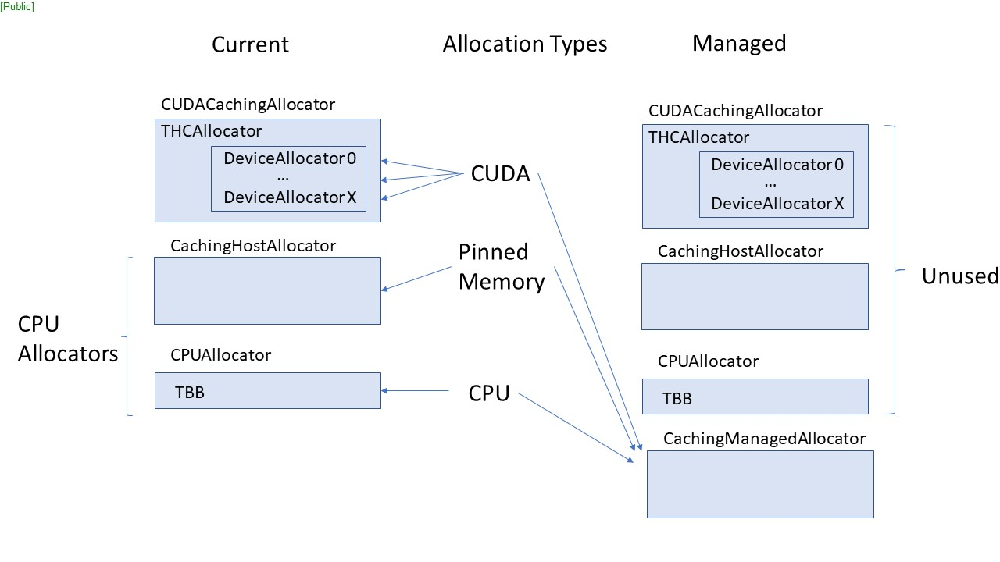
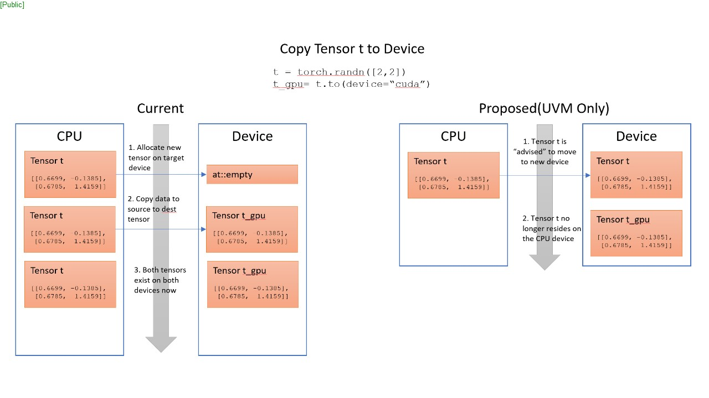

# Unified Memory for Pytorch

This RFC proposes to add Unified Virtual Memory (UVM) (or “Managed Memory”) function. CUDA and ROCm include managed memory allocation APIs so this RFC applies to both. The terminology included references CUDA, but automatic hip conversion is expected to work via hipify.  Important usage and behavior differences in the managed memory APIs include control of memory allocations, device placement and DMA/copy scheduling. These APIs are also not limited to GPU memory sizes and offer a set of hints for control of the managed function.  

The proposed changes to the front end and back end have been minimized as much as possible to have a very targeted effect when UVM is enabled and have no effect at all when UVM is disabled. 

## Frontend Changes

Minimal changes are proposed on the frontend as not to burden the user with changes outside of an enablement flag. Default settings for all new frontend additions will be off/disabled. UVM will not successfully enable when CUDA/ROCm is not present. 

### Python

We propose adding the following APIs to the python interface to enable and control the behavior of the UVM function: 


### `torch.cuda.set_enabled_uvm()` and `torch.cuda.get_enabled_uvm()`

These APIs will be used to set and query unified memory usage in Pytorch. These will be defined in torch/cuda/memory.py. The `set_enabled_uvm()` API will set the enablement flag (enabled_uvm) which will be held in the default global context (`at::globalContext().userEnabledUVM()`). This location should allow us to avoid adding new parameters to functions that need to be modified. 

The default value for enabled_uvm will be False. Setting the value to True, will have two different effects:

1. Newly created tensors will be created as "managed" tensors.
2. The default value for the proposed "manage" parameter to the `torch.Tensor.to()` function will be True. See below for more details.

### Usage of `torch.Tensor.to()`

This API performs a Tensor dtype and/or device conversion. Currently this function returns `self` in the special caes when `torch.dtype` and `torch.device` are unchanged. Additionally, a copy can be forced by using the `copy=True` parameter. We propose to expand on this by returning `self` in the additional special case of `torch.dtype` being unchanged, and `torch.device` is changed while the tensor is marked "managed". A copy will still be forced when the `copy=True` parameter is sent.

### Managed Tensors
A tensor will be allocated and marked as "managed" if it was created after setting `enabled_uvm=true`. New helper functions will be added. A function is needed to query if a tensor is managed. We propose `Tensor.is_managed()` for this. Additionally, we also propose to add a new function `tensor.manage_memory()`. This follows the usage precident used for pinned memory tensors.

Here are some usage examples (assuming the original tensor is on CPU):
```
tensor.to(dtype, device='cpu`, copy=true)                     // copy forced
tensor.to(device='cuda:0`, copy=false, dtype=torch.float32)   // dtype change, copy required
tensor.manage_memory()                                        // copy to managed, resulting tensor is managed
tensor.to(device='cuda:0')                                    // return self if tensor is managed; otherwise copy
tensor.to(device='cpu', non_blocking=true)                    // return self if tensor is managed; no sync issued
tensor.unmanage_memory()                                      // copy to unmanaged, resulting tensor is standard
```

### Additional Notes
When a managed tensor is sent to a new device, the device attribute of the tensor will be updated, the appropriate managed memory location hints will be sent and a prefetch will be scheduled. In the case where the tensor is sent from a `cuda` device to a `cpu` a device level sync will also be sent. This can be disabled by using the non_blocking=true parameter. In this case, synchronization responsibility falls to the user.

### C++
Additionally, we propose to add a check on the environment for the `PYTORCH_ENABLE_UNIFIED_MEMORY` variable. When set, the same global context enablement flag will be set. 

## Backend Changes
To enable usage of the managed memory APIs in CUDA/ROCm, minimal backend changes are proposed below and focus on the memory allocator(s), empty tensors and copies. 

### Memory Allocation
Currently there are different allocators used for CPU (CPUAllocator) , pinned host memory (CachingHostAllocator), and device memory (CUDACachingAllocator) memory allocations.  

 - When UVM is enabled, we propose forgoing all traditional allocators and working with a newly developed CachingManagedAllocator. 
 - This will provide benefits in a few areas. We can continue to develop and improve on Unified memory allocations without the risk of introducing performance degradation, or errors to the existing CUDACachingAllocator. In addition, we expect the behavior of Managed memory to be different than that of traditional discrete GPU/CPU memory. For example, managed memory is available to all GPUs on all streams by default and can move between host and any number of GPUs at will. This will provide intricacies to the caching methodology that may conflict with the existing caching allocators. 
 - When UVM is enabled, `at:Allocator *GetAllocator()` will lazy init and return the CachingManagedAllocator for all CPU and GPU allocator requests. 



 - Currently, the CUDACachingAllocator/THCCachingAllocator creates one DeviceCachingAllocator for each GPU device that is present at initialization time.  

   - We propose using only the CachingManagedAllocator for all CPU and GPU allocations when UVM is enabled. Using a single allocator here should make things simpler. For example, when using UVM and enabled_uvm_move_on_copy is set, we will no longer be scheduling explicit copies on device moves (managed memory takes care of that, more on that below). Since there is no copy (only a move) we also will not be doing a new allocation for a destination tensor on the destination device.  

   - With a single allocator everything is more easily tracked, and this design more closely aligns with the managed memory API usage model. 

### Empty Tensors
Changes will be needed for the `at::empty_cpu()` and `at::empty_cuda()` functions. 

 - In `at::empty_cpu()`, there is already a switch to determine which cpu allocator to use (pinned vs cpu). When UVM is enabled, this switch will always return the CUDACachingAllocator. As described above, the CUDACachingAllocator will only reference device_allocator[0]. There are likely a few other places (other empties) that get an allocator as well. 

 - Per a find from the FBGEMM team, there is an issue with the context being moved from the device where the memory was allocated, and where it currently resides. We need to keep the original context, so we don’t create new ones unnecessarily on other devices. To account for this, at `at::empty` time, we will create two Storage structs: 
   - RealStorage -- This will be the original context of the device where the CUDAMallocManaged occurred. 
   - Indirect -- This will be the new Storage that contains the new context of where the memory is currently being used, with reference back to the release of the RealStorage being moved with it.  (This is like the shared pointer’s design.) 

### Tensor Copies
In the UVM model, the managed memory APIs can be relied upon to ensure data and tensors are available and accessible and explicit calls to `cudaMemCopy()`/`hipMemCopy()` are not required for moving tensors to a GPU device. Users, however, often expect to deal with copies. 

### UVM Copies vs Traditional
Currently when PyTorch performs an update to a tensor’s attribute(s), a copy of the tensor is returned to the caller that includes the requested change. In a UVM case, this is potentially suboptimal. For example, when the user only wants to ensure the tensor is transferred to a GPU and issues a tensor.to(device=”cuda”) with a change only to the device attribute, this should not require an additional Block allocation and potential `CudaMallocManaged()` call to accomplish. 

On the other hand, if a conversion of a tensor under UVM changes any other attribute (dtype, layout, etc) the tensor will need to make decisions based on the attributes of the current and requested tensor. This will require a traditional call to the `_to_copy` function to return the expected object to the user. 

We propose to treat tensor.to(device) as a special case when UVM is enabled and `enabled_uvm_move_on_copy` has been set. Additionally, the behavior of tensor.uvm_to() will match the behavior of tensor.to() when UVM is enabled and  `enabled_uvm_move_on_copy` is True.



 - `.to(device)` (UVM move instead of copy) 
   - `.to(device)` will call `_to_copy` in TensorConversions.cpp 
     - The current implementation of `_to_copy` will create a new tensor with `at::empty` based on parameters specified in the `.to()` statement (e.g. device type, dtype). We propose to treat `.to(device)` as a special case where instead it only creates a new Storage object and DataPtr with the current tensor’s memory address and original allocation context(which is needed for freeing).  Then at `at::empty` creation time the new Storage object is assigned to the new tensor via the `set_()` function. This allows the managed API to perform the copy.
     - This is true for all common types of copies, regardless of their direction, DtoH, HtoD, DtoD 
   - In aten/src/ATen/native/cuda/Copy.cu::copy_kernel_cuda:
     - No explicit cudaMemcpy in either direction 
     - Set cudaMemPrefetchAsync() 
   - Device to Host synchronization
     - There is no concept of a GPU “stream” on the host so Device-to-Host copies have a required synchronization step attached. With UVM enabled, no explicit copy will be scheduled, but synchronization will still be required. 
   - Device to Device
     - If the device is the only tensor attribute being changed, the memadvise will be changed to reflect the new GPU. 

 - .to(dtype, layout) (Or no UVM move on copy enabled) 

   - The `_to_copy` function will operate as normal.  We will not interfere with backloading the storage of the at::empty() with existing pointers, and let a new copy of the tensor exist, and be returned. There is reasonable expectation that a user will want to cast a tensor for a single operation, and not lose the original data. 

   - In `aten/src/ATen/native/cuda/Copy.cu::copy_kernel_cuda`:
     - The tensor copy will occur as normal 
     - set memadvise in the direction of the transfer 
     - Set cudaMemPrefetchAsync() 

   - Device to Host synchronization 
     - There is no concept of a GPU “stream” on the host so Device-to-Host copies have a required synchronization step attached. With UVM enabled, a copy will occur with the destination tensor having the desired attribute changes requested. 
   - Device to Device 
     - If a device and additional attribute are being changed at the same time, a copy of the tensor will be made, and the necessary conversions will be applied as already designed. 


## Additional Notes and Design Considerations
Tuning Managed Memory with MemAdvise hints 

 - Device allocations will use the managed memory APIs with initial memadvise hints for device mapping.  
   - CudaMemAdviseSetPreferredLocation = current GPU device 
   - CudaMemAdviseSetAccessedBy = unset 
 - CPU allocations will be directed to the CachingManagedAllocator, but with initial memadvise hints for host mapping. 
   - CudaMemAdviseSetPreferredLocation = cudaCpuDeviceId 
   - CudaMemAdviseSetAccessedBy = current GPU device 

### Optimal Block Sizes
It is possible that there are different optimal block sizes when using managed memory due to default DMA sizes when migrating memory. Byte size boundaries for memory block division function to be determined based on prototyping 

 - Currently, CUDACachingAllocator uses small and large block sizes: 
   - Small: 2M 
   - Large: 20M

## FAQ 

#### Should we have set_enabled_uvm(bool)? Will there be a use case where the user can set this to false? 
- As of now, UVM will be OFF until it is turned ON. We don’t want to mix the two just yet, so there won’t specifically be the ability to turn it OFF. 

#### Will this eliminate all calls to cudaMemcpy/hipMemcpy? 
- No, copies are still expected in many cases such as when are user assigns a new tensor B to an old tensor A with some modificaitons (dtype, layout, etc). 
