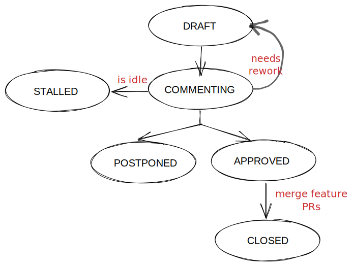

# Process for RFC shepherding

**Authors:**
* @suraj813 

## **Summary**
This document proposes a controlled and consistent RFC shpeherding process from proposal to implementation, along with a standard RFC template for authors to follow.  

## **Context**
RFC is a structured document that allows community members to propose an idea to everyone before it is implemented. RFCs enable stakeholders to be aware and confident about the direction the library is evolving in.

### Features of RFCs
* Good for sparking a discussion around features larger than regular issues
* Enable participation and visibility across the community
* Not a consensus device; synchronous tools like meetings are better for this.
* Bakes in silence as positive indifference / absence of opinions or context.

## **Motivation**
* To standardize a lightweight process for discussions around new features (design, goals, risks and decisions/next steps).
* To ease the process of shepherding RFCs by aligning them in a workflow
* To clarify the decision-making process leading to stronger technical governance in an open source foundation
* To promote a shared understanding of the library by sharing institutional knowledge across different domains.
* To serve as a reference repository of prior discussions that can facilitate future onboarding.

Some projects redirect feature requests to their RFC flow to encourage requesters to make a stronger thoughtful proposal and open it for discussion among the community. This automatically filtered out low-effort requests. 

Maintainers also found the RFC process useful because it gave them a sense of what the community was asking for, even if the proposals weren’t accepted.

## **Proposed Implementation**
### RFC Lifecycle

* All RFCs start as a **draft**. 
* When it is ready to be discussed, the RFC is in **commenting** stage.
* If there is no activity, the RFC is **stalled**.
* After the commenting stage, the RFC can enter into a stage of:
    * **approved** if a decision has been made in the RFC
    * **draft** if the author needs to rework the RFC’s proposal
    * **postponed** if there are no plans to move ahead with the current RFC’s proposal
* After an approved RFC is implemented and merged into the codebase, it can be **closed**

### Platform
We can easily implement this lifecycle on the existing rfcs repo (https://github.com/pytorch/rfcs) via PR labels. The full workflow looks like:
* Fork the rfcs repo: https://github.com/pytorch/rfcs
* Copy `RFC-0000-template.md` to `RFC-0000-my-feature.md`, or write your own open-ended proposal. Put care into the details.
* Submit a pull request titled `RFC-OOxx-my-feature`. Assign the `commenting` label on the PR to open it for discussions. 
* Build consensus for your proposal, integrate feedback and revise it as needed, and summarize the outcome of the discussion via a [resolution template](https://github.com/pytorch/rfcs/blob/rfc-process/RFC-0000-template.md#resolution).
    * If the RFC is idle here (no activity for 2 weeks), assign the label `stalled` to the PR.
* Once the discussion has settled, assign a new label based on the level of support:
    * `approved` if a decision has been made in the RFC
    * `draft` if the author needs to rework the RFC’s proposal
    * `postponed `if there are no plans to move ahead with the current RFC’s proposal
* A state of `approved` means that the core team has agreed in principle to the proposal, and it is ready for implementation. 
* The author (or any interested developer) should next open a tracking issue on Github corresponding to the RFC.
    * This tracking issue should contain the implementation next steps ([example](https://github.com/pytorch/pytorch/issues/50344)).
    * Link to this tracking issue on the RFC (in the Resolution > Next Steps section)
* Once all relevant PRs are merged, the RFC’s status label can be finally updated to `closed`.

### Improving Visibility of RFCs
When an RFC is in `commenting`, we can highlight it in a few ways by cross-posting on:
* A new RFC category on dev-discuss.pytorch.org (and optionally discuss.pytorch.org)
* Workplace 
* A separate webpage on pytorch.org
* In a biweekly/monthly digest
* In a biweekly/monthly Twitter thread rollup

### RFC Template
The provided [RFC template](https://github.com/pytorch/rfcs/blob/rfc-process/RFC-0000-template.md) contains sections to help draft a detailed RFC, and workflow instructions so that contributors don't need to refer to any other place to understand the process.

### Advantages of Github as a platform for RFCs:
* Review comments are threaded, so conversations around a particular sentence are colocated
* Writing code is better on Github
* Resolved comments don’t disappear
* Can easily cross-link to issues on Github
* One single platform for all development-related work

## Alternative Platforms

### Alt 1: Google Docs only

Recently, the team introduced a public GDrive folder called ‘PyTorch Design Docs’. Documents here are open for public commenting. Write access is limited to the `[contributors@pytorch.org](mailto:contributors@pytorch.org)` mailing list; anyone currently on the mailing list can add new authors. 

Each RFC will have a status label in the doc title, like **_[STATUS] RFC #[number] : [Title]_** which helps viewers identify what stage the discussion is in. The RFC author is responsible for updating the status label of the document. 

**Advantages:**
Quoting a post on Workplace:

> Anecdotally, engineers at Meta create GDocs (and formerly Quips) today, and it is difficult to migrate this behavior entirely to the RFC repo. Google docs have a number of advantages: 
> * smooth inline comments with notifications, 
> * rich formatting, 
> * embeddable diagrams compared to plain markdown + review UI of the RFCs repo.
> * There's an 'Export to Markdown' plugin for gdocs, so it's easy to commit the final version after the discussion is done.

**Drawbacks:**
* Discoverability: Contributors are used to working in Github; having a separate location is prone to discoverability issues. 
* With GDocs, developers need to check two places for notifications. Cannot use github labels for autoping.
* Long comments can be difficult to read in the Google UI. Resolved comments are difficult to find in the UI.
* Centralizing all RFC discussions implies that existing discussion threads must be imported into the GDrive folder.
* Introducing time-bound state changes can stifle the spontaneity of the discussion process.

### Alt 2: GDocs + RFC repo hybrid approach

Many opensource projects maintain an RFC presence on Github (either via a separate RFCs repo, or on the project’s Issues). A GDocs + Github hybrid solution will help the visibility of RFCs in a more familiar way, but at the cost of complicating the process and increasing overheads.

When authors open a new PR on the RFCs repo, they are asked to create a document on the GDrive. The PR serves as the tracking PR and the objective is to improve visibility.  Once they create a new RFC GDoc, they link it in the PR. All subsequent comments and feedback will be directed to the GDoc. When the RFC is **[Approved]** on GDocs, it can be exported to markdown, committed to the tracking PR on Github.

## **Open Questions**

* What changes will need an RFC as opposed to directly opening an issue or a PR?
    * @dzhulgakov: We require RFCs when adding a new abstraction, or if a discussion about the tradeoffs involved in a new addition are non-trivial.

## **Prior Art**
The proposals in this document are inspired by  
* [Rust](https://github.com/rust-lang/rfcs) and [React](https://github.com/reactjs/rfcs/) RFC process that use Github, 
* the Artsy RFC process for the [resolution template](https://github.com/artsy/README/blob/main/playbooks/rfcs.md#resolution), and 
* the [Sourcegraph RFC](https://handbook.sourcegraph.com/company-info-and-process/communication/rfcs) process that uses Google Docs.

## Resolution
We decided to implement the RFC workflow on the github rfcs repo.
Level of support: 2 (positive feedback)

### Additional Context
**@mruberry:**
> We actually do receive RFCs from people who aren't from Facebook/Meta and I don't think the principal problem is that they don't know where to post but that we often ignore their posts or their posts are unfunded feature requests where our response is "that's a neat idea" but we don't have a team of engineers able to immediately tackle the issue. Here's an example: https://github.com/pytorch/pytorch/issues/64327. Here's us ignoring Intel: https://github.com/pytorch/pytorch/issues/63556.
>
> RFCs are inherently controversial significant changes and I would expect only a small community to reasonably create and fund them, and we probably have existing relationships with that community or should develop relationships beyond just forum posts.
>
> There are very rare exceptions to the above where people write entire position papers, but those are usually published as blogs, anyway (like Sasha Rush's named tensor post). And then those blogs percolate through the community and we eventually decide to fund them (or not).
>
> The other major issue with RFCs, as this doc points out, is discoverability. Whatever we do for RFCs we should probably think to post in Workplace, GitHub Issues, PyTorch Dev Discussions and, if we're using Google Drive, Google Drive.
>
> The final consideration is how easy it is to read and comment on the RFC. Personally I think GitHub issues, forum posts and Google Drive are all about the same and offer the same access to the community.

**@rgommers:**
> Compared to GDocs, the RFC repo has better support for code formatting and in-line commenting, and a better developer experience.
> PEP and NumPy Enhancement Proposal also use Github repos for RFC (alluding to a standard way of doing RFCs in the community).

**@dzhulgakov:**
> I was debating between Repo and GDocs + Repo options. My hope was that with GDocs it'd be easier to incentivize Meta developers to write them. But if we want a high-quality document structure, it requires additional work on top of regular 'just some notes gdoc' anyway. So we might as well require to write the content as markdown and put it in the repo.

## Next Steps
* Create RFC lifecycle labels and assign them to open RFCs
* Add RFC template to the repo
* Add instructions in the repo README

