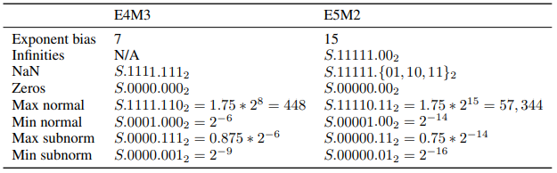

# Proposal of fp8 dtype introduction to PyTorch

**Authors:**
* @australopitek


## **Summary**
More and more companies working on Deep Learning accelerators are experimenting with 8-bit floating point numbers usage in training and inference. Results of these experiments are presented in many papers published in the last few years.

Since fp8 data type seems to be a natural evolution of currently used fp16/bf16, to reduce computation of big DL models, it’s worth to standardize this type. Few attempts of this were done recently:

* Nvidia, Arm and Intel - https://arxiv.org/pdf/2209.05433.pdf
* GraphCore, AMD and Qualcomm - https://arxiv.org/pdf/2206.02915.pdf
* Tesla - https://tesla-cdn.thron.com/static/MXMU3S_tesla-dojo-technology_1WDVZN.pdf

This RFC proposes adding two 8-bit floating point data types variants to PyTorch, based on the Nvidia/Arm/Intel paper. It’s important to consider these two variants, because they’re already known to be used by Nvidia H100 and Intel Gaudi2 accelerators.


## **Motivation**
Existence of native fp8 dtypes in PyTorch would simplify research and development of DL models using 8-bit floating point precision.

It would be simpler to create high level libraries on top of PyTorch. Potential automatic mixed-precision frameworks, like Nvidia’s TransformerEngine, could use this type directly instead of emulating it.

Built-in fp8 would also increase performance and optimize memory usage of such frameworks, by avoiding overhead caused by type emulation.

In addition, it’s worth to note that fp8e5m2 type was recently added to mlir https://github.com/llvm/llvm-project/blob/fd90f542cf60c2a4e735f35513268c052686dbd6/mlir/include/mlir/IR/BuiltinTypes.td#L80 and similar RFC is already being discussed in XLA https://github.com/openxla/xla/discussions/22


## **Proposed Implementation**
Both new data types would be added as separate PyTorch dtypes, on python and C++ levels, similarly to float16 and bfloat16. They would have all properties of floating-point datatype, including PyTorch type promotion, C++ std::numeric and math arithmetic.

### **Basic example of fp8 usage with types promotion**

Some ops in PyTorch allow for inputs with different dtypes. In such case, these inputs are internally casted to the common dtype got from type promotion matrix and below rules:

* floating point types take precedence over integer types,
* dimensioned tensors over zero-dim tensors,
* types with more bits over types with less bits.

```python
input_fp32 = torch.rand((3, 3))
input_bf16 = torch.rand((3, 3), dtype=torch.bf16)
input_i32 = torch.rand((3, 3)).to(torch.int32)
input_fp8 = torch.rand((3, 3)).to(torch.fp8e5m2)

res_fp32_fp8 = torch.add(input_fp32, input_fp8) # dtype == torch.fp32
res_bf16_fp8 = torch.add(input_bf16, input_fp8) # dtype == torch.bf16
res_i32_fp8 = torch.add(input_i32, input_fp8)   # dtype == torch.fp8e5m2
res_fp8_fp8 = torch.add(input_fp8, input_fp8)   # dtype == torch.fp8e5m2
```
Full description can be found in the documentation: https://pytorch.org/docs/stable/tensor_attributes.html#type-promotion-doc

### **Binary codes configuration**

Below table is taken from https://arxiv.org/pdf/2209.05433.pdf.



### **HF8 (E4M3) - hybrid float 8**

Applicable mainly for weight and activation tensors, i.e. forward pass of training and inference. Due to only 4 exponent bits, dynamic range of this variant is small. To extend it from 240 to 448, it was proposed to differ from IEEE special values encoding in the following ways:

* resign from encoding Infinities,
* decrease NaN encodings to only all-ones mantissa.

PyTorch implementation of this variant is similar to existing float16, with main difference in handling special values.

### **BF8 (E5M2) - brain float 8**

Applicable mainly for gradients in the backward pass of training, however there are many models that can be trained only with this variant. Its dynamic range is big, at least comparing to above E4M3 dtype, so it's ok to have special values encoding aligned with IEEE.

### **Small range and precision issues**

**Scaling**

Small precision and range of fp8 dtypes make them susceptible to underflows and overflows. To avoid it, tensors should be scaled to fp8 range.

One way is to scale gradients the same way as it’s already done with fp16 dtype. The existing `torch.cuda.amp.GradScaler` could be moved/copied to `torch.amp` namespace and adapted to new dtypes and devices. Examples of `GradScaler` usage can be found in https://pytorch.org/docs/stable/notes/amp_examples.html

However, with both precision and dynamic range limited, single scale factor may be insufficient for fp8 training. Considering bigger models, it’s easy to imagine a set of gradient tensors with values that cannot all be scaled into fp8 format without part of it being clamped to zero. The proper, more complex solution should be used for more efficient scaling, collecting maximum values statistics from few iterations back and keeping separate scale factor for each gradient tensor. This way every few iterations each tensor is scaled by its individual factor and the risk of over/underflow is minimized.

Finally, above solution with per-tensor scaling may be extended for all tensors, not only gradients.

### **Automatic conversion**

It’s important to consider adding a module for automatic mixed precision training to make fp8 usage more user friendly. Since fp8 dtypes have very small range and precision, for the most efficient training of big, complex DL models, more advanced solutions than simple `torch.autocast` + `GradScaler` will be needed.

One way of implementing the efficient solution for automatic mixed precision is a higher-level library on top of PyTorch. Such module would take care of execution of applicable ops in fp8 precision and gradients scaling.

Details of this module are not in the scope of this RFC.

### **Basic CPU support**

It’s probably a long time until some CPUs have fp8 support (or maybe never), but it’s worth to add fp8 support for few PyTorch ops, like MatMul and Conv, at least for the testing purpose.

It’s enough to have basic math operations implemented via casting to float:

```cpp
inline C10_HOST_DEVICE float operator+(FP8 a, float b) {
  return static_cast<float>(a) + b;
}

inline C10_HOST_DEVICE float operator*(FP8 a, float b) {
  return static_cast<float>(a) * b;
}
```

and register kernels by adding fp8 dtypes into macro:

```cpp
AT_DISPATCH_ALL_TYPES_AND_COMPLEX_AND6
```


## **Open points**
### **Stochastic rounding**

**Overview**

It’s an open question if stochastic rounding should be used in training with fp8 dtype.

Due to very small precision of fp8 data type, conversion from higher precision dtypes is susceptible to bias error, when input data is not uniformly distributed. To avoid it, casting to fp8 may use stochastic rounding instead of RNE.

On the other hand, most papers don’t mention it at all, which means models converge also without it. Moreover, stochastic rounding may cause harm when used in wrong places, e.g. in optimizer step.

**How should it be exposed?**

On the python level it can be exposed as an optional parameter in casting operator, e.g. `rounding_mode`. It would be ignored by backends that don’t support it. To make it additionally deterministic, one more parameter `seed` can be added.

In addition to explicit rounding mode selection via `.to` operator API, it’s worth to provide more general selection on higher level, e.g. stochastic rounding could be enabled for the whole model or part of it. In such case some mixed-precision module or hardware backend could apply stochastic rounding in the optimized way. Not only casting operations, but also internal accumulation in matmul/conv ops could benefit on that.

**Implementation proposal**

Excessive bits of higher precision number’s mantissa are compared to randomly generated bits. If they’re bigger, higher precision number is rounded up, otherwise down.

Example for float32 to fp8e5m2 conversion with stochastic rounding:

```cpp
uint32_t r = random_number & UINT32_C(0x1FFFFF);
uint32_t m = float_bits & UINT32_C(0x1FFFFF);
if (m > r) {
    float_bits += UINT32_C(0x200000);
}
```

**Example**

Below code shows a naïve example of bias error caused by conversion from fp32 to fp8 and how stochastic rounding solves it.

```python
# consecutive fp8e5m2 representable numbers are 40.0 and 48.0
input_fp32 = torch.full((1000, 1000), 42.5)

res_fp8 = input_fp32.to(torch.fp8e5m2)
torch.mean(res_fp8)
# mean = 40.0, bias error = 2.5

res_fp8_stochastic = input_fp32.to(torch.fp8e5m2, rounding_mode="stochastic")
torch.mean(res_fp8_stochastic)
# mean ~=42.5, bias error ~= 0.0
```

### **Automatic conversion placement**

It has to be decided where the module for fp8 automatic mixed precision should be stored. Initially, for development, it could be an external Python package. Finally, the stable version could land in the PyTorch in `torch.amp` namespace, together with `autocast` and `GradScaler`.

### **Autocast**

As mentioned before, the current torch.autocast is too simple for efficient handling fp8 mixed precision.

The question is, does it make sense to add fp8 support to autocast anyway? It could help with testing and debugging simple models.

**Autocast implementation proposal**

* `torch.autocast()` gets new optional parameter `second_dtype`
* new casting policy - `CastPolicy::second_lower_precision_fp` (or even better name)
* ops supporting fp8 dtype are registered for autocast with this new CastPolicy
* if `second_dtype` is not specified, it falls back to the first dtype (fp16/bf16)
* additionally, functionality of configurable list of autocast ops could be added to increase flexibility, but it’s not trivial in the current design of autocast.

**Example**

Below code presents simple example of autocast with a support for fp8 and two dtypes at once.

Assumptions:

* `torch.matmul` is registered to `CastPolicy::second_lower_precision_fp`,
* `torch.addmm` is registered to `CastPolicy::lower_precision_fp`,
* `torch.log_softmax` is registered to `CastPolicy::fp32`

```python
a = torch.rand((5, 5), dtype=torch.fp32)
b = torch.rand((5, 5), dtype=torch.fp32)
c = torch.rand((5, 5), dtype=torch.fp32)

with torch.autocast(dtype=torch.bfloat16, second_dtype=torch.fp8e5m2):
  mm = torch.matmul(a, b)                    # dtype == torch.fp8e5m2
  res_log_softmax = torch.log_softmax(mm, 0) # dtype == torch.float32
  res_addmm = torch.addmm(a, b, c)           # dtype == torch.bfloat16

with torch.autocast(dtype=torch.bfloat16):
  mm = torch.matmul(a, b)                    # dtype == torch.bfloat16
  res_log_softmax = torch.log_softmax(mm, 0) # dtype == torch.float32
  res_addmm = torch.addmm(a, b, c)           # dtype == torch.bfloat16
```

### **Generic bits for fp8 prototyping**

In the recent discussion about fp8 type in PyTorch (https://dev-discuss.pytorch.org/t/fp8-datatype-in-pytorch/719/6), the intermediate solution was mentioned.

> we are going to add some generic bits8/16/etc type to PyTorch so you can easily prototype FP8 in a tensor subclass

There are few questions regarding details of this solution in the context of being an alternative for true dtype.

* What are the limitations comparing to native built-in type?
* Does it have properties of floating-point format like infs/nans, underflow numbers, rounding modes?
* Is it configurable in terms of size of exponent/mantissa, bias, special values encoding?
* Can it be included in type promotion matrix?
* Is it possible to register and use many of such types at once?
* Does it support Autograd? How?
* What is the reason of not customizing int8 based dtype to fp8?
* Will bit8 be a base class off which the int8 and fp8 both gets created, or is it specifically for fp8?
