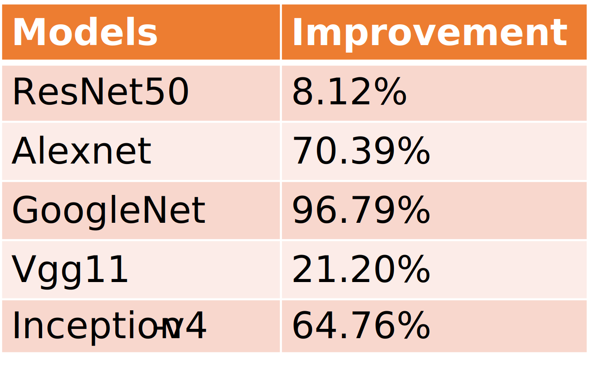

# ZenDNN Integration

## **Author**
* @naveenthangudu

## **Summary**
This document proposes an approach for integrating ZenDNN library into PyTorch. This integration will enable inference optimizations for deep learning workloads on AMD CPUs.

## **Highlights**
* Default build behavior remains un-altered.
* A pre-build step will generate ZenDNN integration code.
* ZenDNN integration is optimized for inference workloads.
* New opt-in build flag (environmental variable) `USE_ZENDNN` will be added.
* No Submodules are added. When `USE_ZENDNN` is set to 1, the following repositories will be downloaded into third_party folder.
  * [ZenDNN](https://github.com/amd/ZenDNN)
  * [AOCL BLIS](https://github.com/amd/blis)
* ZenDNN optimizations are added as JIT Passes on frozen graph under `optimize_for_inference` API.
* Support will be added for fp32 and bf16 data types.

## **Motivation**
The main goal of this integration is to realize optimal inference on AMD CPUs for PyTorch. ZenDNN is a library which enables performance improvements on AMD CPU architectures. Please find the repo and more details [here](https://github.com/amd/ZenDNN). To highlight the potential uplift using ZenDNN vs. oneDNN on AMD CPUs, we have benchmarked our fully integrated ZenDNN version using PyTorch v1.12 on a Genoa CPU (4th Generation AMD EPYC™ Processors).

### **Benchmarking Configuration**
|||
|-----------------------------|-------|
| PyTorch version             | v1.12  |
| CPU                         | 4th Generation AMD EPYC™ Genoa CPU |
| Number of physical cores    | 96   |
| NUMA Nodes per Socket(NPS)  | 1    |
| Model data type             | FP32 |

### **Latency Performance - batch_size=1**

### **Throughput Performance - batch_size=640**

## **Proposed Implementation**

### **Overview**
This approach references the [hipify](https://github.com/ROCm-Developer-Tools/HIPIFY) approach used by the AMD ROCm team for integration of ROCm libraries into PyTorch. By leveraging shared APIs between oneDNN and ZenDNN, a pre-build step will generate ZenDNN integration code wherever possible. By adding an opt-in build flag, default build behavior is un-altered. Required repositories are only downloaded when the build flag is enabled.

### **Code generation script**
* References hipify tool, which is present in PyTorch.
* Implemented in Python and run as a pre-build step.
* Takes in folders or files and generates substituted code.

### **Build Infrastructure**
* Support for opt-in flag (environmental variable) `USE_ZENDNN` in Linux build path.
* PyTorch build reverts to default behavior if `USE_ZENDNN` environmental
variable is set to zero or unset.
* When `USE_ZENDNN` is set to 1,
  * ZenDNN and AOCL BLIS repositories will be downloaded into third_party folder.
  * AOCL BLIS and ZenDNN will be built into PyTorch.
  * oneDNN path will be disabled.
* BLIS library is built as a pure dependency for ZenDNN acceleration. MKL will continue to be the BLAS library used by default.

### **Graph Optimizations**
As part of this integration, the following optimizations will be added into PyTorch. As optimization is an ongoing process, we will be adding more optimizations in the future. 
* Fusion of ops. Examples include,
  * Conv Bias and Relu (CBR) fusions
  * Conv and Add fusions (Fusing Residual addition into conv)
  * Inplace concatenation (Inception)
* Reorder optimizations
* Inplace unary elementwise operations
* Memory Pool optimizations

As a few optimizations are specific to inference only workloads, our graph optimizations are added onto frozen graphs. They are added under `optmize_for_inference` API. The figure below illustrates ZenDNN graph optimizations in the PyTorch workflow.

## **Open Questions**
The following questions will impact the design and implementation of ZenDNN integration.

* Can ZenDNN have a new dispatch key added specifically for it?
* Can ZenDNN have its own backend?
* Can we add ZenDNN tensor layout to tensor layouts?

## **Next Steps**
* First PR - with code generation tool and build infrastructural changes with support for eager mode.
* Second PR - featuring a few graph optimizations.
* Third PR - including unit tests and CI deployment.
* Further PRs with more optimizations and PyTorch 2.0 feature integration.