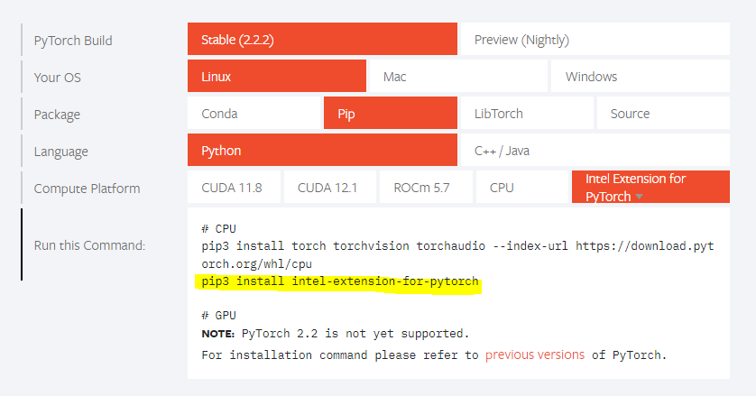

# Hardware accelerators at pytorch.org

**Authors:**
* Intel: @bsochack @sujoysaraswati @fzhao3 @jgong5
* Huawei: @Yikun @hipudding

## **Summary**
The main page of pytorch.org only shows PyTorch Get-Started  on CUDA, ROCm and CPU, but the hardware accelerator support is more diverse and the ecosystem is rapidly evolving with new accelerators like Intel Gaudi, Huawei Ascend, Google TPU, etc.
The proposal in this RFC is to enable the visibility of broad set of accelerators that supports PyTorch for the community, and create a space for hardware vendors to provide instructions and details about their PyTorch support.  

## **Motivation**
There are 2 primary motivations behind this RFC:
1. Evangelize PyTorch as an open source framework that supports a wide variety of hardware.
   * PyTorch is supported on more compute platforms than CUDA, ROCm and CPU .
   * PyTorch can maintain and enhance its competitive position in the machine learning frameworks  by enabling the visibility of rich set of hardware accelerators on which PyTorch can run.
2. Provide a consolidated entry point where to look for more information about supported hardware accelerators.
   * pytorch.org is a starting point for many users. The page can help users to find more details.

## **Proposed Implementation**
The proposal is to enhance pytorch.org by adding 3  new sections:
* Add new compute platforms to “Install PyTorch” section at the main page of pytorch.org.
* Add new compute platforms to https://pytorch.org/get-started/.
* Add new “Compute Platforms” section at the main page of pytorch.org.

### PyTorch integration types
There are at least 2 ways how compute platforms are integrated with PyTorch:
1. In-tree – CPU, CUDA, ROCm are developed, built and tested in PyTorch environment. PyTorch is ensuring quality criteria. This approach is limited to only a few compute platforms and it does not scale with number of compute platforms.
2. Out-of-tree – Integration of other compute platforms like Intel Gaudi or Huawei Ascend is done via additional python package (extension) that needs to be installed on top of PyTorch CPU package. Development, built and testing is done outside of PyTorch. In this case:
   * PyTorch is ensuring quality of PyTorch CPU package.
   * Hardware provider is ensuring quality of its extension against PyTorch CPU package.

### Out-of-tree integration vs. device key
Out-of-tree integration refers to compute platforms integrated with its own device key or PrivateUse1.
Example of out-of-tree integration with its own device key is Intel Gaudi with "HPU" key.
Example of out-of-tree integration using PrivateUse1 is Huawei Ascend.

### Stable vs. nightly builds
1. Stable builds – the hardware provider shall provide the installation commands when a compute platform is tested against given PyTorch version and it meets the quality criteria set by PyTorch Foundation.    
2. Preview (nightly) -  Similar to the stable builds, but the hardware provider must implement method to provide quickly fixes for PyTorch nightly.   It should be optional.

### Quality criteria
PyTorch foundation shall introduce minimal requirements for new compute platforms.
Report what kind of testing was done on a compute platform with PyTorch build
* A common test report format - to be defined.
  * A test report to contain: results of tests (PyTorch UT, TorchBench, model runs, additional test suites), tested OSes.
* Test requirements:
  * Define must pass tests from PyTorch perspective i.e. subset of PyTorch framework UT tests.
    * The must pass tests shall focus on basic PyTorch infrastructure as compute platforms have various capabilities.
  * Leave other tests as optional so hardware providers can decide what kind of tests are the most relevant for its compute platform.

### Extend the “Install PyTorch” section on pytorch.org with new compute platforms
Currently, the “Install PyTorch” section only includes information about CUDA, ROCm, and CPU. It gives the impression that these are the only compute platforms users can work with.

The proposal is to add buttons for new compute platforms:

### Device plugins maintained out of the PyTorch tree
Most devices are maintained out of the PyTorch tree, and some of them require an additional device extension package to be installed to initialize the device, register operators, and provide  optimizations. In such case, the additional command to install a device extension package should be provided in the installation instruction.

#### Editing PyTorch installation instructions
The hardware providers should have a way to edit the installation commands via GitHub PRs.

### Extend pytorch.org/get-started with new compute platforms
Similarly to adding new compute platforms at the main page of pytorch.org, the get started page should be extended with other compute platforms. Similar description to CUDA and ROCm should be added for other compute platforms.

### Add a new “Compute Platforms” section on pytorch.org
pytorch.org is a starting point for many users where they can find initial information about all supported compute platforms, and select the most optimal solution for its needs from perspective of purpose,  speed and power consumption.
The proposal is to add a new section on the main pytorch.org page showing supported hardware accelerators.

When clicked at the hardware accelerator, it should take a user to a Pytorch subpage with more details:
* How to prepare machine before installation of PyTorch i.e. where to look for dockers, how to obtain drivers, etc.
* How to install PyTorch.
* How to get started to work with a compute platform in Python i.e. importing pytorch, importing additional compute platform specific packages.
* Where to get help in case of any issues.
