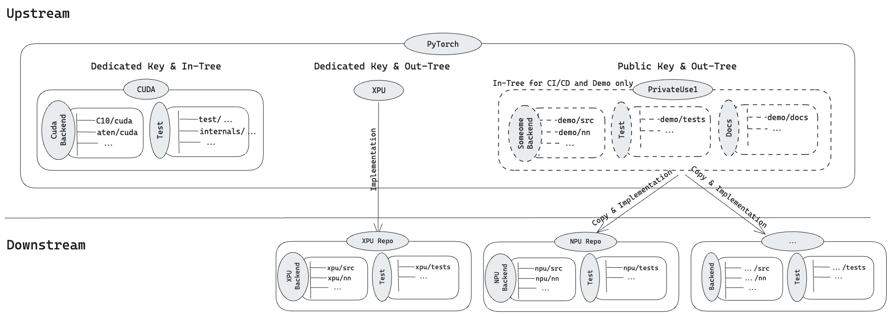

# The interoperability Standard of Third-party Backend Integartion Mechanism

**Authors:**
* @fffrog
* @hipudding

## **Summary**
As the top AI framework,PyTorch will see more and more backends wanting to integrate with it in the future. A universal third-party device integration mechanism will be their first choice, making the usability, accessibility, and stability of this mechanism particularly important. 

The main goals of this RFC include the following three points:
- **CI/CD**: Ensure the quality of the third-party device integration mechanism through in-tree lightweight backend.
- **Demo**: Standardize the integration of third-party devices and provide official reference implementation.
- **Docs**: Provide E2E full-process documentation.

## **Motivation**
### **The Quality of Third-party Device Integration Mechanism**
PyTorch has mechanisms in place to ensure the functionality and stability of backends such as **CPU**, **CUDA**, **ROCM**, etc. However, there is a lack of corresponding mechanism for the universal third-party device integration mechanism that will be widely used by backends in the future. Since PyTorch is not aware of the downstream accelerators integrated into PyTorch based on the third-party device integration mechanism, code modifications in upstream such as function optimization and new features may cause functional problems in the downstream accelerator, or even compilation failure.

Take Ascend NPU as an example:

The Ascend NPU (torch_npu) successfully integrated with PyTorch based on the third-party device integration mechanism (PrivateUse1) in October 2023. Starting from November 2023, a set of daily tasks was established in the downstream code repository to test the functional compatibility between the latest PyTorch (main branch) and Ascend NPU (master branch) on a daily basis. As of March 2024, it has been running stably for approximately four months. The analysis results are shown in the table below:

| Type | Description | Occurr Counts | Example PR |
| :---: | :--- | :---: | :---: |
| Refactoring | Turn Allocator::allocate into non-const, derived class’ override function is not modified. | 1 | [#120969](https://github.com/pytorch/pytorch/pull/120969) |
| Refactoring | ​​Use DeviceIndex instead of int in CUDA wrappers, derived class’ override function is not modified. | 1 | [#119142](https://github.com/pytorch/pytorch/pull/119142) |
| Refactoring | Move new trace utils from source to header, which leads to some symbols can’t be found. | 1 | [#114367](https://github.com/pytorch/pytorch/pull/114367/files) |
| Refactoring | Migrate to getCvar* functions for env variable checking, which leads to function name can’t be found. | 1 | [#113797](https://github.com/pytorch/pytorch/pull/113797) |
| New Features | Add support for new data types, data type assert fails. | 2 | [#107586](https://github.com/pytorch/pytorch/pull/107586), [#116594](https://github.com/pytorch/pytorch/pull/116594) |
| New Features | Add function to materialize COW storages, which add a pure virtual function Allocator::copy_data, derived class didn’t implement this pure virtual function. | 2 | [#117053](https://github.com/pytorch/pytorch/pull/117053), [#113396](https://github.com/pytorch/pytorch/pull/113396) |

Based on the above table, it is evident that upstream modifications do have a negative impact on out-of-tree third-party devices. These modifications directly affect the functionality of third-party devices and greatly increase the cost of adaptation and maintenance.

### **Standardized Integration of Third-party Device**
PyTorch is a complex framework with numerous features, making it a significant challenge for third-party devices to adapt to. The quality of integration methods directly impacts the stability and sustainability of the subsequent functionality of third-party backends. Therefore, standardizing the integration for third-party devices not only reduces integration barriers and time costs but also enhances compatibility and stability. This, in turn, solidifies PyTorch's leading position in the field of artificial intelligence frameworks.

## **Proposed Implementation**

As shown in the above diagram, based on the third-party device integration mechanism (PrivateUse1) and a real device, a in-tree and lightweight backend will be added. This backend synchronously adds minimal test suites and end-to-end integration documentation. It serves as both a quality assurance for the third-party device integration mechanism and a standard official reference implementation for third-party devices. This backend has the following characteristics:

* **Functionality**: Implements only the most essential and minimal functionality while covering the entire feature set.
* **Tests**: Minimal test suite
* **Usage**: Reserved for CI/CD and official standard reference implementation, not intended for user use.
* **Compilation**: Separate compilation entry point, separate from other backends.
* **Independence**: The related code is stored separately, without coupling with other functional modules of PyTorch.
* **In-tree**: Maintained by community developers collectively.

Taking Ascend NPU as an example, PrivateUse1 is used as the exclusive key of Ascend NPU. Based on PrivateUse1 Key + third-party device access mechanism + Ascend NPU, a lightweight in-tree backend is implemented, providing official reference implementation and third-party device quality care (combined with github action ).

Based on the lightweight backend, we will add a new github action task described in the below to verify the functionalities related to PrivateUse1, which is similar to other github actions, but there will be some differences:
1. If the validation fails, developers need to attempt code refactoring to minimize the impact on the privateuse1 mechanism. If unavoidable, they need to modify the implementation of the built-in lightweight backend and resubmit the PR.
2. If the validation passes, when the PR is merged into the main branch, the modified files will be checked. If there are modifications related to the built-in lightweight backend, a dedicated label will be added to the current PR for downstream developers to filter and identify, speeding up downstream adaptation.

Based on the above mechanism, we can improve the compatibility and stability between upstream and downstream while minimizing the impact on upstream developers.

The impact on the third-party device integration process is shown in the following diagram:

Explanation:
1. Third-party device developers can directly copy the official in-tree reference implementation provided by PyTorch.
2. By following the module granularity, they can refer to the corresponding end-to-end documentation and module reference implementation for reuse/modification. This approach minimizes the adaptation threshold and ensures compatibility between upstream and downstream.

## **Drawbacks**
The above mechanism has the following drawbacks:
1. To some extent, it increases the development workload for community developers.

## **Alternatives**
Selecting an out-of-tree backend implementation based on the third-party device integration mechanism that is stable and continuously evolving as the CI/CD validation backend for the third-party device integration mechanism and as the official reference implementation.

We will also add a new github action related to PrivateUse1 and the impact on community developers is similar to the above solution, but slightly different:
Per PR workflow (referring to XLA's implementation):
1. Developers perform feature development and validate functionality locally.
2. They submit a Pull Request, triggering relevant GitHub actions (we will add a new action here to fetch the pinned commit ID code of the out-of-tree backend, compile it, and perform testing and validation). If the validation fails, developers need to attempt code refactoring to minimize the impact on the privateuse1 mechanism.
3. If unavoidable, they need to wait for the out-of-tree backend team to adapt to the PR within 24 hours, and then update the pinned commit ID in PyTorch for that out-of-tree backend.
4. Developers retrigger the GitHub action, and if it passes, the PR is merged.

Weekly recurring task: 
1. Add a weekly recurring task (GitHub action) to update the pinned commit ID for the corresponding out-of-tree backend. This helps reduce the negative impact of the out-of-tree backend on upstream.

## Open points
Is it possible to preset a common test set for all out-of-tree devices?
