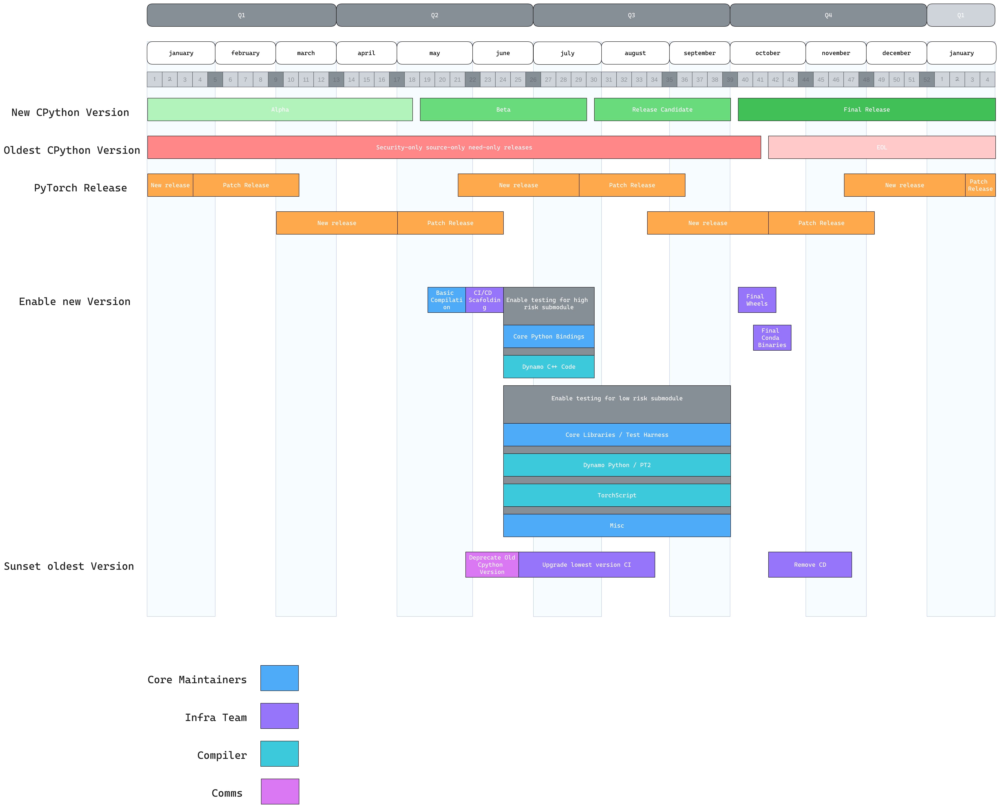

# [CPython version support]

**Authors:**
* @albanD

## **Motivation**

CPython release schedule is regularly cadenced every year. Given that the amount of work to enable and sunset versions yearly is fixed, we should be proactive in how we handle these tasks.
This RFC suggests an updated policy we want for CPython version support, CI/CD requirements and the proposed yearly timeline for enablement/sunsetting.

The key requirements driving this proposal are:
- Enable new versions as soon as possible
- Sunset old versions in a timely manner
- Set clear long-term expectations for our users
- Mitigate the risk of a CPython change that would render PyTorch non-functional making it to the CPython final release
- Minimize any work that would not have been needed if the enablement was done post-final release

## **Proposed Implementation**

### Proposed timeline

### Which CPython version are supported

PyTorch supports all CPython versions that are fully released and have not reached end of life: https://devguide.python.org/versions/

Note: This is an update from the current policy at https://github.com/pytorch/pytorch/blob/main/RELEASE.md#python which is following NumPy’s approach. In practice, we are not following the rules stated in that .md and following the rule stated just above here. We are updating the rule (instead of enforcing the NEP above) as the cost of supporting more versions is minimal.
Also split build to have a single (large) c++ package shared by all CPython version is way underway (https://github.com/pytorch/pytorch/pull/129011) and will reduce the binary size use on PyPi even though we support a large number of versions.

### What is tested in CI/CD

The goal here is for us to ensure coverage of testing while reducing the cost on CI.

At any given time, we should run:
- General CI on PR and trunk should run on the oldest supported version.
- Maintainers can ask for specific CI shard to run on specific versions:
- Long term for testing features tightly bound to CPython versions (for example Dynamo).
- Temporarily for enablement work (for example while a new CPython version is being enabled).
- CD for docker and binaries should run for all supported versions.
- Wheel/release smoke test should run on all supported versions.

### Detailed CPython new version enablement

- Enable new version basic compilation
  - When: Once the first beta version is released (Usually in May)
  - Planned for 3.13: 5/07
  - ETA: 1-2 weeks. Before beta 2
  - Goal: Fix compilation issues allowing to compile PyTorch locally. Report any needed patch in CPython before beta 2.
  - Who: Core Maintainers for pytorch/pytorch + relevant maintainers for managed domains
  - Note: If a patch is needed in CPython, it will be made available easily until next beta release happens
- Enable new version CI/CD Infrastructure
  - When: As soon as basic compilation is done
  - ETA: 2-3 weeks. 
  - Goal: Generate nightly wheels and scaffolding for new version testing
  - Who: Core Infra
- High risk enablement work for the new version  for submodules
  - When: as soon as the CI/CD infrastructure is done
  - ETA: before CPython first RC
  - Planned for 3.13: 07/30
  - Goal: Verify high risk systems and report any needed patch in CPython such that they can be fixed before RC1
  - Who: High risk systems owners. As of today this is Dynamo C++ code and python binding subsystems.
- Low risk enablement work for the new version  for submodules
  - When: as soon as the CI/CD infrastructure is done
  - ETA: before CPython final RC
  - Planned for 3.13: 09/03
  - Goal: Enable all testing for the new CPython version
  - Who: Core Maintainers handle the long tail of issues. Specific submodule owner handle larger migration efforts (dynamo, TorchScript, etc)
- Full new version wheel release
  - When: When the new cpython verion is officially released (Usually in October)
  - Planned for 3.13: 10/01
  - ETA: 2 week
  - Goal: Update nightlies to track the final release and advertise it as fully working
  - Who: Infra + Comms
- Full new version conda release
  - When: When the new cpython version and our runtime dependencies are supported onconda
  - ETA: 2 week
  - Goal: Push binaries that are officially supported
  - Who: Infra + Comms

### Detailed CPython old version Sunset

- Deprecate old version
  - When: During the release process of the last PyTorch release before the oldest version of python goes EOL
  - Planned for 3.8: October
  - Goal: announce deprecation of the oldest cpython version on dev-discuss + release
  - Who: Comms
- Stop releasing nightly binaries for oldest version
  - When: Once the last supported release happened
  - ETA: 2 weeks
  - Goal: remove all wheel and conda binaries for the EOL version
  - Who: Infra
- Upgrade oldest version CI
  - When: After nightlies are not published anymore
  - ETA: 2 weeks
  - Goal: migrate all the CI jobs running on the oldest version to the soon-to-be oldest version
  - Who: Infra

