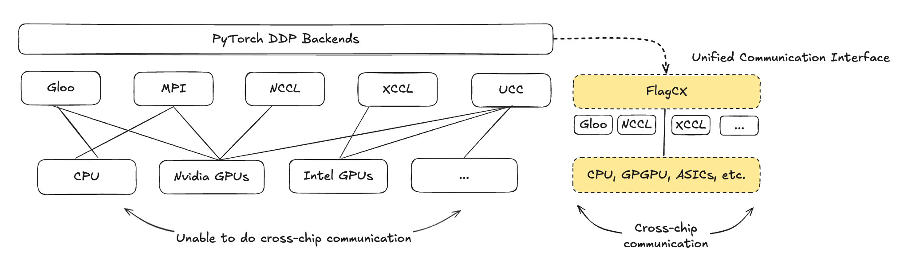

# Add FlagCX Backend to torch.distributed for Heterogeneous Cross-Chip Communication

**Authors:**

* @MC952-arch
* @mikethegoblin
* @heavyrain-lzy
* @ceci3
* @aoyulong
* @lindylin1817

## **Summary**

This RFC proposes the addition of a new distributed backend, `ProcessGroupFlagCX`, to PyTorch’s `torch.distributed` module.

The FlagCX backend provides a unified, high-performance communication runtime designed for heterogeneous cross-chip environments. It enables seamless data exchange across different accelerator types, such as NVIDIA GPUs, AMD GPUs, and custom AI chips, through an original device-buffer RDMA design that allows direct memory-to-memory transfers without redundant host staging.

Unlike existing frameworks such as ProcessGroupNCCL (limited to NVIDIA devices) or ProcessGroupUCC (which supports multiple chip types but only homogeneous communication within each type), FlagCX natively supports cross-chip communication in a single process group, enabling true mixed-vendor collectives and point-to-point operations within the same cluster. This capability provides a flexible and portable backend for large-scale training on heterogeneous GPUs or accelerator clusters, extending RDMA performance benefits across device boundaries.

The goal is to enable seamless integration of the FlagCX library into PyTorch’s collective communication stack, providing users with a high-performance, cross-vendor distributed backend targeting for various AI workloads. With this integration, PyTorch can inherently perform collective operations across heterogeneous devices—including NVIDIA, AMD GPUs, AI ASICs, and other accelerators—within a unified runtime. This capability breaks the traditional vendor boundaries of distributed deep learning, allowing true cross-chip collaboration while preserving PyTorch’s familiar programming model and performance efficiency.

## **Motivation**

PyTorch currently provides several process group backends for distributed communication:

* Gloo, a portable CPU backend
* MPI, a standard and portable CPU backend
* NCCL, which is optimized for NVIDIA GPUs
* XCCL, which is optimized for Intel GPUs
* UCC, the Unified Collective Communication backend that supports multiple device types

However, none of these backends natively support heterogeneous or cross-chip environments, where devices from different vendors (such as NVIDIA and AMD) or architectures (such as CPUs, GPGPUs, and ASIC-based accelerators) must participate in the same distributed job.

The FlagCX runtime overcomes the limitations of existing communication backends by providing a unified communication and device abstraction layer that seamlessly supports heterogeneous hardware, including CPUs, general-purpose GPUs (GPGPUs), domain-specific accelerators (DSAs), and custom ASIC-based AI chips (AI ASICs). Moreover, FlagCX offers a unified network abstraction layer that integrates diverse transport protocols such as TCP, InfiniBand, and RoCE, delivering high-performance, portable connectivity across mixed infrastructures. At its core, FlagCX implements a high-performance device-buffer RDMA runtime, enabling efficient heterogeneous peer-to-peer and collective operations with minimal host intervention, ensuring scalable and low-latency communication in complex multi-vendor environments.

As an open-source communication library (https://github.com/FlagOpen/FlagCX), FlagCX has been adapted and validated across multiple mainstream AI chip platforms, demonstrating both robustness and broad applicability. It enables seamless cross-vendor distributed training and other AI workloads, allowing heterogeneous chips—such as NVIDIA, AMD, and custom accelerators—to collaborate efficiently within a single process group. To date, FlagCX supports:

* 9 AI chip platforms, including NVIDIA, AMD, Cambricon, and Huawei Ascend, among others
* 3 network protocols—InfiniBand (IB), RoCE, and TCP/IP
* 2 frameworks, including PyTorch via DDP custom backend and PaddlePaddle via native integration

We believe that through native integration with PyTorch’s distributed communication stack, FlagCX could bring vendor-agnostic, cross-chip scalability to PyTorch’s distributed ecosystem, breaking existing interoperability barriers and paving the way for next-generation heterogeneous AI computing.

## **Design Overview**

### High-level Architecture

The proposed backend follows the existing process group abstraction:
torch.distributed.ProcessGroup:

* ProcessGroupNCCL
* ProcessGroupGloo
* ProcessGroupMPI
* ProcessGroupXCCL
* ProcessGroupUCC
* ProcessGroupFlagCX <- (new)

### Core Components

| Component           | Description                                                |
|:--------------------|:-----------------------------------------------------------|
| ProcessGroupFlagCX  | Main backend implementation subclassing c10d::ProcessGroup |
| WorkFlagCX          | A subclass of c10d::Work supporting async collectives      |

### Initialization

The backend is registered via `torch.distributed.init_process_group(backend="flagcx")`.
Example: `torch.distributed.init_process_group(backend="flagcx", world_size=8, rank=rank)`

## **Implementation Plan**

| Phase | Description                                                                      | PR Scope   |
|:------|:---------------------------------------------------------------------------------|:-----------|
| 1     | Add core ProcessGroupFlagCX and backend registration along with WorkFlagCX class | Initial PR |
| 2     | Integrate FlagCX C++ runtime library (build system and dependencies)             | Subsequent |
| 3     | Implement core collectives (allreduce, broadcast, barrier, etc.)                 | Subsequent |
| 4     | Add unit tests and CI integration                                                | Later      |
| 5     | Add benchmark tests (torch.distributed.benchmarks)                               | Later      |

## **Backward Compatibility**

This RFC introduces a new distributed backend `flagcx` without altering the behavior or functionality of any existing PyTorch modules. Current backends, including NCCL, GLOO, MPI, XCCL and UCC, continue to operate as before, ensuring that existing workflows remain fully compatible. Similar to the introduction of UCC, this RFC extends PyTorch’s process group ecosystem by providing a new, high-performance backend for heterogeneous and cross-vendor environments, while leaving all other DDP backends unaffected.

The `flagcx` backend is introduced as an optional DDP backend. Users may enable it explicitly by setting `backend="flagcx"` during process group initialization, allowing PyTorch to utilize FlagCX for collective and point-to-point operations.

## **Performance Expectations**

Most AI chips supported by the `flagcx` backend provide a comprehensive set of communication primitives for both homogeneous and heterogeneous (cross-chip) scenarios, including send, recv, broadcast, all_reduce, reduce, all_gather, gather, scatter, reduce_scatter, all_to_all, barrier.

Under homogeneous communication settings, the `flagcx` backend is expected to achieve performance parity with vendor-native communication libraries—such as NCCL for NVIDIA GPUs and RCCL for AMD GPUs. In heterogeneous environments, where multiple chip types (e.g., NVIDIA + AMD + custom accelerators) participate in the same distributed workload, the `flagcx` backend introduces a novel hierarchical collective communication algorithm known as the Cluster-to-Cluster (C2C) algorithm. This approach enables scalable and efficient collective operations across diverse hardware architectures, effectively extending PyTorch’s distributed capabilities beyond the limitations of homogeneous, vendor-specific ecosystems. For instance, using the `flagcx` backend, we may perform C2C AllReduce, AllGather, and AllToAll operations across clusters composed of NVIDIA, Cambricon, Huawei Ascend, and other heterogeneous AI chips.

## **Dependencies**

* FlagCX runtime library (`libflagcx.so`)
* UCX or Infiniband verbs library (`libucx.so`, `libibverbs.so`)
* CUDA/HIP (or other) SDK for device management

## **References**

* [FlagCX](https://github.com/FlagOpen/FlagCX)
* [FlagCX PyTorch Plugin](https://github.com/FlagOpen/FlagCX/tree/main/plugin/torch)
* [FlagCX Integration with PaddlePaddle](https://github.com/PaddlePaddle/Paddle/commit/17d2967d784d0514973a7a6a334e0ec70436abe1)