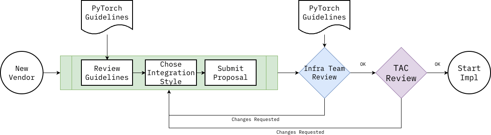
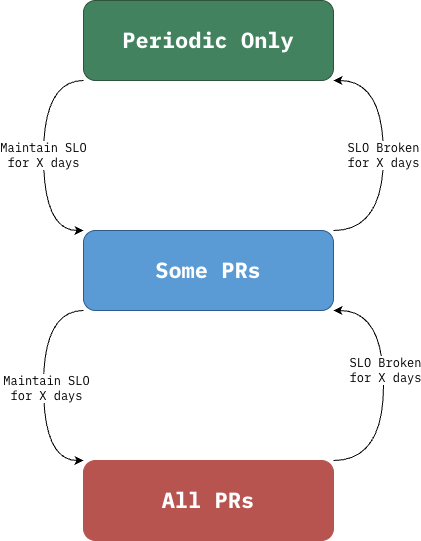

# CI/CD Infrastructure Contribution Process

**Authors:**
* @afrittoli
* Multi-cloud Working Group 

## **Summary**
This proposal defines a streamlined process for companies that want contribute to PyTorch CI/CD infrastructure, test matrix and builds.

## **Motivation**
Several companies invested in the PyTorch project are interested in contributing to PyTorch CI/CD infrastructure, but the project today lacks clear guidance about what are the options, when to choose which, how to enroll and what are the requirements to be met.

Documenting a process that the community agrees upon benefits all parties:
* The project: a vetted process with best practices leads to more reliable integration of new infrastructure with less engineering effort from the community and reduced security risks
* The contributing companies: clear guidance, requirement and expectations mean a better and more predictable onboarding experience
* The PyTorch Foundation: a streamlined contribution process can help scale the infrastructure while maintaining it financially suistainable
* The end-users: integrating new platforms in the CI/CD infrastructure allows for public testing of PyTorch on a wider range of platform this serving more end-users

## **Proposed Implementation**
The implementation of this RFC is entirely in the form of documentation, although several aspects of the proposal rely on technology that is being implemented and that will be tracked through separate RFCs. Relevant RFCs will be listed here as they are created:
* [Vendor-managed runner pools for in-tree CI/CD]
* [CI Relay for PyTorch out-of-three backends]
* [OSDC: Modular Kubernetes CI Infrastructure for PyTorch]

Most of this proposal is currently defined in [Google docs](https://docs.google.com/document/d/18-1uLPMWHpcI5LMQt8gsjFQN22X3MTosvQnXdD7--qQ/edit?usp=sharing). I will be porting it to markdown in here.

### Process

At a high level, the process for process for contributing infrastructure consists of three steps:
* Submit a proposal, in the form of a GitHub issue to the RFC repository
* Review iteration cycles with the PyTorch infra team
* Presentation to the TAC and vote

The PyTorch guidelines for contributions are the outcome of this RFC, along with the process described here.

The proposal, using a [predefined template](#proposal-template) is submitted as an RFC to allow for detailed, line-by-line review and comments. A GitHub project can be used to track proposals through their lifecycle.

Once a proposal is approved, the implementation may start. The implementation is always incremental, and it MUST start with the smallest scope, which corresponds to the smallest impact on the PyTorch community. As the implemtation matures and meets specific SLOs, it can start providing services with a wider scope, for example:

  

The scope of an implementation is defined in tems of the [*role*](#roles) and *frequency* of execution. 

### Roles

Depending on the type of CI/CD jobs that a runner executes, it may require read and/or write access to various resources, which include:
- S3 buckets
- ECR images/repositories
- Test database (dynamo DB)

The more access is required to those resources, the higher the bar in terms of requirements for the runners. The following roles are presented in order from the lower to higher bar of requirements:

- [Tester](#runner-of-type-tester)
- [Builder](#runner-of-type-builder)
- [Publisher](#runner-of-type-publisher)
- [Releaser](#runner-of-type-releaser)

When a runner produces resources that may be consumed runners from a different pool, the resources should be:
- Either published to a secure local repository, and pulled to a central location by a separate trusted process. The pull process may verify and/or filter the resources to be pulled based on customizable policies
- Or published to a central location, using a dedicated bucket or repository, using credentials scoped only to the dedicated target

Built artifacts may include attestations, signatures and other features required to achieve SLSA Build Level 3 (https://slsa.dev/spec/v1.2/build-track-basics#build-l3) quality. This is out of scope for this document and should be discussed in a separate setting.

#### Runner of type "Tester"

A tester runner executes test jobs which mainly consume artifacts and may produce ephemeral artifacts for other jobs in the same runner pool or data/documentation artifacts such as test reports and benchmark results.

A tester runner may be used with triggers: on-demand, periodic, PR subet, all PRs.

| Allowed Resources | Access | Location | Description |
|---|---|---|---|
| Buckets | Read | Local, cached from central | Pre-built artifacts |
| Buckets | Write | Local only | Artifacts consumed by jobs in the same runner pool |
| Buckets | Write | Local, may be pulled centrally | Test reports, Benchmark results (not used by other jobs) |
| Container Registry | Read | Local, pass-through cache | Container images used for tests |
| Container Registry | Write | Local only | Artifacts consumed by jobs in the same runner pool |
| Dynamo DB | Write (inserts only) | Central | Tests and build results/telemetry |

#### Runner of type “Builder”
A builder runner executes build jobs that create artifacts consumed by other PyTorch CI/CD jobs which may run on runners outside of the vendor pool. Examples are compiler caches, doc previews, prebuilt libraries.

A builder runner may be used with triggers: Periodic, On-demand.

| Allowed Resources | Access | Location | Description |
|---|---|---|---|
| Same as Tester, plus: ||||
| Buckets | Write | Local OR Central, dedicated bucket | Build artifacts used by any other jobs, not end-users |
| Container Registry | Write | Local OR Central, dedicated repository | Artifacts consumed by any other jobs, not end-users |

#### Runner of type “Publisher”
A publisher runner executes build jobs that create artifacts that are consumed by PyTorch end-users, except for full releases. Examples are nightly builds.

A publisher runner may be used with triggers: Periodic, On-demand.

| Allowed Resources | Access | Location | Description |
|---|---|---|---|
| Same as Builder, plus: ||||
| Buckets | Write | Local OR Central shared bucket | Build artifacts that may be used by end-users, but not releases |
| Container Registry | Write | Local OR Central shared repository | Artifacts that may be used by end-users, but not releases |

#### Runner of type “Releaser”
A releaser runner executes build jobs that create full release artifacts that are consumed by PyTorch end-users.

A releaser runner may be used with triggers: On-demand.

| Allowed Resources | Access | Location | Description |
|---|---|---|---|
| Same as Publisher, plus: ||||
| Buckets | Write | Release bucket | May publish any artifacts for end-users |

### Proposal Template

The proposal template depends on the type of integration.
For vendor-managed runner pools, the proposal should include the following sections:

* **Company or organisation** that will operate the infrastructure
* **Platform being tested** by the runner pool. A platform is a combination of hardware (CPU architecture and Accelerator if any) and software (Operating System)
* **Runner Role, Triggers and Jobs**: this section should describe the entire plan, from the starting point (typically testing through on a fork) to the desired level testing, integration and build
* **Benefits to the Ecosystem**: for example, describe current adoption and availability of the platform to end-users
* **Technical Implementation**:
  * Setup of the nodes: type, recipe (Dockerfile or similar), ephemeral vs. long running
  * Provisioning: architecture (ARC, ad-hoc scripts, else)
  * Security: secret management, security update frequency
* **Communication and SLO**:
  * Platform-specific Slack channel
  * Enginneers: who and what time-zone
  * Expected reponse times

## **Metrics **
What are the main metrics to measure the value of this feature? 

## **Drawbacks**
Are there any reasons why we should not do this? Here we aim to evaluate risk and check ourselves.

Please consider:
* is it a breaking change?
* Impact on UX
* implementation cost, both in terms of code size and complexity
* integration of this feature with other existing and planned features

## **Alternatives**
What other designs have been considered? What is the impact of not doing this?

## **Prior Art**
Discuss prior art (both good and bad) in relation to this proposal:
* Does this feature exist in other libraries? What experience has their community had?
* What lessons can be learned from other implementations of this feature?
* Published papers or great posts that discuss this

## **How we teach this**
* What names and terminology work best for these concepts and why? How is this idea best presented?
* Would the acceptance of this proposal mean the PyTorch documentation must be re-organized or altered?
* How should this feature be taught to existing PyTorch users?

## **Unresolved questions**
* What parts of the design do you expect to resolve through the RFC process before this gets merged?
* What parts of the design do you expect to resolve through the implementation of this feature before stabilization?
* What related issues do you consider out of scope for this RFC that could be addressed in the future independently of the solution that comes out of this RFC?

<!--
## Resolution
We decided to do it. X% of the engineering team actively approved of this change.

### Level of Support
Choose one of the following:
* 1: Overwhelming positive feedback.
* 2: Positive feedback.
* 3: Majority Acceptance, with conflicting Feedback.
* 4: Acceptance, with Little Feedback.
* 5: Unclear Resolution.
* 6: RFC Rejected.
* 7: RFC Rejected, with Conflicting Feedback.

#### Additional Context
Some people were in favor of it, but some people didn’t want it for project X.

### Next Steps
Will implement it. 

#### Tracking issue
<github issue URL>

#### Exceptions
Not implementing on project X now. Will revisit the decision in 1 year.
-->