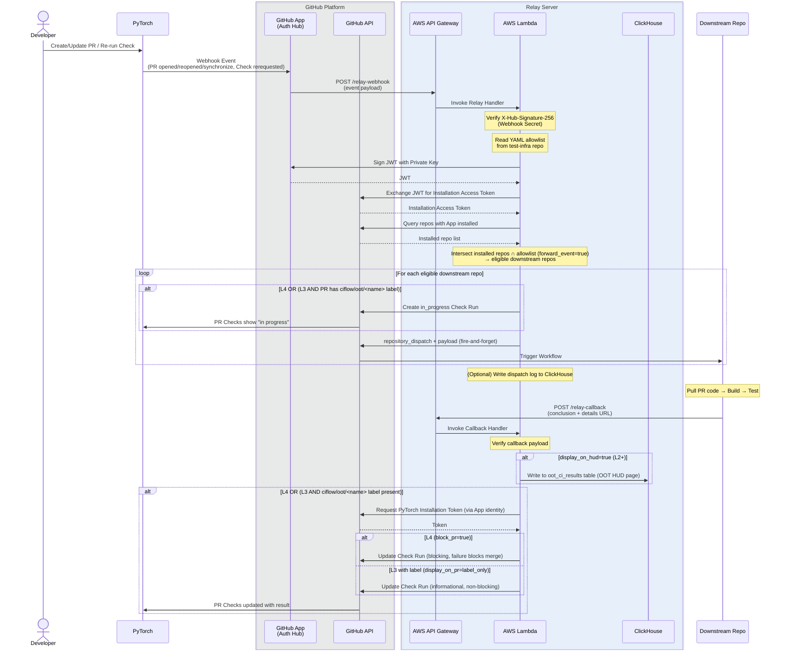
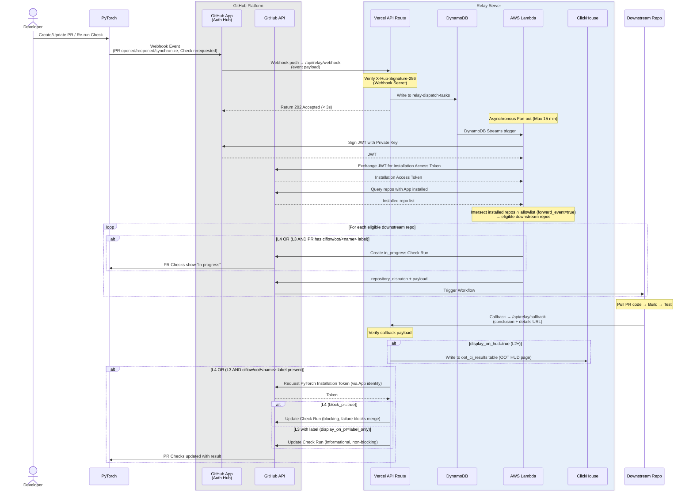

## Author

- @fffrog
- @can-gaa-hou
- @KarhouTam

## Abstract

This RFC proposes a cross-repo CI coordination mechanism based on a GitHub App and a Relay Server. The system allows specific events in the PyTorch repository to automatically trigger CI jobs in downstream repos. Based on configuration, results can optionally be reported back to the PyTorch PR check list or HUD, with support for hints, PR blocking, re-runs, and update notifications. This provides strong compatibility guarantees between PyTorch and its downstream repositories.

> \[!NOTE\]
> - This design does not guarantee 100% event delivery.
> - Each downstream repo that uses this mechanism is the primary owner of its own CI failures.

## Architecture

This design involves four core components:

- **GitHub App:** The authentication and decoupling hub. It declares required permissions, event subscriptions, and handles authorization.
- **PyTorch Repo:** The upstream event source. It authorizes external communication through the GitHub App.
- **Relay Server:** The core dispatcher. It handles Webhook events from GitHub and callback requests from downstream repos.
- **Downstream Repos:** The repos that actually run the tests (out-of-tree backend accelerator plugins).

The overall flow and component responsibilities are shown below:



## GitHub App

The GitHub App is the **authentication and decoupling hub** of the entire design. It plays three key roles:

- **Unified identity:** The Relay Server calls the GitHub API as the GitHub App identity (not a personal PAT). The permission lifecycle is independent of any personal account, making it secure and manageable.
- **Event bridge:** Through Webhook subscriptions, GitHub pushes PR events to the Relay Server in real time, driving the entire automation flow.
- **Upstream/downstream decoupling:** Downstream repos **only need to install this App to join the cross-repo CI coordination**. Downstream repos do not need an upstream token, and the upstream does not need to know about the downstream. All interactions are bridged through the GitHub App and Relay Server.

> \[!NOTE\]
> This GitHub App should be created under the `pytorch` organization and owned by the PyTorch team or the LF AI & Data Foundation team, to ensure credibility. An App created by a third party will face trust issues during installation and adoption.

### Permissions / Events

Following the principle of least privilege, the full set of permissions and event subscriptions required by the GitHub App is as follows:

#### Permissions

| Category | Permission | Level | Purpose |
| :--- | :--- | :--- | :--- |
| Repository | Actions | Read & Write | Re-run downstream CI workflows on demand; when a developer re-requests a Check Run on a GitHub PR page, the Relay Server can re-dispatch the OOT job |
| Repository | Checks | Read & Write | Create/update Check Runs on PyTorch PRs to relay downstream CI status and conclusions |
| Repository | Contents | Read & Write | Read repo content and config files; send `repository_dispatch` events to downstream repos to trigger CI workflows |
| Repository | Pull requests | Read-only | Read PR metadata (branch, SHA, author, etc.) to build the downstream payload |
| Repository | Metadata | Read-only | Required base permission for GitHub Apps |

#### Events

| Event | Purpose |
| :--- | :--- |
| Pull request | Trigger downstream CI when a PR is opened or reopened; clean up when a PR is closed |
| Check suite | Handle re-run requests for all Check Runs within a Check Suite |
| Check run | Handle re-run requests for a single Check Run |

### Key Configuration

| Config | Description |
| :--- | :--- |
| **Webhook URL** | The public endpoint of the Relay Server. GitHub pushes all subscribed events here. |
| **Webhook Secret** | A high-entropy random string. The Relay Server uses it to verify the request source and prevent forgery. |
| **Private Key** | Download the `.pem` file after creation. The Relay Server uses it to generate a JWT for calling the GitHub API. **Must be stored securely and never committed to a code repository.** |
| **Installation Scope** | Must be set to **"Any account"** (public installation). Downstream repos may belong to different organizations, and only a public installation can support cross-organization coordination. |

## PyTorch (Upstream)

### Installing the GitHub App

After the GitHub App is created, a PyTorch repo Maintainer opens the App installation link in a browser, selects the `PyTorch` repository, and confirms the installation.

### Reusable Actions

After a downstream repo receives the `repository_dispatch` event from the Relay Server, typical CI workflow steps are:

1. Pull the PyTorch PR source code based on PR info in the payload
2. Build PyTorch
3. Check out the downstream repo (using the existing `checkout` action)
4. Build the downstream plugin
5. Run tests
6. Report results to the Relay Server

**Step 1** and **Step 6** are common needs shared by all downstream repos, and the logic is identical. To avoid requiring downstream repos to understand the Relay Server integration details (such as callback URLs and auth tokens), and to standardize the result reporting format, this proposal suggests creating two reusable Actions in the PyTorch repo for all downstream repos to reference directly.

#### Action 1: `pytorch/.github/actions/checkout-pr`

Checks out the PyTorch PR source code into the downstream workspace, based on PR metadata (PR number, head SHA, head ref, etc.) in the `repository_dispatch` event payload. This Action encapsulates all the logic for checking out PyTorch code. Downstream repos can use it directly without parsing the payload or running git commands themselves.

#### Action 2: `pytorch/.github/actions/report-ci-result`

Called as the last step of the downstream CI workflow to report standardized execution results to the Relay Server. This Action defines a structured format with required fields (e.g., `conclusion`, `details_url`) and optional fields (e.g., `summary`), ensuring all downstream repos output consistent, machine-readable results. The Relay Server then decides, based on the allowlist policy, whether to report the result back to the PyTorch PR as a Check Run.

> \[!NOTE\]
> This structured data is the source for the downstream repo's dedicated HUD page. It can be dynamically extended based on downstream repo requirements, including run results, downstream CI infrastructure status, and more.

## Relay Server

The Relay Server is the core dispatcher. It handles two types of incoming requests and applies the allowlist policy:

1. **PR events from PyTorch** (Webhook push): Trigger CI in downstream repos
2. **Callbacks from downstream repos** (HTTP callback): Relay CI results back to the upstream PR

### Allowlist Policy

The allowlist is the core control mechanism of the Relay Server. It determines how deeply each downstream repo participates. The Relay Server maintains the following fields for each downstream repo (repos not explicitly configured use default values):

| Field | Type | Description | Default |
| :--- | :--- | :--- | :--- |
| `forward_event` | bool | Controls whether upstream PR events are forwarded to this downstream repo. Acts as a gate to prevent abuse from unauthorized large-scale installations. | `false` |
| `display_on_hud` | bool | Controls whether downstream CI results are shown on the dedicated OOT HUD page (`hud.pytorch.org/oot/[org]/[repo]`). | `false` |
| `display_on_pr` | string | Controls whether downstream CI results can be shown as a Check Run in the **PR Checks** list. <br/> **Options:** <br/> `always`, `label_only`, `false` | `false` |
| `block_pr` | bool | Controls whether the Check Run shown in **PR Checks** can block PR merges. | `false` |

Based on these four fields, four participation levels are defined:

| Level | forward_event | display_on_hud | display_on_pr | block_pr | Description |
| :--- | :--- | :--- | :--- | :--- | :--- |
| `L1` | `true` | `false` | `false` | `false` | Events are forwarded to downstream, but upstream receives no downstream feedback. |
| `L2` | `true` | `true` | `false` | `false` | Downstream results are shown on the dedicated HUD page by default. |
| `L3` | `true` | `true` | `label_only` | `false` | Adds a non-blocking Check Run for the device in PR Checks (only triggered when the `ciflow/oot/<name>` label is added). |
| `L4` | `true` | `true` | `always` | `true` | Adds a blocking Check Run for the device in PR Checks (auto-triggered for every PR); reserved for critical accelerators only. |

> \[!NOTE\]
> - Repos not listed in the allowlist YAML default to: no downstream CI triggered, no results forwarded, and no PR merges blocked.
> - For L3, the `ciflow/oot/<name>` label permission is enforced by the existing pytorchbot mechanism in PyTorch, which already prevents unauthorized users (non-PR authors or Maintainers) from adding `ciflow/oot/<name>` labels to a PR.

Level management is based on a YAML config file. Downstream repo developers who meet the requirements in the [Evolution Path](#evolution-path) section can submit a PR with supporting materials to modify this config file. Community Maintainers/TAC will review and merge it.

```yaml
L1:
    - org1/repo1
    - org2/repo2

L2:
    - org3/repo3

L3:
    - org4/repo4

L4:
    - org5/repo5: @oncall1,oncall2
```

### Evolution Path

The allowlist is designed to naturally support gradual progression from experimental participation to mature participation, downstream repos that meet the requirements can apply to advance level by level (L1 → L2 → L3 → L4). The table below lists the requirements for advancing to each level.

| Phase | Level | Requirements |
| :--- | :--- | :--- |
| **Onboarding** | `L1` | 1. GitHub App installed <br/> 2. Provide verifiable accelerator hardware information <br/> 3. Provide a downstream adaptation repo for the accelerator |
| **Observation** | `L2` | 1. Follow the standard [Workflow Configuration](#workflow-configuration) to receive events and report results <br/> 2. Must not send excessive or invalid requests to the Relay Server |
| **Stable** | `L3` | 1. CI infrastructure must keep job queue time under `X min` per workflow <br/> 2. CI infrastructure must keep total run time under `X hour` per PR <br/> 3. Weekly CI success rate > `X %` (including both infra failures and test failures) |
| **Mature** | `L4` | Fully determined by Core Maintainer, considering factors including but not limited to: <br/> - `community adoption`, <br/> - `hardware usage`, <br/> - `test coverage` (whether the PyTorch core test suite is required, @mikaylagawarecki), <br/> - `test pass rate`, <br/> - `oncall responsiveness`, etc. |

> \[!NOTE\]
> - The requirements above are an **initial reference** and may **be adjusted over time based on real-world conditions** (e.g., determining the specific values of `X`).
> - To maintain the PyTorch community's user experience, **downstream repos that no longer meet the requirements of their current level will be downgraded to the level that matches their actual status.**
> - `L3` is the recommended long-term target for most downstream repos, as it provides a good balance between signal depth and minimal negative impact on upstream.
> - `L4`: Only applies to a small number of downstream repos. Detailed requirements will be defined before any backend approaches the `L4` bar.

## Downstream Repos

### Installation

After the GitHub App is created, downstream repos that want to receive PyTorch PR events open the App installation link in a browser, select the target repo or organization, and confirm. This completes the downstream repo's authorization of the GitHub App.

### Relay Configuration

Downstream developers follow the requirements in the [Evolution Path](#evolution-path) section and submit a PR to the [test-infra](https://github.com/pytorch/test-infra) repo with supporting evidence (e.g., accelerator details, CI reliability metrics). After a community Maintainer reviews and merges it, the Relay Server will forward events according to the updated config.

### Workflow Configuration

Downstream backend CI workflows share a similar structure: pull upstream code, build, test, and report results. Below is a reference template showing the key steps. Each backend can add intermediate steps as needed.

```yaml
name: PyTorch CI

on:
  repository_dispatch:
    types: [pytorch-pr-trigger]

concurrency:
  group: upstream-pr-${{ github.event.client_payload.pr_number }}
  cancel-in-progress: true

jobs:
  upstream-ci:
    runs-on: [self-hosted]
    steps:

      # Step 1: Report the startup status to the relay server so that a check run with a status of "In Progress" can be created for the PR
      - name: Report startup to Relay Server
        uses: pytorch/actions/report-ci-result@v1
        if: always()  # Must report regardless of success or failure
        with:
          conclusion: ${{ job.status }}
          url: ${{ github.server_url }}/${{ github.repository }}/actions/runs/${{ github.run_id }}
          # other parameters...

      # Step 2: Check out PyTorch PR code
      - name: Checkout PyTorch PR
        uses: pytorch/actions/checkout-pr@v1
        with:
          head-sha: ${{ github.event.client_payload.head_sha }}
          path: pytorch  # Check out to ./pytorch directory

      # Step 3: Build PyTorch
      - name: Build PyTorch
        working-directory: pytorch
        run: |
          pip3 install -vvv --no-build-isolation -e . # Example only

      # Step 4: Check out downstream repo
      - name: Checkout downstream repo
        uses: actions/checkout@v4
        with:
          path: backend

      # Step 5: Build backend plugin
      - name: Build backend
        working-directory: backend
        run: |
          python setup.py develop

      # Step 6: Run tests
      - name: Test backend
        run: |
          pytest tests/

      # Step 7: Report results to Relay Server
      - name: Report CI result
        uses: pytorch/actions/report-ci-result@v1
        if: always()  # Must report regardless of success or failure
        with:
          conclusion: ${{ job.status }}
          url: ${{ github.server_url }}/${{ github.repository }}/actions/runs/${{ github.run_id }}
          # other parameters...
```

## HUD Integration

The PyTorch CI HUD (hud.pytorch.org) is a CI status dashboard maintained by the PyTorch team. It shows all CI job runs for every commit and PR. To minimize the impact of downstream repo results on the PyTorch HUD, this proposal introduces the following HUD integration strategy:

- **Dedicated OOT repo page (`hud.pytorch.org/oot/[org]/[repo]`):** Available from L2 onwards. Downstream CI results are shown on a dedicated page for the downstream repo. The layout is similar to the main HUD page, but focused only on the test history of a single downstream repo. It gives OOT Maintainers a self-service CI health dashboard without affecting any upstream views.
- **Global OOT CI summary page:** Primarily for PyTorch CI Maintainers. Provides a global view of OOT CI health across all repos. Makes it easy to spot widespread OOT infrastructure issues or identify repos that may need to be downgraded.
- **HUD PR view (`hud.pytorch.org/pr/<number>`):** For L3/L4 repos, OOT check results are displayed in the PR-level HUD view under a dedicated "Out-of-Tree Backends" section, grouped alongside standard CI results. This ensures developers and Maintainers can see OOT CI status in their normal PR review workflow without switching to a separate page.
- **Main HUD page:** Only shows `L4` (required) Check Runs, ensuring the main dashboard stays focused on signals that every PyTorch contributor needs to care about.

The Relay Server writes all results from `L2` and above into `ClickHouse`, which powers the dedicated OOT HUD pages described above.

## Alternative Architecture

The design described in the [Architecture](#architecture) section processes webhook events and downstream fan-out synchronously within a single Lambda invocation. While straightforward, this means that if the Lambda encounters a transient failure mid-dispatch (e.g., GitHub API rate limit spike, network timeout), some downstream repos may miss the event with no built-in retry mechanism. This RFC therefore proposes a more resilient alternative architecture:

The webhook handler only performs signature verification and task persistence (writing dispatch tasks to DynamoDB), returning a `202 Accepted` immediately. DynamoDB Streams then trigger separate Lambda invocations for asynchronous fan-out, providing built-in retry semantics, per-task isolation, and reliable at-least-once delivery to all eligible downstream repos.



## Demo

An end-to-end prototype has been completed. A few key points are noted below.

1. Upstream repo — Checks overview


- To avoid cluttering the PyTorch PR Checks page, the naming convention for Check Runs is defined as `oot / DEVICE / workflow detail`. With this naming, related checks are automatically grouped alphabetically in the UI.
- By configuring `concurrency` in the downstream workflow, when a PR is updated, the old Action is cancelled and a new one runs. The upstream Check Run is updated accordingly.

2. Upstream repo — Check Run details


- The right-hand detail panel can be customized to show the `downstream Action link`, `run result`, and `key errors` (can be extended later as needed).
- Clicking `Re-run` or `Re-run checks` will trigger the downstream Action to re-run, and the new result will automatically sync back to the upstream Check Run.

## Security Considerations

- **Webhook signature verification:** The Relay Server must verify the `X-Hub-Signature-256` header on every Webhook request to confirm the request comes from GitHub and prevent third-party event forgery.
- **Callback authentication:** When a downstream repo sends a callback result to the Relay Server, the server must verify the legitimacy of the request (e.g., validate the PR / Check Run ID in the payload) to prevent malicious repos from injecting fake CI results into upstream PRs.
- **Token expiry:** GitHub App Installation Access Tokens are valid for 1 hour. The Relay Server should request them on demand and discard them immediately after use, with no long-term caching, to minimize the impact window of a token leak.
