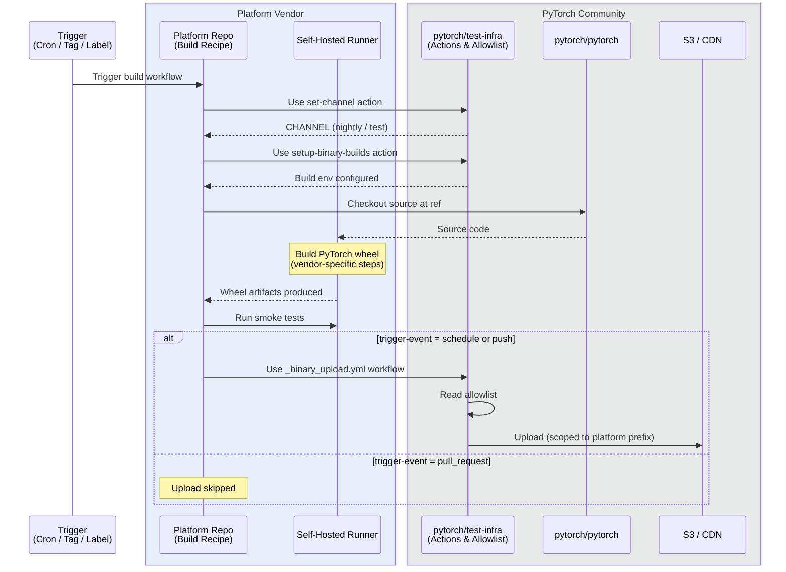

# Out-of-Tree Platform Build and Distribution

**Authors:**
* @afrittoli


## **Summary**

This RFC proposes a community-managed build and distribution system for out-of-tree compute platforms that have been admitted to the PyTorch ecosystem. Platform vendors own and operate their hardware and host their own build recipes; the platform-specific compilation steps are entirely vendor-controlled. This RFC proposes a standard packaging and publishing layer, with shared actions for wheel naming, provenance attestation, and CDN upload. The resulting pip wheels and libtorch C++ archives are published to community-managed infrastructure (download.pytorch.org), providing users with a consistent installation experience, giving the community CDN analytics to measure platform adoption, and establishing a shared security baseline for all distributed artifacts.


## **Motivation**

The [PyTorch Additional Compute Platforms Admission Process](https://docs.google.com/document/d/1np5twetOiefqfEMq5hvbKKC4T84qu7_vH0-QhWJc-m8/edit?tab=t.0#heading=h.festytgajtv1) defines how out-of-tree compute platforms can be listed on the PyTorch website. The admission requirements include binary installation options (pip/Conda), but leave the building, hosting, and maintenance of those binaries entirely to the platform vendor. This creates several problems:

**Fragmented user experience.** Each platform vendor hosts artifacts at its own URL, uses its own versioning scheme, publishes on its own cadence, and writes its own installation instructions. Users who want to try multiple platforms face an inconsistent patchwork of install commands and index URLs.

**No community visibility into adoption.** When artifacts are hosted on vendor infrastructure, the PyTorch community has no signal about how many users are actually running PyTorch on a given platform. CDN analytics are valuable for prioritizing investment in platform support.

**Inconsistent security posture.** There is currently no standard for artifact signing, provenance attestation, or responsible disclosure when platform-specific packages hosted under the pytorch.org domain contain vulnerabilities.

**Duplication of build infrastructure effort.** Each platform vendor independently reimplements the packaging and release pipeline that already exists for in-tree platforms. Out-of-tree platforms lack the infra access that first-party platforms (CUDA, ROCm) have, but should not need to reinvent the wheel entirely.

This RFC proposes a path that mirrors the philosophy of [RFC-0050 (Cross-Repository CI Relay)](RFC-0050-Cross-Repository-CI-Relay-for-PyTorch-Out-of-Tree-Backends.md): platform vendors own and control their build recipes, hardware, and build compute, while community infrastructure provides the connective tissue — a standard packaging and publishing layer, artifact storage, CDN delivery, and analytics.


## **Proposed Implementation**

> **Note:** All configuration examples, workflow templates, and YAML snippets in this section are illustrative drafts. They convey the intended design and interfaces but are subject to changes during implementation based on review feedback, evolving `pytorch/test-infra` conventions, and practical constraints discovered during integration.

### Scope

This RFC covers pip wheel packages (manylinux, macOS, Windows as applicable per platform) and libtorch C++ archives. Conda packages, Docker images, and any other platform-specific distribution formats are excluded.

### Architecture

The system spans components owned by the PyTorch community and by the platform vendor. All three build flows (nightly, release, on-demand) follow the same pipeline; they differ only in what triggers them and whether artifacts are published.

| Component | Owner | Responsibilities |
| :--- | :--- | :--- |
| `pytorch/pytorch` | PyTorch maintainers | Source code, release tags, nightly branch |
| `pytorch/test-infra` | PyTorch infra team | Allowlist, reusable actions/workflows, upload tooling, CDN config, credential provisioning |
| Platform repo | Platform vendor | Build recipe, build environment definition, platform-specific build logic |
| Platform runners | Platform vendor | Hardware provisioning, runner registration (repo-level or org-level), runner maintenance |
| S3 / CDN | PyTorch infra team | Storage, CDN delivery, access control, artifact lifecycle |
| Release notification | PyTorch infra team | Extension of RFC-0050 relay to handle release tag events and notify eligible platforms |

#### Build Flow

There are three types of build flows: on-demand, nightly, and release.

- **On-demand builds** are triggered by a `ciflow/oot-build/<platform-name>` label on a PyTorch PR (applied by maintainers or the PR author, enforced by pytorchbot) or by manual dispatch. They run the full pipeline but do not publish artifacts. Available to any admitted platform regardless of nightly/release status, making `admitted: true` the entry-level for participation.
- **Nightly builds** are cron-triggered daily from the platform repo. The branch nightlies build against depends on the platform's tracking mode: platforms tracking `main` build from the nightly branch; platforms on a specific release build from their latest supported release branch (e.g., `release/2.8`). Nightly artifacts are published to `download.pytorch.org/whl/nightly/<platform>/` and retained for a fixed window (see [Unresolved Questions](#unresolved-questions)).
- **Release builds** are triggered when PyTorch pushes a release tag, with the RFC-0050 relay filtering platforms by `latest_supported_release` (see [Participation Levels](#participation-levels)). Release artifacts are published to `download.pytorch.org/whl/<platform>/` and retained indefinitely within the 3-version window. Platform readiness does not block the main PyTorch release.

The three flows share the same pipeline and are all represented in the diagram below:



#### Platform Runners and Repository Layout

Build workflows run on vendor-owned self-hosted runners, following the same model as RFC-0050. The recommended approach is to use the same downstream repo for both CI (RFC-0050) and builds. For vendors who need separation, [org-level runner groups](https://docs.github.com/en/actions/hosting-your-own-runners/managing-self-hosted-runners/managing-access-to-self-hosted-runners-using-groups) allow the same hardware pool to serve multiple repos. Vendor runners must not be registered to PyTorch-owned repositories.

### Participation Levels

Access to community build infrastructure is gated by the [Additional Compute Platforms Admission Process](https://docs.google.com/document/d/1np5twetOiefqfEMq5hvbKKC4T84qu7_vH0-QhWJc-m8/edit?tab=t.0#heading=h.xj56c8flod4x). A compute platform must be admitted before it can use any level of community build infrastructure, including on-demand builds. Platform retirement (via the periodic review process defined in that document) triggers removal of build access and artifact cleanup.

This coupling means that the quality and governance bar for listing on the PyTorch website automatically applies to hosted builds. Platforms are not required to use community build infrastructure — they may continue to host artifacts themselves — but doing so is a benefit of admission.

A YAML allowlist in `pytorch/test-infra` (modeled on the allowlist introduced in RFC-0050) tracks each platform's participation level. The schema below is a draft; field names and structure may evolve during implementation:

```yaml
# pytorch/test-infra: .github/oot-builds/allowlist.yaml
platforms:
  example-vendor/torch-myplatform:
    admitted: true          # entry-level; enables on-demand builds; set via admission process
    nightly: true           # platform publishes nightly builds
    release: true           # platform publishes release builds
    storage_prefix: myplatform   # storage namespace on community CDN
    maintainers: "@example-vendor/pytorch-maintainers"  # GitHub team or handle(s); pinged on build failures and security notices
    latest_supported_release: "2.8"  # latest PyTorch release series this platform supports; omit if aligned to main
```

The three participation levels represent increasing commitment from both the platform vendor and the community:

- **Admitted** (`admitted: true`). The entry-level. The platform can trigger on-demand builds via `ciflow/oot-build/<name>` labels on PyTorch PRs. No artifacts are published. Requires a public build recipe and build environment definition in the platform repo, and self-hosted runners registered.
- **Nightly** (`nightly: true`). The platform publishes nightly builds to `download.pytorch.org`. Requires publishing infrastructure to be provisioned for this platform (OIDC role, S3 prefix, CDN path) and a working build recipe with passing smoke tests. The `nightly` flag can be enabled independently of `release`.
- **Release** (`release: true`). The platform publishes release builds to `download.pytorch.org`. This is a higher commitment than nightlies: release artifacts are retained indefinitely within the 3-version window and carry greater brand trust. Requires passing the qualification process (see below). The `release` flag can be enabled independently of `nightly`.

#### Release Series and Qualification

The `latest_supported_release` field tracks which PyTorch release series a platform currently supports. The release notification mechanism uses this field to determine which platforms to trigger:

- A new PyTorch release (e.g., 2.9.0) only triggers builds for platforms where `latest_supported_release` is `"2.9"` or is omitted (meaning the platform tracks `main` and is expected to support every new release).
- A patch release (e.g., 2.8.1) triggers builds for any platform where `latest_supported_release` is `"2.8"` or later.
- Platforms that lag behind (e.g., `latest_supported_release: "2.7"` when PyTorch is at 2.9) are only triggered for patch releases on 2.7.x and earlier series still within the 3-version window from the admission requirements.

When `latest_supported_release` is omitted, the platform is considered aligned to `main` — it receives triggers for every new release and patch release.

To update `latest_supported_release`, a platform must run qualification nightlies against the target branch, demonstrate a reasonable success rate over a qualification window (e.g., 2 weeks), then submit a PR to the allowlist with evidence. This provides a public, machine-readable signal of each platform's compatibility level.

#### Downgrade and Remediation

The `nightly` and `release` flags are independent and can be disabled separately based on a vendor's build health:

- A platform whose **nightly builds** remain broken for an extended period (e.g., more than 1 month) may have its `nightly` flag disabled. The platform's publishing infrastructure (OIDC role, S3 prefix) remains provisioned; the vendor can request re-enablement by demonstrating passing nightlies again.
- A platform whose **release builds** fail qualification or produce broken artifacts may have its `release` flag disabled independently of its nightly status.
- **Infrastructure revocation** (removing the OIDC role and S3 access entirely) is reserved for platform retirement, security incidents, or credential compromise — not for build health issues.


### Build Recipes (Out-of-Tree)

Platform vendors host their own build workflow definitions in their own repository. This is the same philosophical commitment as RFC-0050's out-of-tree CI job definitions: the platform team owns and controls the recipe, can iterate on it independently, and does not require a PyTorch maintainer to land changes to the build definition.

#### Build Environment Reproducibility

The build environment (VM image, container, or equivalent) used to produce artifacts must itself be publicly defined. Vendors must host the environment definition (e.g., a `Dockerfile`, a Packer template, or an equivalent recipe) in a public repository alongside the build workflow. This ensures that any party with access to the appropriate hardware can independently reproduce the build environment and verify the artifacts.

All build-time dependencies — including platform SDKs, compilers, and headers required to compile the wheel — must be publicly accessible for download. A dependency that requires an NDA, internal access, or purchase to obtain violates this requirement even if it is otherwise proprietary. Runtime-only dependencies (kernel drivers, firmware loaded at inference time) are out of scope here but must be disclosed as part of the platform admission process.

#### Recipe Interface

Recipes must conform to a standard interface so that PyTorch infra tooling can trigger, validate, and monitor them. The interface should align with the conventions already established in `pytorch/test-infra` for building and uploading wheels:

- **Channel detection**: The `set-channel` action (from `pytorch/test-infra`) derives the build channel (`nightly` or `test`) from the git ref (nightly branch → `nightly`; RC tags or release branches → `test`). Platform recipes should use this action rather than inventing a separate `build_type` parameter.
- **Build matrix**: Build parameters (Python versions, architectures) are provided as a JSON build matrix, consistent with `pytorch/test-infra`'s `generate_binary_build_matrix.yml` workflow.
- **Upload gating**: Whether artifacts are actually published is controlled by the `trigger-event` parameter (`schedule` or `push` → upload; `pull_request` → dry-run). This matches the existing `_binary_upload.yml` convention.
- **Artifact upload**: The existing `upload-artifact-s3` action handles S3 upload with configurable ACLs, prefixes, and SHA256 checksums.

The following reference template illustrates how a platform recipe would leverage existing test-infra tooling. This is a draft — the exact inputs, step ordering, and action versions will be refined during implementation:

```yaml
# In the platform repo: .github/workflows/pytorch-build.yml
name: PyTorch Platform Build

on:
  workflow_call:
    inputs:
      repository:
        required: true
        type: string
        description: "Platform repository (e.g., example-vendor/torch-myplatform)"
      ref:
        required: true
        type: string
        description: "Git ref to build against (branch, tag, or SHA)"
        default: "nightly"
      build-matrix:
        required: true
        type: string
        description: "JSON build matrix (python_version, arch, etc.)"
      trigger-event:
        required: true
        type: string
        description: "schedule | push | pull_request — controls upload behavior"

jobs:
  build:
    strategy:
      matrix: ${{ fromJson(inputs.build-matrix) }}
    runs-on: [self-hosted, <platform-runner>]
    steps:
      # Step 1: Determine channel from git ref
      - name: Set channel
        uses: pytorch/test-infra/.github/actions/set-channel@main

      # Step 2: Setup build environment
      - name: Setup binary build
        uses: pytorch/test-infra/.github/actions/setup-binary-builds@main
        with:
          repository: ${{ inputs.repository }}
          ref: ${{ inputs.ref }}
          python-version: ${{ matrix.python_version }}
          cuda-version: ""  # platform-specific; not CUDA
          arch: ${{ matrix.arch }}

      # Step 3: Build PyTorch with platform support (vendor-specific)
      - name: Build torch wheel
        run: |
          # Platform-specific build invocation — this step is entirely vendor-controlled
          python setup.py bdist_wheel

      # Step 4: Run smoke tests
      - name: Smoke test
        run: |
          pip install dist/*.whl
          python -c "import torch; print(torch.myplatform.is_available())"

  upload:
    needs: build
    if: ${{ inputs.trigger-event == 'schedule' || inputs.trigger-event == 'push' }}
    # Upload goes through the official _binary_upload.yml workflow.
    # No secrets: inherit — authentication uses OIDC (see Credentials section).
    uses: pytorch/test-infra/.github/workflows/_binary_upload.yml@main
    with:
      repository: ${{ inputs.repository }}
      ref: ${{ inputs.ref }}
      build-matrix: ${{ inputs.build-matrix }}
      trigger-event: ${{ inputs.trigger-event }}
      iam-role: arn:aws:iam::<pytorch-account>:role/oot-build-myplatform
      storage-prefix: myplatform
```

Some aspects of this integration require new work:
- Extending `_binary_upload.yml` to accept an `iam-role` input and authenticate via OIDC instead of long-lived secrets.
- Extending `_binary_upload.yml` to accept a `storage-prefix` input to scope uploads to the platform's CDN namespace.
- Extending `setup-binary-builds` to support platform identifiers beyond the current `cuda-version` / `gpu_arch_type` parameters.
- Extending `generate_binary_build_matrix.py` to generate matrices for out-of-tree platforms (or allowing platforms to provide their own matrix).

#### Naming Conventions

Artifact file names must follow the existing PyTorch wheel naming convention extended with a platform suffix:

```
torch-2.8.0+myplatform-cp311-cp311-manylinux_2_28_x86_64.whl
libtorch-cxx11-abi-shared-with-deps-2.8.0+myplatform.zip
```

The `+myplatform` local version identifier (analogous to the existing `+cu126` or `+rocm7.1` suffixes) ensures pip does not confuse platform-specific wheels with official CUDA/CPU builds. The artifact naming for GitHub Actions and S3 paths follows the existing convention: `{repository}_{ref}_{python_version}_{platform_version}_{arch}`.

#### Recipe Requirements

- Recipes must be publicly accessible in the platform repository (no private forks)
- Recipes must not embed proprietary logic that prevents reproducibility verification
- Recipes should use the existing `pytorch/test-infra` actions and workflows where applicable, rather than reimplementing upload or channel-detection logic
- Changes to the recipe interface are managed upstream in `pytorch/test-infra`


### Artifact Hosting

Two options are presented for community discussion. Both keep artifacts on community-managed infrastructure, which is a core requirement of this RFC (vendor-hosted alternatives are covered in the [Alternatives](#alternatives) section). From the user's perspective, the install URL is the same regardless of which option is chosen:

```
# Nightly
pip install torch --pre --extra-index-url https://download.pytorch.org/whl/nightly/myplatform/

# Release
pip install torch --extra-index-url https://download.pytorch.org/whl/myplatform/
```

| | Option A: Shared S3 with per-platform prefix | Option B: Per-platform S3 buckets |
| :--- | :--- | :--- |
| **Storage model** | Single bucket, per-platform prefix (`s3://pytorch/whl/myplatform/`) | Dedicated bucket per platform (`s3://pytorch-builds-myplatform/`) |
| **Isolation** | IAM prefix policies only | AWS bucket boundary |
| **Revocation** | Remove IAM permissions | Block or delete the bucket |
| **Cost attribution** | Requires additional tooling (S3 Storage Lens, per-prefix metrics) | Native per-bucket billing |
| **Operational overhead** | Lower; no additional buckets or CDN origins | Higher; more buckets and CDN origin configs to manage |
| **Risk** | Misconfigured policy could allow cross-platform overwrites | Stronger isolation by default |


### Credentials and Publishing Access

#### Recommended: OIDC Federation via `_binary_upload.yml`

The recommended credential model uses GitHub Actions OIDC federation, with authentication handled inside the `_binary_upload.yml` reusable workflow from `pytorch/test-infra`. No long-lived secrets are stored in the platform vendor's repository.

When a vendor's build workflow calls `_binary_upload.yml`, GitHub Actions makes an OIDC token available. The token's `sub` claim identifies the calling repo and ref (e.g., `repo:vendor/torch-myplatform:ref:refs/heads/main`). Inside `_binary_upload.yml`, the OIDC token is exchanged for short-lived AWS credentials scoped to the platform's storage prefix.

The IAM role's trust policy validates the `sub` claim, ensuring that only the approved vendor repo can assume the role. A draft trust policy (illustrative; actual configuration will depend on PyTorch infra team's AWS setup):

```json
{
  "Version": "2012-10-17",
  "Statement": [{
    "Effect": "Allow",
    "Principal": {
      "Federated": "arn:aws:iam::<pytorch-account>:oidc-provider/token.actions.githubusercontent.com"
    },
    "Action": "sts:AssumeRoleWithWebIdentity",
    "Condition": {
      "StringEquals": {
        "token.actions.githubusercontent.com:sub": "repo:vendor/torch-myplatform:ref:refs/heads/main",
        "token.actions.githubusercontent.com:aud": "sts.amazonaws.com"
      }
    }
  }]
}
```

> **Desirable but subject to verification:** The GitHub OIDC token also carries a `job_workflow_ref` claim that identifies the reusable workflow being called (e.g., `pytorch/test-infra/.github/workflows/_binary_upload.yml@main`). If AWS IAM supports conditioning on this claim, the trust policy could enforce a dual-gate: uploads must come from the approved vendor repo **and** go through the official `_binary_upload.yml`. This would prevent a vendor from bypassing the upload workflow to skip validation or provenance steps. Whether this claim is directly usable as an AWS IAM condition key, or whether it requires customizing the GitHub OIDC `sub` claim format (supported at the org level), needs to be confirmed during implementation.

The IAM permission policy on the role restricts `s3:PutObject` to the platform's storage prefix only.

**Advantages:**
- No long-lived secrets stored anywhere — credentials are short-lived and automatically expire.
- Trust policy scopes uploads to the approved vendor repo. If the dual-gate on `job_workflow_ref` can be confirmed, uploads would additionally be restricted to the official `_binary_upload.yml` workflow, preventing vendors from bypassing validation or provenance steps.
- Easy to audit via AWS CloudTrail — every upload is logged with the OIDC identity.
- Revocation is immediate: delete or disable the IAM role.

**Disadvantages:**
- Requires IAM role provisioning by PyTorch infra for each admitted platform (one-time setup).
- Platforms using non-GitHub CI would need an equivalent OIDC flow or the fallback mechanism below.

#### Fallback: Scoped IAM Keys

For platforms that cannot use GitHub Actions OIDC (e.g., CI running on a non-GitHub platform), PyTorch infra can issue per-platform IAM access keys scoped to the platform's storage prefix. These are stored as encrypted secrets in the platform's repository.

**Advantages:** Works with any CI system; simpler setup.
**Disadvantages:** Long-lived secrets that must be rotated; if a platform repo is compromised, the key must be revoked manually; no guarantee that uploads go through the official workflow.


### Security

#### Package Signing and Provenance

For out-of-tree platforms — where users are installing third-party builds from a trusted domain — provenance is particularly important for establishing trust. This section describes the target state once Stage 3 of the [Implementation Plan](#implementation-plan) is complete; it is not a requirement for initial publishing.

Once provenance support is implemented, all artifacts published through community infrastructure will be accompanied by SLSA provenance attestations. The provenance attestation records the repository, ref, workflow, and build environment that produced the artifact, and is stored alongside the artifact on the CDN. Provenance generation will be integrated into `_binary_upload.yml` so that it runs as part of the official upload workflow, not in the vendor's build steps — this ensures provenance cannot be omitted or tampered with. Provenance will be mandatory for all platforms publishing builds (nightly or release).

Optionally, wheel files may be signed using [sigstore](https://sigstore.dev/) (`.sigstore` bundles). This is consistent with PEP 740 (in-toto attestations for PyPI) and the direction of the Python packaging ecosystem. Once available, consumers will be able to verify provenance using standard SLSA tooling.

When provenance tooling is implemented, it is expected to be adopted for both in-tree and out-of-tree builds.

#### Supply Chain Isolation

Each platform operates in an isolated lane:

- **Credential isolation**: Each platform has a dedicated IAM role that can only write to that platform's storage prefix. OIDC trust policies scope the role to the specific vendor repo. A compromised vendor repo cannot access another platform's storage or the main PyTorch artifact space.
- **Upload workflow isolation**: Uploads go through the official `_binary_upload.yml` workflow, which enforces naming conventions before writing to S3. Once [Stage 3](#implementation-plan) is complete, this workflow also generates provenance attestations. If the `job_workflow_ref` dual-gate can be confirmed (see [Credentials and Publishing Access](#credentials-and-publishing-access)), vendors cannot bypass this workflow even with valid OIDC credentials.
- **Build environment isolation**: Platform builds run on platform-owned self-hosted runners registered to the vendor's own repo (see [Platform Runners and Repository Layout](#platform-runners-and-repository-layout)). No vendor runners are attached to PyTorch-owned repositories.
- **Naming isolation**: The `+<platform>` local version identifier prevents pip from selecting a platform wheel when the user did not request it.

A compromised platform build cannot affect official PyTorch packages or other platform builds.

#### Vulnerability Disclosure

Platform vendors are responsible for security vulnerabilities in their platform-specific code. When a vulnerability affects packages hosted at `download.pytorch.org`, the following process applies:

1. Vendor discloses the vulnerability to the PyTorch security team at security@pytorch.org (or equivalent) within 7 days of discovery.
2. PyTorch infra can yank (remove from the CDN index without deleting) the affected artifacts while a fix is prepared.
3. The vendor publishes a patched build; once verified, it is published to the CDN.
4. Public disclosure follows a coordinated timeline agreed between the vendor and the PyTorch security team.

Failure to follow responsible disclosure may result in immediate credential revocation.

#### Credential Monitoring and Revocation

Since all uploads go through the `_binary_upload.yml` reusable workflow, each publish operation has a corresponding GitHub Actions workflow run that records the triggering repo, ref, actor, and trigger event. This provides a built-in audit trail for all published artifacts. Optionally, AWS CloudTrail can be enabled on the S3 bucket to add a second layer of audit logging at the storage level, capturing the OIDC identity of each upload request independently of GitHub's logs.

Credentials are revoked by deleting or disabling the platform's IAM role:
- When a platform is retired from the admission list
- On detection of credential abuse or compromise
- On request from the platform vendor

For platforms using the scoped IAM keys fallback, revocation means deactivating the access key. This is less auditable than OIDC role deletion, which is another reason OIDC is the recommended model.


### Impact on Users

With community-hosted builds, installation instructions for all admitted platforms follow the same pattern:

```bash
# Nightly
pip install torch --pre --extra-index-url https://download.pytorch.org/whl/nightly/<platform>/

# Stable release
pip install torch --extra-index-url https://download.pytorch.org/whl/<platform>/
```

PyTorch's `get-started` page can list all admitted platforms in a uniform table with a single install command per platform, rather than sending users to disparate vendor documentation.

libtorch archives follow the same CDN path structure:

```
https://download.pytorch.org/libtorch/<platform>/libtorch-cxx11-abi-shared-with-deps-2.8.0%2Bmyplatform.zip
```


### Impact on Infra Maintainers

The system is designed to minimize ongoing infra burden. Per-platform setup is a one-time cost; day-to-day operations are largely automated.

- **IAM role provisioning**: For each admitted platform, create an OIDC-federated IAM role scoped to the platform's storage prefix. Credentials are provisioned on the fly via OIDC, so no secrets need to be managed.
- **Storage namespace management**: Create and configure the per-platform storage prefix (ACLs, lifecycle policies for nightly pruning).
- **CDN configuration**: Add per-platform origin paths to the CDN distribution.
- **Build monitoring**: Monitor nightly build success rates across platforms; notify platforms whose builds remain broken (see [Downgrade and Remediation](#downgrade-and-remediation)).
- **Security response**: Act as the first contact for platform-specific vulnerability disclosures affecting pytorch.org-hosted artifacts.
- **Retirement cleanup**: On platform retirement, disable the IAM role, remove artifacts from the CDN index, and update the allowlist.

Per-platform setup is estimated at a few hours of infra engineer time. Ongoing maintenance is expected to be low for compliant platforms, with occasional intervention for security incidents or build health downgrades.


### Implementation Plan

The technical implementation of this RFC will proceed in stages. Each stage builds on the previous one and delivers a usable capability:

| Stage | What is built | What it enables |
| :--- | :--- | :--- |
| **Stage 1 — On-demand builds** | Reusable workflow in `pytorch/test-infra` for triggering and monitoring on-demand builds. Allowlist enforcement in place. | Admitted platforms can trigger builds via `ciflow/oot-build/<name>` labels on PyTorch PRs to validate their build recipes. No artifacts are published. |
| **Stage 2 — Nightly and release publishing** | OIDC federation and IAM role provisioning process established. `_binary_upload.yml` extended to support platform-scoped uploads. CDN configuration for per-platform paths. | Platforms with `nightly` or `release` enabled in the allowlist can publish artifacts to `download.pytorch.org`. |
| **Stage 3 — Provenance and verification** | SLSA provenance attestation generation integrated into `_binary_upload.yml`. Optional sigstore signing support. | All published artifacts are accompanied by provenance attestations. Once implemented, provenance is mandatory for all platforms publishing builds (nightly or release). |

> **Note:** Package signing and provenance attestations do not currently exist for in-tree PyTorch packages (CUDA, ROCm, etc.). Stage 3 will be implemented once the provenance tooling is integrated into `_binary_upload.yml`. When provenance support is available, it is expected to be adopted for both in-tree and out-of-tree builds.


## **Metrics**

The following metrics measure whether this RFC is achieving its goals of improving user experience, community visibility, and ecosystem health:

- **Platform coverage**: Percentage of admitted platforms that have active nightly builds published to community CDN. Measures adoption of the community build system by platform vendors.
- **CDN adoption**: Download counts per platform per version, as reported by CDN analytics. Measures whether users are finding and using the community-hosted artifacts, which directly addresses the motivation of providing community visibility into platform adoption.


## **Drawbacks**

**Additional infra scope.** PyTorch infra takes on per-platform setup (IAM roles, storage prefixes, CDN paths). The system is designed to keep this minimal and one-time, but it does grow with the number of admitted platforms.

**Expanded security surface.** Hosting platform artifacts at `download.pytorch.org` extends PyTorch brand trust to vendor build systems. The supply-chain isolation measures mitigate this, but the association exists.

## **Alternatives**

### Status Quo: Vendor-Hosted Artifacts

Each platform vendor continues to build and host artifacts independently. This requires no new infra from PyTorch and leaves platform vendors fully in control. The downsides are precisely the motivation for this RFC: fragmented UX, no community analytics, no shared security baseline.

### Full In-Tree Build Management

PyTorch infra builds platform-specific artifacts directly, using the existing build workflows in `pytorch/pytorch` and `pytorch/test-infra`. This provides the highest quality guarantee but requires platform-specific build expertise and hardware access within the PyTorch CI, which is impractical for a growing ecosystem of diverse hardware.

### Package Registry / Index Only

PyTorch maintains a registry that maps platform names to vendor-provided PEP 503 simple index URLs. This is a lightweight option with no hosting burden, but provides no CDN analytics and no consistent security posture, and users must trust vendor infrastructure.


## **Prior Art**

### CUDA and ROCm (in-tree)

The existing in-tree build pipeline uses reusable workflows and actions in `pytorch/test-infra` to produce pip wheels and libtorch archives for CUDA, ROCm, and XPU, hosted at `download.pytorch.org`. In-tree platforms have direct access to PyTorch CI resources and maintainer bandwidth; out-of-tree platforms currently lack equivalent infrastructure, which is the gap this RFC addresses.

### RFC-0050: Cross-Repository CI Relay

RFC-0050 established the precedent for out-of-tree repositories owning their CI job definitions while connecting to PyTorch community infrastructure for event routing and result reporting. This RFC extends that philosophy to build and distribution: platform vendors own their build recipes; community infrastructure provides the publishing pipeline, artifact storage, and CDN delivery.

### PyPI and pip Trusted Publishing

[PyPI's Trusted Publishing](https://docs.pypi.org/trusted-publishers/) (OIDC-based, no long-lived secrets) and SLSA provenance for packages are the direction of the Python packaging ecosystem. This RFC's recommended credential model (OIDC federation) and provenance requirements align with these standards.


## **How We Teach This**

**For platform vendors seeking to participate:**
The `pytorch/test-infra` repository will contain documentation covering: how to write a compliant build recipe, how to request admission to the build program, and how credentials are provisioned. A reference recipe template (analogous to RFC-0050's workflow configuration template) will be provided.

**For users:**
The `pytorch.org/get-started` page will be updated to include a table of admitted platforms with uniform install commands. The install pattern (`--extra-index-url https://download.pytorch.org/whl/<platform>/`) is already familiar to users who install nightly PyTorch builds.

**For PyTorch contributors and infra team:**
The allowlist YAML in `pytorch/test-infra` is the authoritative source of truth for which platforms are admitted and what their configuration is. Monitoring dashboards (similar to hud.pytorch.org for CI) will surface per-platform nightly build health.


## **Unresolved Questions**

*To be resolved through the RFC process:*
- Which artifact hosting model (Options A or B) should be adopted? Is Option A's simplicity worth the shared-bucket risk, or does the community prefer the stronger isolation of Option B?
- Is OIDC federation the right default credential model? Are there admitted platforms that would require the scoped IAM keys fallback, and if so, what additional safeguards should apply?
- Should a healthy nightly build be a prerequisite for release builds? If a platform's `nightly` flag is disabled due to persistent build failures, should its `release` flag also be disabled, or can a platform maintain release qualification independently? This should be verified with the release manager.

*To be resolved during implementation:*
- What extensions are needed to `pytorch/test-infra` actions and workflows to support out-of-tree platforms? At minimum: extending `setup-binary-builds` to accept a platform identifier beyond `cuda-version`, extending `_binary_upload.yml` to support OIDC and platform-scoped S3 prefixes, and potentially extending `generate_binary_build_matrix.py` to generate matrices for platform builds.
- Release build re-triggering: When an automated release build fails, who can re-trigger it? If only the PyTorch infra team can re-trigger, they retain control over when releases are published but take on more operational load. If platform owners can self-trigger (e.g., via `workflow_dispatch`), they gain independence but releases may happen without the infra team's awareness.
- Nightly artifact retention window (proposed: 90 days, consistent with existing PyTorch nightly retention).
- Whether on-demand label builds require the platform to be at RFC-0050 L1 (CI relay) or higher, or whether build access is independent of CI relay participation.
- Exact SLSA provenance level to target (L1 is straightforward; L2 requires a hosted build; L3 requires a hardened build environment).


## Resolution

_This RFC is under discussion. No decision has been reached._

### Level of Support

_TBD_

### Next Steps

_TBD_

#### Tracking issue

_TBD_
