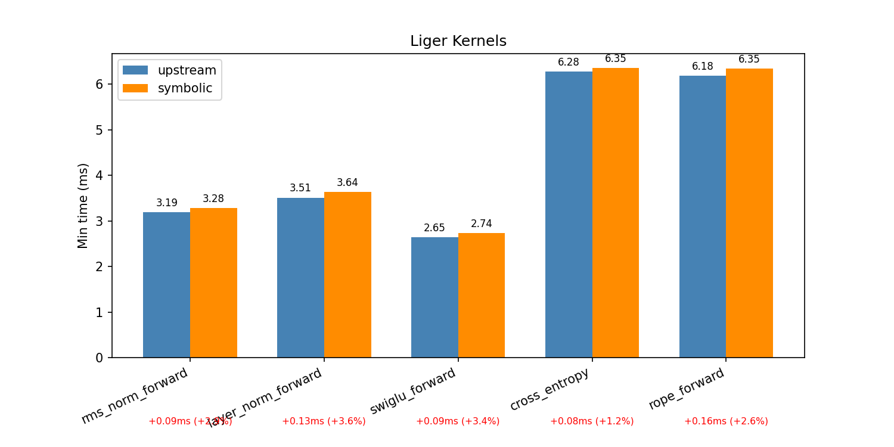
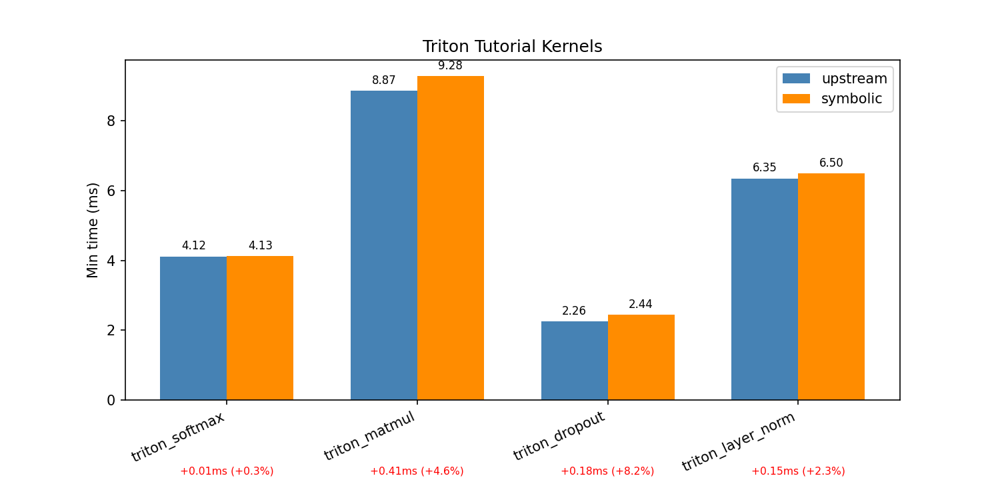

# Broaden Coverage of Fusion for User-Defined Triton Kernels 

Author:

* Joshua James Venter (@jjvraw)

## **Summary**

Recently, support for user-defined kernel fusion in TorchInductor was added. 
Current fusion legality checks are intentionally conservative. In turn, many 
common operator patterns are rejected. Some of these restrictions may be relaxed
with incremental changes, while others require more substantial implementation. 
For the latter, the approach is to extract index expressions with minimal 
compilation overhead of custom kernels to reason about fusion more formally. 

The broad goal is to allow user-defined kernels to be reused as part of different
compositions, rather than authoring many fused variants for each. When surrounding
pointwise operations are left out of the kernel, Inductor can fuse them at compile 
time, while the user retains explicit schedule control over the kernel's core computation.

This RFC proposes a roadmap to incrementally broaden the coverage of fusion cases, and may
serve as a tracker as the work progresses.

## **Background**

Currently, user-defined kernel fusion is supported under the following conditions
([#173662](https://github.com/pytorch/pytorch/pull/173662/changes)):

1. The user-kernel’s mutated / output buffer must operate on an empty tensor.
    - The said buffer must be a non-atomic, single write-only buffer within the kernel body.
2. The user-kernel must only have one output.
3. The intermediary buffer layout must be equal.
4. The epilogue must be a unary pointwise operation, registered as a `SchedulerNode` in the scheduler.
5. The epilogue cannot introduce any additional load expressions.
6. Sanity checks for removing the intermediate buffer must be met.
    - i.e. No other references to said buffer.

Condition (4) implies (5), but (5) covers separate cases such as:
```python
user_kernel[GRID](out, …)
torch.tril(out)
```

Constraining the user kernel's fusion legality to empty tensors eliminates the need 
to reason about index equality between the two kernels. When the epilogue inherits the
user kernel’s schedule, any unwritten inbound memory remains undefined after the epilogue.
Correctness then holds by the semantics of epilogue(UB) = UB . That is, while this may 
introduce numerical differences between eager and compiled execution, such differences are
a consequence of undefined behaviour in the user’s code.

Together this covers the common pattern:
```python
def kernel_wrapper(input_1, ...):
    single_out = torch.empty(...) # or torch.empty_like(...)
    ...
    kernel[GRID](input_1, ..., single_out, ...)
    return out
```

## **Motivation**
It is given that Triton kernels are used to optimise specific parts of a model’s computation,
either because generated kernels may be less efficient for a given operation, and/or to explicitly
control how operations are grouped/fused, rather than relying on torch.compile fusion heuristics.
The latter targets memory-bound operations. It follows that the user is then aware of the model's
compute profile and intentionally authors appropriate pre-fused kernels. However, in the case of 
shared layer implementations, as seen in inference and training libraries, the assumption of a
known compute profile no longer exists. As a result, varied composed custom kernels are authored,
sacrificing cross-operator fusion unless the conditions above are met.

For reference, among the inference serving libraries [vLLM](https://github.com/vllm-project/vllm)
and [SGLang](https://github.com/sgl-project/sglang), there are recent parallel discussions
addressing tension between compiling a model with external kernels and delegating kernel 
generation to Inductor:

- **vLLM**
  - [#24629](https://github.com/vllm-project/vllm/issues/24629) - Observation that custom op boundaries 
  are too coarse, fusing cheaper pointwise ops (quants, RMSNorm) alongside heavy kernels (GEMM, attention),
  causing missed fusions at the boundary. The solution is to expose these cheaper ops to the compiler and
  either let Inductor handle fusion or pattern-match specific cases via a custom pass to a pre-fused kernel
  variants.
    - [Fusion `torch.compile` passes (docs)](https://docs.vllm.ai/en/stable/design/fusions/) - *“Model authors
    write declarative, modular code that focuses on correctness... rather than rewriting the models, vLLM
    custom passes rewrite the torch.fx graph.”*
    - [#36066](https://github.com/vllm-project/vllm/issues/36066) - Corresponding issue tracker.
  - https://github.com/vllm-project/vllm/issues/25179
  - https://github.com/vllm-project/vllm/issues/32358
- **SGLang**
  - [#21855](https://github.com/sgl-project/sglang/issues/21855) - Similar observation as vLLM: hand-written kernels
  for memory-bound ops prevent cross-operator fusion, but propose an opposite approach. Rather than building compiler
  passes around existing custom kernels, the proposed solution is to replace them entirely with Inductor-generated
  fusions via an opt-in flag. The argument is that these are competitive with their hand-written counterparts,
  and offer a more maintainable path forward.
  - [#10118](https://github.com/sgl-project/sglang/issues/10118) - Promotes a custom fusion pass, similar to vLLM.

Both converge to similar solutions of unwrapping pre-fused compute-bound kernels, exposing
memory-bound ops to Inductor, and using a custom fusion pass for the remaining patterns.
As Inductor-generated kernels become competitive for more patterns (the recent work done on
RMSNorm being one example [blog](https://pytorch.org/blog/sota-normalization-performance-with-torch-compile/))
this is increasingly a viable path. Broadening fusion coverage for user-defined kernels is 
a complementary alternative, for cases where the user wants to remain in control of the kernel's
schedule without paying for it in many fused variants.


The following cases are currently not supported:

- Multi-output user kernels
    - Any kernel writing multiple buffers, including forward kernels that
    write to intermediate results to HBM for backwards pass.
- In-place user kernels
    - Kernels whose output depends on defined values in the output
    buffer, such as RoPE.
- Non-unary pointwise epilogues / Additional load expressions
- Prologue pointwise
- Reduction epilogues
    - The canonical example being per-token / per-channel quant following a 
    normalisation kernel.


## **Proposed Implementation and Timeline**

The strategy is to incrementally broaden fusion cases.

### **Multi-Output User Kernel**
Registering a user kernel in the compute graph relies on two representations of the user kernel.
For buffer mutation tracking, the TTIR representation is flattened into a linear def-use chain,
then a simple upward traversal from read/write sinks to the kernel’s parameters is performed.
The Python AST of the kernel’s source is traversed both during initialisation and code generation
to locate all `tl.store` expressions. All downstream logic (legality checks, code generation) is
predicated on a single mutated buffer.

Several changes are required to relax this. In the scheduler, the mutated buffer can no longer
be assumed. It must be resolved per fusion-pair candidate, as the intersection of the user kernel’s
writes and the epilogue’s reads. Fusion legality checks and intermediate buffer pruning must then
be operated on this resolved buffer. On the AST side, the single `tl.store` restriction can be lifted,
and the empty-tensor check must be deferred until the target buffer is known. During code generation,
each `tl.store` node must be attributed to its corresponding buffer so that the correct store 
is rewritten with the fused epilogue’s variable.

Resolving the intermediate buffer of fusion candidates is straightforward. However, bridging the output
buffer to the correct `tl.store` AST node is slightly more involved. During TTIR parsing, we may 
retrieve the line number of each `tl.store` from Triton’s MLIR bindings. Then, during the upward
traversal, we attach it to a new dependency type, `UserTritonDep`, in place of `StarDep`. Finally,
during code generation, the line number serves as the canonical reference between the resolved
buffer’s `UserTritonDep` and its corresponding AST node, allowing the correct `tl.store` to be 
located and rewritten.

In summary, all fusion-specific legality checks are deferred from initialisation to scheduling, where the
fusion candidate pair is known. AST manipulation is deferred to code generation, where it is performed
if fusion proceeds.

> There may be opinions about removing AST parsing/unparsing entirely. My initial implementation of
user-kernel fusion (prior to what's been landed) did not rely on AST and instead involved string
manipulation of the kernel source, which may be less stable.

### **Multiple Epilogue Operations**
In the case of an epilogue representated as multiple `SchedulerNode`s or a `FusedSchedulerNode`,
the initialisation of `FusedExternTritonKernelSchedulerNode` needs to be refactored for either case.
Currently, `FusedExternTritonKernelSchedulerNode` only holds a single `SchedulerNode` as reference
to the epilogue.

It is unlikely (TODO: be more precise here) that more than one `SchedulerNode` composes pointwise epilogue operations.
However, to support prologue and non-pointwise, dicussed later, this refactor is necessary.

TODO: Code-generation


### **Symbolic Analysis**
Lifting certain constraints, namely the UB restriction (empty tensor), non-unary, pointwise
and epilogue only, requires reasoning about the kernel configuration and/or the iteration
space.

Draft PR [#179149](https://github.com/pytorch/pytorch/pull/179149/changes) offers a
potential solution. That is, to extract the index expression in terms of the kernel's
configuration. As a tractable example, for the following kernel,

```python
@triton.jit
def vec_add_kernel(
    a_ptr, b_ptr, out_ptr, N,
    BLOCK_SIZE: tl.constexpr,
):
    pid = tl.program_id(0)
    offset = pid * BLOCK_SIZE + tl.arange(0, BLOCK_SIZE)
    mask = offset < N

    a = tl.load(a_ptr + offset, mask=mask)
    b = tl.load(b_ptr + offset, mask=mask)

    tl.store(out_ptr + offset, a + b, mask=mask)
```

We may extract the following:

```python
# Reads
[
    UserTritonDep(
        name="a_ptr",
        index=i0 * BLOCK_SIZE + i1,
        var_names=(i0, i1),
        size=(GRID[0], BLOCK_SIZE),
    ),
    UserTritonDep(
        name="b_ptr",
        index=i0 * BLOCK_SIZE + i1,
        var_names=(i0, i1),
        size=(GRID[0], BLOCK_SIZE),
    ),
]
# Writes
[
    UserTritonDep(
        name="out_ptr",
        index=i0 * BLOCK_SIZE + i1,
        var_names=(i0, i1),
        size=(GRID[0], BLOCK_SIZE),
    ),
],
```
where the `GRID`, `BLOCK_SIZE` is resolved at compile time.

At a high level, we recurse through the flattened TTIR building the index expression
while encountering pointer arithmetic operations. We mint symbols when encountering
appropriate leaves (`tt.get_program_id`, `tt.make_range`). A recursion cache is
maintained, keying on both the operation's index and the current "shape". This memoises the
traversal, but more importantly provides semantics for our iteration symbols/bounds.
When encountering a shape-context op (e.g. `tt.expand_dims`, `tt.broadcast`, `tt.reshape`)
the shape key changes, allowing a new axis/symbol bound to be minted.
For loop-carried pointer arithmetic, expression simplifications and the full implementation
ill defer to the [PR's description](https://github.com/pytorch/pytorch/pull/179149#issue-4195425124).


As a measure of the added compilation overhead, the following benchmarks 
`identify_accesses_tensor` against upstream across a selection of kernels from Liger and
the [Triton tutorials](https://triton-lang.org/main/getting-started/tutorials/).




Downstream usage of these extracted index expressions requires reasoning beyond just
the syntactic equality of expressions. This arises from tension between `SchedulerNode`'s
expression, in terms of shapes and strides, and the user kernel's, in terms of kernel
configuration. Typically, we would rely on tooling such as [ISL](https://www.jeremykun.com/2025/10/19/isl-a-primer/).
A more practical path is to extend Inductor's existing `sizevar`, to bridge the two 
expression domains.


#### UB Restriction


#### Non-unary Pointwise Epilogues


#### Persistent Reduction Epilogues


#### Prologue Fusion


## **Metrics**


## **Drawbacks and Alternatives**


## **Unresolved Questions**
