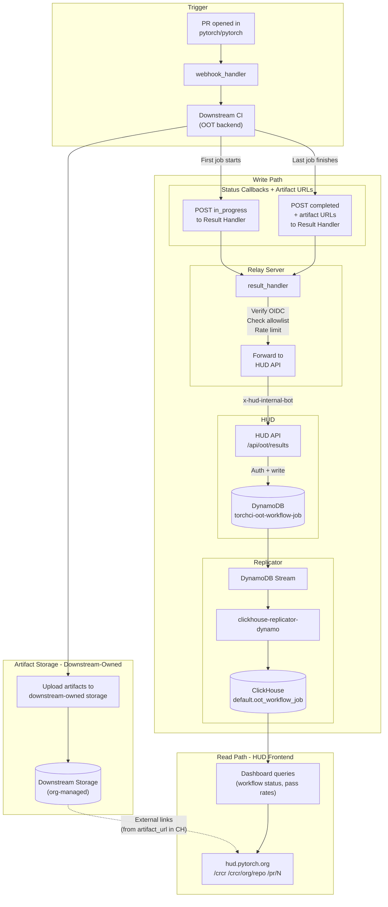
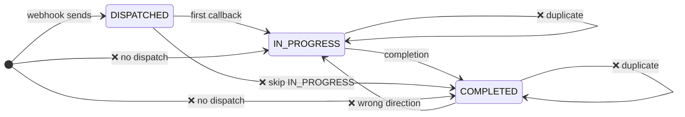

## Author(s)

- @groenenboomj
- @jewelkm89
- @subinz1
- @NayanNagabhushana-28

## Abstract

PyTorch HUD (`hud.pytorch.org`) currently only ingests test results from in-tree CI workflows. Out-of-tree (OOT) backends — custom accelerators, downstream device integrations — have no supported path to surface their CI results on the dashboard.

This RFC defines the **HUD ingestion and display layer** for OOT CI results. It builds on the cross-repository CI relay system (RFC-0050) which handles event dispatch and downstream triggering. This RFC covers:

- The **write path**: how downstream CI results flow from the relay's Result Handler into DynamoDB and ClickHouse
- The **read path**: three new HUD pages that display OOT CI health
- **Storage schemas**: DynamoDB table and ClickHouse table designs
- **DB protection**: rate limiting and payload caps
- **Security**: authentication at each hop, with a proposal for signed callback tokens

The complete pipeline is: Downstream CI → Result Handler → HUD API → DynamoDB → DynamoDB Stream → Replicator → ClickHouse.

> [!NOTE]
> - Artifact storage (logs, test reports, full results) is **owned and managed by each downstream organization**. HUD only stores URLs and links to externally-hosted artifacts.
> - This design follows the DynamoDB → ClickHouse replication pattern prescribed by PyTorch infrastructure maintainers.

## Motivation

With PyTorch's growing ecosystem of OOT backends (custom accelerators, partner hardware, etc.), there is increasing need for visibility into how upstream changes affect downstream projects. The relay system (RFC-0050) solves the *dispatch* problem — triggering downstream CI when a PyTorch PR is opened. But dispatch alone is not enough: results need to flow back and be displayed where maintainers and contributors can see them.

Without a standardized HUD integration:

- **Downstream maintainers** have no central place to monitor the health of their backend against PyTorch trunk.
- **PyTorch maintainers** have no visibility into whether a PR breaks OOT backends, even at the informational L2 level.
- **PR authors** cannot see OOT CI results alongside their in-tree checks without visiting each downstream repo individually.

This RFC fills that gap by defining how OOT results are ingested, stored, and displayed on HUD.

## Proposed Implementation

### Architecture Overview

The system has four components on the write path and three views on the read path.

**Write path:**

1. **Result Handler** (existing, from relay): receives callbacks from downstream CI, verifies OIDC, checks allowlist, forwards to HUD
2. **HUD API** (`/api/oot/results`): validates auth (`x-hud-internal-bot`), enforces payload caps, writes to DynamoDB via `UpdateItem`
3. **DynamoDB** (`torchci-oot-workflow-job`): mutable storage supporting the two-callback model (`in_progress` → `completed`)
4. **ClickHouse** (`default.oot_workflow_job`): analytical storage, replicated automatically via the existing `clickhouse-replicator-dynamo` replicator

**Read path:**

1. **Global CRCR Summary** (`/crcr`): cross-repo health overview for CI maintainers
2. **Per-Backend Dashboard** (`/crcr/[org]/[repo]`): detailed job grid for a single downstream repo
3. **PR View Integration** (`/pr/[number]`): collapsible CRCR section on existing PR pages



### Data Flow Summary

| Phase | Source | Destination | Auth | What Happens |
|-------|--------|-------------|------|--------------|
| **Callback 1 (start)** | First downstream job | Result Handler | OIDC token | POST `in_progress` status |
| | Result Handler | HUD API | `x-hud-internal-bot` | Forward `{trusted, untrusted}` payload |
| | HUD API | DynamoDB | Service role | UpdateItem with `in_progress` status |
| | DynamoDB | ClickHouse | Stream + replicator | Replicated to ClickHouse |
| **Callback 2 (end)** | Last downstream job | Result Handler | OIDC token | POST `completed` status + test counts + failures + artifact URLs |
| | Result Handler | HUD API | `x-hud-internal-bot` | Forward `{trusted, untrusted}` payload |
| | HUD API | DynamoDB | Service role | UpdateItem — merges `completed` fields into existing record |
| | DynamoDB | ClickHouse | Stream + replicator | Replicated to ClickHouse (replaces `in_progress` row via `SharedReplacingMergeTree`) |
| **Read** | HUD Frontend | ClickHouse | Read-only | Dashboard queries: status, pass rates, durations |
| | HUD Frontend | Downstream storage | Public URL | On-demand: external link to logs, full test results |

### Write Path

#### Two-Callback Model

Following the relay's L2 design, each downstream workflow sends two callbacks:

**Callback 1 — "In Progress"** (from the first job in the downstream workflow):
- Minimal payload: `downstream_repo`, `pr_number`, `pytorch_head_sha`, `workflow_run_id`, `status: "in_progress"`, `started_at`
- Written to DynamoDB via `UpdateItem` — creates the record with initial fields
- Replicated to ClickHouse — allows dashboards to show "running" indicators

**Callback 2 — "Completed"** (from the last job in the downstream workflow):
- Full payload: everything from Callback 1, plus `conclusion`, `completed_at`, test summary counts, failed test details (as JSON array), artifact URLs (pointing to downstream-owned storage), environment metadata
- Written to DynamoDB via `UpdateItem` — merges completed fields into the existing record without clobbering `in_progress`-only fields (e.g. `queue_time`)
- Replicated to ClickHouse — `SharedReplacingMergeTree` replaces the `in_progress` row with the `completed` row for the same `dynamoKey`

The two-callback model is why DynamoDB is the write target: the status changes from `in_progress` to `completed`, requiring an upsert. Both records are replicated to ClickHouse; `SharedReplacingMergeTree` handles the deduplication.

#### Artifact Storage (Downstream-Owned)

Each downstream organization owns and manages its artifact storage. PyTorch infrastructure does not provision, host, or manage any storage for OOT backend artifacts.

Downstream can use any publicly accessible storage: cloud object storage, GitHub Actions native artifacts, or any other URL-accessible location.

The only requirement is that the downstream provides **publicly accessible URLs** in the "completed" callback payload. HUD stores these URLs and renders them as external links.

This ensures:
- No PyTorch infra cost for artifact storage
- No access control complexity across N downstream orgs
- Full flexibility — downstream teams choose storage that fits their existing infra

#### Hop 1: Downstream → Result Handler

| Step | Action | Failure Response |
|------|--------|------------------|
| 1 | Verify OIDC token signature against GitHub JWKS | `401 Unauthorized` |
| 2 | Check `repository` claim against cached allowlist | `403 Forbidden` |
| 3 | Verify repo is authorized at L2 or above | `403 Forbidden` |
| 4 | Per-repo rate limit check | `429 Too Many Requests` |
| 5 | Forward validated payload to HUD API | — |

The relay's Result Handler receives the callback and produces a `{trusted, untrusted}` payload:

- `trusted` — relay-generated fields: `verified_repo` (OIDC-proven identity), `ci_metrics` (relay-measured `queue_time`, `execution_time`), and `downstream_repo_level` (allowlist-determined level: `L1`–`L4`)
- `untrusted` — downstream-reported data: `callback_payload` (the full callback body, passed through verbatim)

HUD always prefers `trusted.verified_repo` over anything self-reported in the body.

#### Hop 2: Result Handler → HUD API

| Step | Action | Failure Response |
|------|--------|------------------|
| 1 | Validate `x-hud-internal-bot` header via `checkAuthWithApiToken()` | `401 Unauthorized` |
| 2 | Payload cap check (2MB max body) | `413 Payload Too Large` |
| 3 | Extract and flatten record from `{trusted, untrusted}` payload | `400 Bad Request` |
| 4 | Write to DynamoDB via `UpdateItem` | `500 Internal Server Error` |

The HUD API endpoint (`torchci/pages/api/oot/results.ts`) follows the existing `webhookToDynamo` pattern:

```typescript
import { checkAuthWithApiToken } from "lib/auth/auth";
import {
  ApiError,
  extractDynamoRecord,
  validatePayloadSize,
  writeToDynamo,
} from "lib/oot/ootUtils";
import type { NextApiRequest, NextApiResponse } from "next";

export const config = {
  api: {
    bodyParser: {
      sizeLimit: "2mb",
    },
  },
};

export default async function handler(
  req: NextApiRequest,
  res: NextApiResponse
) {
  if (req.method !== "POST") {
    return res.status(405).json({ error: "Method not allowed" });
  }

  try {
    // Auth: standard HUD internal-bot check (shared with DrCI, trymerge)
    const auth = await checkAuthWithApiToken(req, res);
    if (!auth.ok) {
      return res.status(401).json({ error: "Unauthorized" });
    }

    // Payload size cap (safety net — relay should also enforce this)
    const rawBody =
      typeof req.body === "string" ? req.body : JSON.stringify(req.body);
    validatePayloadSize(rawBody);

    // Extract and write to DynamoDB via UpdateItem
    // Schema validation is done by the relay before forwarding.
    const body = typeof req.body === "string" ? JSON.parse(req.body) : req.body;
    const record = extractDynamoRecord(body);
    await writeToDynamo(record);

    return res.status(200).json({
      ok: true,
      status: record.status,
      dynamoKey: record.dynamoKey,
    });
  } catch (err: any) {
    if (err instanceof ApiError) {
      return res.status(err.statusCode).json({ error: err.message });
    }
    console.error("OOT results handler error:", err);
    return res.status(500).json({ error: "Internal error writing to DynamoDB" });
  }
}
```

#### Payload Extraction

The relay sends a `{trusted, untrusted}` payload. The HUD utility library extracts and flattens fields into a DynamoDB record:

```typescript
export interface RelayPayload {
  trusted: {
    verified_repo: string;
    downstream_repo_level?: string; // "L1" | "L2" | "L3" | "L4"
    ci_metrics?: {
      queue_time?: number | null;
      execution_time?: number | null;
    };
  };
  untrusted: {
    callback_payload: {
      event_type: string;
      delivery_id: string;
      payload: {
        pull_request?: { number: number; head?: { sha: string } };
        repository?: { full_name: string };
      };
      workflow: {
        schema_version?: string;
        status: string;
        conclusion?: string | null;
        name: string;
        url: string;
        job_name?: string;
        check_run_id?: string;
        run_id?: string;
        run_attempt?: number | string;
        started_at?: string;
        completed_at?: string;
        test_results?: {
          passed?: number;
          failed?: number;
          skipped?: number;
        };
        artifact_url?: string;
      };
    };
  };
}
```

The `extractDynamoRecord` function flattens this into a single record. It uses `started_at` and `completed_at` timestamps reported by the downstream action (wall-clock time when the callback was sent), rather than generating timestamps at HUD. Timing metrics (`queue_time`, `execution_time`) are only set when the relay provides a non-null value, preventing `completed` callbacks from clobbering `queue_time` with `null`:

```typescript
export function extractDynamoRecord(payload: RelayPayload): OotWorkflowJobRecord {
  const { trusted, untrusted } = payload;
  const cb = untrusted.callback_payload;
  const wf = cb.workflow;
  const pr = cb.payload?.pull_request;

  const jobName = wf.job_name ?? "default";
  const checkRunId = wf.check_run_id ?? "unknown";
  const runAttempt = Number(wf.run_attempt ?? 1) || 1;
  const dynamoKey = `${trusted.verified_repo}/${cb.delivery_id}/${wf.name}/${jobName}/${checkRunId}`;

  const record: OotWorkflowJobRecord = {
    dynamoKey,
    status: wf.status,
    downstream_repo: trusted.verified_repo,
    upstream_repo: cb.payload?.repository?.full_name ?? "pytorch/pytorch",
    pr_number: pr?.number ?? 0,
    pytorch_head_sha: pr?.head?.sha ?? "",
    delivery_id: cb.delivery_id,
    workflow_run_url: wf.url ?? "",
    workflow_name: wf.name,
    job_name: jobName,
    check_run_id: checkRunId,
    run_id: wf.run_id ?? "",
    run_attempt: runAttempt,
  };

  if (trusted.downstream_repo_level) {
    record.downstream_repo_level = trusted.downstream_repo_level;
  }

  // Only set timing metrics when the relay provides a non-null value.
  if (trusted.ci_metrics?.queue_time != null) {
    record.queue_time = trusted.ci_metrics.queue_time;
  }
  if (trusted.ci_metrics?.execution_time != null) {
    record.execution_time = trusted.ci_metrics.execution_time;
  }

  if (wf.started_at) {
    record.started_at = wf.started_at;
  }

  if (wf.artifact_url) {
    record.artifact_url = wf.artifact_url;
  }

  if (wf.status === "completed") {
    record.conclusion = wf.conclusion ?? undefined;
    if (wf.completed_at) {
      record.completed_at = wf.completed_at;
    }
    if (wf.test_results) {
      const tr = wf.test_results;
      if (typeof tr.passed === "number") record.passed_tests = tr.passed;
      if (typeof tr.failed === "number") record.failed_tests = tr.failed;
      if (typeof tr.skipped === "number") record.skipped_tests = tr.skipped;
      // L2 action sends {passed, failed, skipped} without total — compute it
      record.total_tests =
        typeof tr.total === "number"
          ? tr.total
          : (tr.passed ?? 0) + (tr.failed ?? 0) + (tr.skipped ?? 0);
    }
  }

  return record;
}
```

#### Schema Validation (at the Relay)

Schema validation is performed by the relay's Result Handler before forwarding to HUD. The relay validates required fields (`delivery_id`, `workflow.status`), status enum values, and conclusion presence on completed callbacks. HUD trusts that the relay has already validated the structure.

#### Hop 3: HUD API → DynamoDB

The HUD API writes the flattened workflow job record to DynamoDB using `UpdateItem` with `SET` expressions (not `PutItem`):

```
dynamoKey = `${trusted.verified_repo}/${delivery_id}/${workflow_name}/${job_name}/${check_run_id}`
```

- For "in_progress" callbacks: creates the record with initial fields (`status`, `started_at`, `queue_time`, etc.) via `UpdateItem`
- For "completed" callbacks: merges `completed` fields (`conclusion`, `completed_at`, `execution_time`, test counts, artifact URL) into the existing record via `UpdateItem` — only non-null fields are set, so `queue_time` (set during `in_progress`) is preserved

#### Hop 4: DynamoDB → ClickHouse (Automatic)

This hop requires **no new code**. The existing infrastructure handles it:

1. **DynamoDB Streams** (enabled on the table with `NEW_AND_OLD_IMAGES`) captures every write
2. **`clickhouse-replicator-dynamo`** receives stream events and inserts **both** `in_progress` and `completed` records into ClickHouse. `SharedReplacingMergeTree` handles deduplication — when a `completed` record arrives for the same `dynamoKey`, it replaces the `in_progress` row after merges.
3. **Replicator mapping** (1 new line): `"torchci-oot-workflow-job": "default.oot_workflow_job"` added to `SUPPORTED_TABLES` in `lambda_function.py`

### Storage Design

#### DynamoDB Table

Table: `torchci-oot-workflow-job`

| Field | Type | Description |
|-------|------|-------------|
| `dynamoKey` (hash key) | String | `{repo}/{delivery_id}/{workflow_name}/{job_name}/{check_run_id}` |
| `status` | String | `in_progress` or `completed` |
| `downstream_repo` | String | Downstream repo `org/name` (from `trusted.verified_repo`) |
| `upstream_repo` | String | Upstream repo (e.g. `pytorch/pytorch`) |
| `pr_number` | Number | PyTorch PR number |
| `pytorch_head_sha` | String | PyTorch PR commit SHA |
| `delivery_id` | String | GitHub webhook delivery ID from L1 dispatch |
| `workflow_run_url` | String | Link to downstream GHA workflow run |
| `workflow_name` | String | Downstream workflow name (`github.workflow`) |
| `job_name` | String | Downstream job name (`github.job`) |
| `check_run_id` | String | GitHub-assigned unique ID per job execution (`job.check_run_id`) |
| `run_id` | String | GitHub workflow run ID (`github.run_id`), same across retries |
| `run_attempt` | Number | Workflow run attempt number (`github.run_attempt`) |
| `conclusion` | String | `success`, `failure` (set on "completed") |
| `queue_time` | Number | Relay-measured dispatch-to-in_progress time in seconds (null on retries) |
| `execution_time` | Number | Relay-measured in_progress-to-completed time in seconds |
| `started_at` | String | ISO 8601 timestamp (downstream-reported, set on "in_progress") |
| `completed_at` | String | ISO 8601 timestamp (downstream-reported, set on "completed") |
| `total_tests` | Number | Total test count (set on "completed") |
| `passed_tests` | Number | Passed test count |
| `failed_tests` | Number | Failed test count |
| `skipped_tests` | Number | Skipped test count |
| `failed_tests_json` | String | JSON array of failed/errored test details |
| `artifact_url` | String | URL to downstream-hosted artifacts |
| `environment` | String | JSON: `{"sdk": "<version>", "device": "<hardware>", ...}` |
| `downstream_repo_level` | String | Repo's relay level: `L2`, `L3`, `L4` |

Table configuration:
- Partition key: `dynamoKey` (String)
- Billing: on-demand (pay per request)
- Streams: enabled with `NEW_AND_OLD_IMAGES`

#### ClickHouse Table

Table: `default.oot_workflow_job`

Based on the existing `default.workflow_job` schema with OOT-specific additions:

```sql
CREATE TABLE default.oot_workflow_job
(
    `dynamoKey` String,
    `status` String,
    `downstream_repo` String COMMENT 'Downstream repo org/name, from trusted.verified_repo',
    `upstream_repo` String COMMENT 'Upstream repo, typically pytorch/pytorch',
    `pr_number` UInt64 COMMENT 'PyTorch PR number',
    `pytorch_head_sha` String COMMENT 'PyTorch PR commit SHA',
    `delivery_id` String COMMENT 'GitHub webhook delivery ID from L1 dispatch',
    `workflow_run_url` String COMMENT 'Link to downstream GHA workflow run',
    `workflow_name` String COMMENT 'Downstream workflow name',
    `job_name` String DEFAULT '' COMMENT 'Downstream job name (github.job)',
    `check_run_id` String DEFAULT '' COMMENT 'GitHub-assigned unique ID per job execution (job.check_run_id)',
    `run_id` String DEFAULT '' COMMENT 'GitHub workflow run ID (github.run_id), same across retries',
    `run_attempt` UInt32 DEFAULT 1 COMMENT 'Workflow run attempt number (github.run_attempt)',
    `conclusion` String COMMENT 'success, failure, cancelled, timed_out (set on completed)',
    `queue_time` Nullable(Float64) COMMENT 'Relay-measured dispatch-to-in_progress time in seconds',
    `execution_time` Nullable(Float64) COMMENT 'Relay-measured in_progress-to-completed time in seconds',
    `started_at` DateTime64(9) COMMENT 'ISO 8601 timestamp when record was created',
    `completed_at` DateTime64(9) COMMENT 'ISO 8601 timestamp when job completed',
    `total_tests` UInt64 DEFAULT 0,
    `passed_tests` UInt64 DEFAULT 0,
    `failed_tests` UInt64 DEFAULT 0,
    `skipped_tests` UInt64 DEFAULT 0,
    `failed_tests_json` String DEFAULT '' COMMENT 'JSON array of failed/errored test details',
    `artifact_url` String DEFAULT '' COMMENT 'URL to downstream-hosted artifacts (logs, reports)',
    `environment` String DEFAULT '' COMMENT 'JSON: {"cuda": "12.8", "device": "H100", ...}',
    `downstream_repo_level` String DEFAULT '' COMMENT 'Relay level at dispatch time: L2, L3, L4',
    `_inserted_at` DateTime MATERIALIZED now(),
    `repository_full_name` String ALIAS downstream_repo COMMENT 'Alias for consistency with workflow_job queries',
    `duration_seconds` Float64 ALIAS if(completed_at = toDateTime64(0, 9), 0, dateDiff(second, started_at, completed_at)),
    INDEX status_index status TYPE bloom_filter GRANULARITY 1,
    INDEX started_at_index started_at TYPE minmax GRANULARITY 1,
    INDEX completed_at_index completed_at TYPE minmax GRANULARITY 1,
    INDEX pr_number_index pr_number TYPE bloom_filter GRANULARITY 1,
    INDEX downstream_repo_index downstream_repo TYPE bloom_filter GRANULARITY 1
)
ENGINE = SharedReplacingMergeTree('/clickhouse/tables/{uuid}/{shard}', '{replica}')
ORDER BY (downstream_repo, delivery_id, dynamoKey)
SETTINGS index_granularity = 8192
```

Key design decisions:
- **`SharedReplacingMergeTree`** for upsert semantics: when a "completed" callback arrives, it replaces the "in_progress" row for the same `dynamoKey`
- **`repository_full_name` as ALIAS**: provides naming consistency with existing `workflow_job` queries without storing redundant data
- **`duration_seconds` as computed ALIAS**: avoids manual duration calculation
- **Bloom filter indexes** on frequently filtered columns for efficient dashboard queries

#### Data Retention

| Storage | Retention | Mechanism |
|---------|-----------|-----------|
| DynamoDB | Indefinite (low volume) | DynamoDB TTL can be added if needed |
| ClickHouse | Follows `workflow_job` table retention | Same TTL/partition dropping as in-tree |
| Downstream artifacts | Downstream org's policy | Managed by downstream org |

### DB Protection Layer

#### Rate Limiting

**At the relay (per-repo)**

```
Key:    oot:rate:{verified_repo}
Value:  counter (atomic INCR)
TTL:    1 minute sliding window
Limit:  60 requests/minute per repo (configurable via RATE_LIMIT_PER_MIN)
```

Rejects at the relay before any HUD/DB traffic. First line of defense against runaway CI loops.

#### Payload Caps

| Limit | Value | Enforced at |
|-------|-------|-------------|
| Max request body | 2 MB | HUD API (`bodyParser.sizeLimit`) |
| Max `failed_tests_json` entries | 1,000 per request | HUD API schema validation |
| Max `stacktrace` length | 4 KB per test | HUD API (truncate before write) |
| Max `message` length | 1 KB per test | HUD API (truncate before write) |

### Authentication Flow

| Hop | From → To | Auth Mechanism | Credential Scope |
|-----|-----------|----------------|------------------|
| 1 | Downstream → Result Handler | OIDC token (GHA-issued, 5 min TTL) | No secrets needed by downstream |
| 2 | Result Handler → HUD API | `x-hud-internal-bot` header | Standard HUD internal API token (`INTERNAL_API_TOKEN`) |
| 3 | HUD API → DynamoDB | Service role | Write to `torchci-oot-workflow-job` only |
| 4 | DynamoDB → ClickHouse | Replicator service role | Existing replicator credentials |

Security properties:

| Property | How |
|----------|-----|
| Downstream never gets DB/HUD credentials | OIDC only |
| Unknown repos rejected before HUD | Allowlist at relay (cached) |
| HUD only accepts internal-bot traffic | `x-hud-internal-bot` header checked via `checkAuthWithApiToken()` |
| Runaway CI caught early | Rate limit at relay |
| DB overload prevented | Payload caps |
| Artifact storage not PyTorch's burden | Each downstream org manages their own |

### Security Design

#### OIDC Authentication

The relay's callback security model is based on GitHub Actions OIDC:

1. Downstream workflow declares `permissions: id-token: write`
2. GitHub's OIDC provider mints a JWT signed with RS256 (5-minute TTL)
3. Token contains claims: `repository`, `actor`, `ref`, `run_id`
4. Result Handler verifies the signature against GitHub's public JWKS
5. Extracts `repository` claim as `verified_repo` — the only cryptographically trusted identity

**What OIDC gives us:**
- Zero secret management — downstream never handles API keys
- Caller identity — cryptographic proof of which repo is calling
- Short-lived — 5-minute TTL, auto-expires

**What OIDC does NOT give us:**
- No dispatch verification — proves *who* is calling, not *whether they were asked to call*
- No replay protection — a new OIDC token can be minted at any time
- No scope-locking — doesn't bind the callback to a specific PR or SHA

#### Trusted/Untrusted Payload Split

The relay separates the forwarded payload into two namespaces:

- **`trusted`** — relay-generated: `verified_repo` (OIDC-proven) and `ci_metrics` (relay-measured timing)
- **`untrusted`** — downstream-reported: `callback_payload` (passed through verbatim)

HUD always prefers `trusted.verified_repo` over anything self-reported.

#### Error Handling Strategy

The relay's `forward_to_hud` function handles HUD API errors:

- **4xx errors** (validation, auth failures): propagated back to downstream so workflow authors see a red CI step and can fix their payload
- **5xx and network failures**: retried by the relay's internal retry loop (in `hud.py`). If all retries fail, the error is raised — the downstream CI step fails

The relay returns `{"ok": true, "status": "<status>"}` on success:
- `"in_progress"` / `"completed"` — HUD received and stored the callback
- `"ignored"` — repo is not configured for L2+ features
- `"skipped"` — no `HUD_API_URL` configured (local dev)

> **Note:** The composite callback action (`cross-repo-ci-relay-callback`) does **not** retry independently — retries were removed ([#8145](https://github.com/pytorch/test-infra/pull/8145)) because they caused duplicate state transitions in the Redis state machine (the same `check_run_id` would re-attempt an already-completed transition). The relay's `hud.py` handles retries internally.

#### Proposal: Signed One-Shot Callback Token

To close gaps in dispatch provenance and replay prevention, we propose adding a signed callback token minted by L1 at dispatch time:

**How it works:**

```
L1 Dispatch:
  1. Mint JWT: sign({delivery_id, repo, pr_number, head_sha, dispatched_at}, SECRET)
  2. Store one-shot key in Redis: crcr:token:{delivery_id}:{repo} = valid (TTL 3 days)
  3. Include token in client_payload → downstream receives it

L2 Callback:
  1. Downstream echoes callback_token in the callback body
  2. Result Handler verifies JWT signature (proves L1 minted it)
  3. Checks Redis key exists (proves token hasn't been consumed)
  4. Validates delivery_id + repo in token match OIDC verified_repo
  5. On "completed" callback: delete Redis key (one-shot, consumed)
  6. Forward to HUD
```

**What the callback token adds:**

| Concern | OIDC Only | OIDC + Callback Token |
|---------|-----------|----------------------|
| Dispatch provenance | Can't verify | Signed proof |
| Replay prevention | Vulnerable | One-shot Redis key |
| Fabrication blocking | Identity check only | Token locks to specific PR/SHA |
| Orphaned job detection | No way to know | Unconsumed Redis key = orphaned |
| Queue time (trusted) | Redis lookup, can miss | Embedded in token, tamper-proof |
| Per-dispatch rate limiting | Per-repo only | Exactly 2 callbacks per dispatch |
| L3/L4 merge gating | Unsafe (self-reported) | Cryptographic proof of dispatch |

> [!NOTE]
> The callback token is not strictly required for L2 (dashboard only). However, L1 is where the token gets minted, and once L1 is deployed and downstream repos depend on the current `client_payload` shape, retrofitting it becomes a breaking change. We recommend adding it now as optional groundwork for L3/L4.

#### State Machine for Status Transitions

The relay implements a strict 3-state machine enforced via Redis. Each callback is validated against the current state before processing:



**State types:**

- `DISPATCHED`: Repo-level state (`check_run_id=DISPATCH_CHECK_RUN_ID`) — one per `{delivery_id, repo}`, set by the webhook handler at dispatch time
- `IN_PROGRESS` / `COMPLETED`: Job-level states — independent per `check_run_id`

**Valid flow:** `DISPATCHED → IN_PROGRESS → COMPLETED` (linear, no shortcuts)

**Rejected:** Skipping `IN_PROGRESS`, duplicate `COMPLETED`, missing `DISPATCHED`, or wrong-direction transitions

The state key uses `check_run_id` (GitHub-assigned, unique per job execution) rather than `run_id`:

```
Key: oot:state:{delivery_id}:{verified_repo}:{check_run_id}
TTL: 3 days (configurable via OOT_STATUS_TTL, default 259200s)
```

Reruns get a new `check_run_id` and are treated as separate jobs, so they don't violate the state machine.

### Read Path: HUD Pages

#### Page 1: Global CRCR Summary — `/crcr`

Cross-repo overview for CI maintainers. Displays a table of all OOT backend repositories sorted by pass rate (worst first), with columns for pass rate, success/failure counts, average duration, and last run time. Includes a time range selector (24h / 7d / 30d).

Clicking a row navigates to the per-backend dashboard.

ClickHouse saved query (`oot_summary`):

```sql
SELECT
    downstream_repo AS repo,
    anyLast(downstream_repo_level) AS downstream_repo_level,
    countIf(conclusion = 'success') AS successes,
    countIf(conclusion = 'failure') AS failures,
    count() AS total,
    if(total > 0, successes / total, 0) AS pass_rate,
    avg(duration_seconds) AS avg_duration_s,
    max(started_at) AS last_run
FROM
    default.oot_workflow_job FINAL
WHERE
    started_at > now() - INTERVAL {days: UInt64} DAY
    AND status = 'completed'
GROUP BY
    repo
ORDER BY
    pass_rate ASC
```

Frontend implementation uses `useSWR` with the ClickHouse query API and renders a Material-UI table with color-coded pass rate chips (green ≥ 95%, yellow ≥ 80%, red < 80%).

#### Page 2: Per-Backend Dashboard — `/crcr/[org]/[repo]`

Detailed CI health view for a single downstream backend. Displays:

- **Header**: repo name, overall health (pass rate), environment summary
- **Matrix view**: rows = PyTorch PRs, columns = OOT jobs. Color-coded status chips: green = `success`, red = `failure`, yellow = `cancelled`/`timed_out`, blue = `in_progress`
- **Failure drill-down**: click a red cell to see failed test details (parsed from `failed_tests_json`)
- **External links**: "View artifacts" → downstream-hosted logs; "View workflow run" → downstream GHA run URL

ClickHouse saved query (`oot_backend_dashboard`):

```sql
SELECT
    pr_number,
    pytorch_head_sha,
    workflow_name,
    job_name,
    check_run_id,
    run_id,
    run_attempt,
    status,
    conclusion,
    started_at,
    completed_at,
    duration_seconds,
    total_tests,
    passed_tests,
    failed_tests,
    skipped_tests,
    workflow_run_url,
    artifact_url,
    queue_time,
    execution_time
FROM
    default.oot_workflow_job FINAL
WHERE
    downstream_repo = {repo: String}
    AND started_at > now() - INTERVAL {days: UInt64} DAY
ORDER BY
    started_at DESC
LIMIT 500
```

#### Page 3: PR View Integration — `/pr/[number]`

A collapsible "Out-of-Tree Backends" accordion added to the existing PR detail page. Only rendered when OOT results exist for the PR. Shows:

- Backend name, job name, status chip (color-coded), duration, links to run/artifacts
- Summary in the accordion header: `"3/4 passed, 1 running"`
- `in_progress` runs show a spinner-style "running" chip

ClickHouse saved query (`oot_pr_results`):

```sql
SELECT
    downstream_repo,
    workflow_name,
    job_name,
    check_run_id,
    run_id,
    run_attempt,
    status,
    conclusion,
    duration_seconds,
    workflow_run_url,
    artifact_url,
    started_at,
    queue_time,
    execution_time
FROM
    default.oot_workflow_job FINAL
WHERE
    pr_number = {pr: UInt64}
ORDER BY
    downstream_repo, started_at DESC
```

The `OotPrSection` React component is integrated into the existing PR page (`torchci/pages/[repoOwner]/[repoName]/pull/[prNumber].tsx`) below the existing `CommitInfo` section.

### Sample Payloads

These samples show the actual wire format at each stage of the pipeline.

#### Stage 1: Downstream → Relay (sent by the callback action)

The reusable GitHub Action (`cross-repo-ci-relay-callback`) builds this payload from `github.event.client_payload` (the L1 dispatch envelope) plus a `workflow` dict with downstream-reported fields:

**In-Progress:**

```json
{
  "event_type": "pull_request",
  "delivery_id": "a8f5f167-6e5b-4c3d-8a2e-4b5c6d7e8f9a",
  "payload": {
    "pull_request": { "number": 179565, "head": { "sha": "a1b2c3d4e5f6a1b2c3d4e5f6a1b2c3d4e5f6a1b2" } },
    "repository": { "full_name": "pytorch/pytorch" }
  },
  "workflow": {
    "schema_version": "1",
    "status": "in_progress",
    "conclusion": null,
    "name": "<hardware>-ci",
    "url": "https://github.com/{org}/{repo}/actions/runs/24033272679",
    "job_name": "test-<hardware>-float32",
    "check_run_id": "98765432100",
    "run_id": "24033272679",
    "run_attempt": "1",
    "started_at": "2025-04-28T10:15:30Z",
    "completed_at": null
  }
}
```

**Completed (failure):**

```json
{
  "event_type": "pull_request",
  "delivery_id": "a8f5f167-6e5b-4c3d-8a2e-4b5c6d7e8f9a",
  "payload": {
    "pull_request": { "number": 179565, "head": { "sha": "a1b2c3d4e5f6a1b2c3d4e5f6a1b2c3d4e5f6a1b2" } },
    "repository": { "full_name": "pytorch/pytorch" }
  },
  "workflow": {
    "schema_version": "1",
    "status": "completed",
    "conclusion": "failure",
    "name": "<hardware>-ci",
    "url": "https://github.com/{org}/{repo}/actions/runs/24033272679",
    "job_name": "test-<hardware>-float32",
    "check_run_id": "98765432100",
    "run_id": "24033272679",
    "run_attempt": "1",
    "started_at": null,
    "completed_at": "2025-04-28T10:45:12Z",
    "test_results": {
      "passed": 8430,
      "failed": 2,
      "skipped": 20
    },
    "artifact_url": "https://{org}.github.io/ci-results/183512/"
  }
}
```

#### Stage 2: Relay → HUD API (sent by `forward_to_hud`)

The relay wraps the callback into `{trusted, untrusted}` namespaces. `trusted` fields are relay-generated; `untrusted` is the raw downstream payload passed through verbatim:

**In-Progress:**

```json
{
  "trusted": {
    "verified_repo": "{org}/{repo}",
    "downstream_repo_level": "L2",
    "ci_metrics": {
      "queue_time": 12.345,
      "execution_time": null
    }
  },
  "untrusted": {
    "callback_payload": {
      "event_type": "pull_request",
      "delivery_id": "a8f5f167-6e5b-4c3d-8a2e-4b5c6d7e8f9a",
      "payload": {
        "pull_request": { "number": 179565, "head": { "sha": "a1b2c3d4e5f6a1b2c3d4e5f6a1b2c3d4e5f6a1b2" } },
        "repository": { "full_name": "pytorch/pytorch" }
      },
      "workflow": {
        "schema_version": "1",
        "status": "in_progress",
        "conclusion": null,
        "name": "<hardware>-ci",
        "url": "https://github.com/{org}/{repo}/actions/runs/24033272679",
        "job_name": "test-<hardware>-float32",
        "check_run_id": "98765432100",
        "run_id": "24033272679",
        "run_attempt": "1",
        "started_at": "2025-04-28T10:15:30Z"
      }
    }
  }
}
```

**Completed (failure):**

```json
{
  "trusted": {
    "verified_repo": "{org}/{repo}",
    "downstream_repo_level": "L2",
    "ci_metrics": {
      "queue_time": null,
      "execution_time": 1782.0
    }
  },
  "untrusted": {
    "callback_payload": {
      "event_type": "pull_request",
      "delivery_id": "a8f5f167-6e5b-4c3d-8a2e-4b5c6d7e8f9a",
      "payload": {
        "pull_request": { "number": 179565, "head": { "sha": "a1b2c3d4e5f6a1b2c3d4e5f6a1b2c3d4e5f6a1b2" } },
        "repository": { "full_name": "pytorch/pytorch" }
      },
      "workflow": {
        "schema_version": "1",
        "status": "completed",
        "conclusion": "failure",
        "name": "<hardware>-ci",
        "url": "https://github.com/{org}/{repo}/actions/runs/24033272679",
        "job_name": "test-<hardware>-float32",
        "check_run_id": "98765432100",
        "run_id": "24033272679",
        "run_attempt": "1",
        "completed_at": "2025-04-28T10:45:12Z",
        "test_results": {
          "passed": 8430,
          "failed": 2,
          "skipped": 20
        },
        "artifact_url": "https://{org}.github.io/ci-results/183512/"
      }
    }
  }
}
```

> **Note on `run_attempt`**: The L2 callback action sends `run_attempt` as a string (from `github.run_attempt` env var). The HUD API coerces it to a number via `Number()` before writing to DynamoDB.

### Comparison: In-Tree vs OOT Pipeline

| | In-Tree | OOT (this RFC) |
|---|---------|-----------------|
| **Hops to ClickHouse** | 6 (job → S3 → workflow_run → upload_stats → S3 → replicator → CH) | 4 (downstream → handler → HUD → DynamoDB → stream → replicator → CH) |
| **Write target** | S3 (`ossci-raw-job-status`) → `clickhouse-replicator-s3` | DynamoDB (`torchci-oot-workflow-job`) → `clickhouse-replicator-dynamo` |
| **Mutability** | Immutable (write once) | Mutable (in_progress → completed via DynamoDB upsert) |
| **Artifact storage** | Centralized storage (LF Foundation managed) | Downstream org's own storage (any public URL) |
| **Auth model** | Service roles (trusted same-org infra) | OIDC → internal token → service role |
| **Rate limiting** | None (relies on GHA concurrency) | Per-repo at relay |
| **Schema** | `default.workflow_job` | `default.oot_workflow_job` (based on `workflow_job`) |

### Files Changed (Reference Implementation)

| File | Action |
|------|--------|
| `torchci/pages/api/oot/results.ts` | New — API endpoint |
| `torchci/lib/oot/ootUtils.ts` | New — types, validation, extraction |
| `clickhouse_db_schema/default.oot_workflow_job/schema.sql` | New — ClickHouse schema |
| `aws/lambda/clickhouse-replicator-dynamo/lambda_function.py` | Edit — +1 line to `SUPPORTED_TABLES` |
| `torchci/pages/crcr/index.tsx` | New — global CRCR summary page |
| `torchci/pages/crcr/[org]/[repo].tsx` | New — per-backend dashboard |
| `torchci/components/oot/OotPrSection.tsx` | New — PR view OOT section |
| `torchci/pages/[repoOwner]/[repoName]/pull/[prNumber].tsx` | Edit — added OotPrSection |
| `torchci/clickhouse_queries/oot_summary/*` | New — saved query |
| `torchci/clickhouse_queries/oot_backend_dashboard/*` | New — saved query |
| `torchci/clickhouse_queries/oot_pr_results/*` | New — saved query |

## Metrics

- **Ingestion latency**: time from callback to ClickHouse availability (target: < 60s)
- **OOT pass rate**: per-backend success rate over 7d rolling window
- **HUD API error rate**: 4xx/5xx rate on `/api/oot/results`
- **Daily callback volume**: per-repo and aggregate, to validate budget thresholds
- **Queue time**: relay-measured dispatch-to-in_progress (identifies downstream infra bottlenecks)
- **Execution time**: relay-measured in_progress-to-completed (identifies test suite performance trends)

## Drawbacks

- **Additional ClickHouse table**: introduces a new `oot_workflow_job` table, increasing schema maintenance surface. Mitigated by reusing the existing `workflow_job` schema pattern.
- **DynamoDB costs**: while PAY_PER_REQUEST auto-scales, high-volume OOT backends could incur non-trivial DynamoDB costs. Mitigated by rate limiting at the relay.
- **Downstream adoption cost**: downstream repos must implement the two-callback model (or use the reusable GitHub Action). This is an incremental cost on top of the relay integration.
- **Trust boundary**: even with OIDC and allowlisting, the relay trusts downstream-reported test counts and failure details. A compromised allowlisted repo could report misleading data. Mitigated by the trusted/untrusted payload split and the proposed callback token.

## Alternatives

1. **Direct ClickHouse writes from HUD API** — eliminates the DynamoDB hop but conflicts with the prescribed DynamoDB → ClickHouse pattern. ClickHouse is append-only, making the two-callback mutable status model awkward.

2. **Separate `oot_ci` database in ClickHouse** — would isolate OOT data but prevents reuse of existing `workflow_job` query patterns and frontend components. Placing the table in the `default` database (as `oot_workflow_job`) is consistent with other tables.

3. **PyTorch-managed artifact storage** — PyTorch infra could provision storage buckets for downstream artifacts. Rejected because it introduces significant access control complexity for N downstream orgs and shifts storage costs to PyTorch.

4. **Single callback model** — one callback at workflow completion. Simpler but loses the "running" indicator on HUD, and the architecture would not match the relay's existing two-callback design.

5. **Polling-based result ingestion** — HUD periodically polls downstream repos for results. Rejected because it requires HUD to know about each downstream repo's API, creates polling overhead, and has higher latency.

## Prior Art

- **PyTorch in-tree CI → HUD pipeline**: S3-based ingestion via `clickhouse-replicator-s3`. Proven at scale but immutable (no status updates). This RFC adapts the pattern for mutable OOT data via DynamoDB.
- **`webhookToDynamo.ts`**: existing HUD pattern for writing webhook data to DynamoDB. The OOT API endpoint follows this pattern.
- **RFC-0050 (Cross-Repository CI Relay)**: defines the relay architecture, allowlist, OIDC auth, and downstream triggering that this RFC builds upon.

## How we teach this

- **Downstream developers** need to know:
  - Their CI results will appear on `hud.pytorch.org/crcr/{org}/{repo}` once they reach L2
  - They should include artifact URLs in their "completed" callback for debugging links on HUD
  - Test counts and failed test details are optional but recommended for richer dashboard views

- **PyTorch CI maintainers** need to know:
  - `/crcr` provides a global health overview of all CRCR backends
  - Rate limits at the relay protect ClickHouse from OOT traffic spikes
  - The replicator mapping is a single line change when adding new downstream tables

- **PR authors** need to know:
  - OOT CI results appear in a collapsible section on their PR page (when results exist)
  - At L2, these are informational only and do not block merging

No documentation reorganization is needed. The `/crcr` pages are self-discoverable from HUD navigation.

## Unresolved Questions

1. ~~**Failed test detail storage**~~ **Resolved**: Embedded as `failed_tests_json` String column in both DynamoDB and ClickHouse. A separate table can be added later if needed for cross-repo flaky test detection.

2. ~~**Redis TTL for relay state**~~ **Resolved**: 3 days (259,200 seconds), configurable via `OOT_STATUS_TTL` env var on the Lambda.

3. **Non-GHA CI support**: OIDC auth is GHA-specific. Jenkins/Buildkite would need pre-shared API keys. Deferred to a future RFC.

4. ~~**Backfill on failure**~~ **Resolved**: The callback handler retries HUD 5xx/network errors with exponential backoff (up to 3 retries). HUD 4xx errors propagate immediately. No dead-letter queue for now.

5. **Callback token adoption timeline**: the signed callback token strengthens security significantly but requires coordination with L1 deployment. Can be added incrementally.

6. ~~**Silent HUD forward skip**~~ **Resolved**: `HUD_API_URL` is now provisioned as a Lambda default ([#8147](https://github.com/pytorch/test-infra/pull/8147)). The relay logs and returns `"skipped"` when the URL is not set (local dev only).

7. **`timed_out`/`cancelled` conclusion support**: The composite action (`cross-repo-ci-relay-callback`) only accepts `success` or `failure` as valid `conclusion` values when `status=completed`. Clarification of accepted values is being addressed in [#8173](https://github.com/pytorch/test-infra/pull/8173).

## Implementation Plan

The implementation follows a 6-phase rollout:

| Phase | Scope | Status |
|-------|-------|--------|
| **1. Storage Layer** | DynamoDB table, ClickHouse table, replicator mapping | **Complete** |
| **2. HUD API Endpoint** | Types, extraction, `UpdateItem` write logic, POST handler | **Complete** |
| **3. Relay Integration** | Callback handler (OIDC, allowlist, rate limiting, state machine), composite action | **Complete** |
| **4. HUD Frontend Pages** | ClickHouse queries, `/crcr` summary, `/crcr/[org]/[repo]` dashboard, PR page section | **Complete** |
| **5. End-to-End Validation** | L2 test workflow, full pipeline verification (callback → Lambda → HUD → DynamoDB → ClickHouse) | **Complete** |
| **6. Security Hardening** | Signed callback token, token verification, orphaned job detection | **Planned** |

> **Note:** The 3-state machine (`DISPATCHED → IN_PROGRESS → COMPLETED`) is already implemented in Phase 3. Phase 6 covers the additional callback token for dispatch provenance and replay prevention.

### Remaining Work

- L3/L4 upstream check run management (device-based allowlist, check run creation, re-run support)
- State machine key migration: `check_run_id` → `{run_id}:{run_attempt}`
- Clarify accepted `conclusion` values in callback action
- Add CRCR CI Summary link to HUD navigation bar
- Onboard real downstream backends

## Resolution

Phases 1–5 are **complete** — all code is merged into `pytorch/test-infra` and the end-to-end pipeline is live. Dispatches from `pytorch/crcr-test` flow through the full pipeline: Downstream CI → Callback Lambda → HUD API → DynamoDB → ClickHouse → HUD pages at `hud.pytorch.org/crcr`.

Active work is focused on L3/L4 check run management and onboarding real downstream backends.

