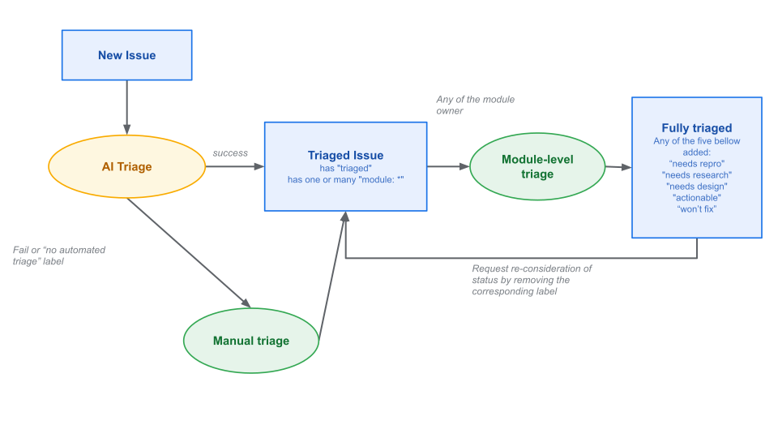
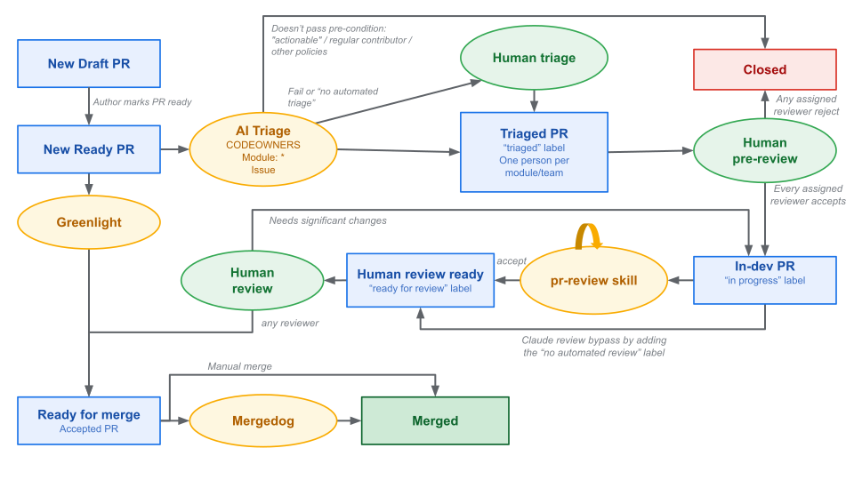

# 2026 Issue and PR workflow update

**Authors:**
* @albanD
* @janeyx99

### 

### **Goal**

The overarching goal is to improve the “health” of the repo. This is a relatively fluid concept so we focus on the following goals and specific angles for each:

* Increase the velocity of development  
  * By better utilizing the maintainer time we have  
* Increase clarity for contributors and maintainers  
  * By having clearer signal on what are next steps for each PR and issue  
  * By having programmatic way to track each state  
* Increase ownership by having more maintainers and clear expectations  
  * By having a clearer onboarding path  
  * By increasing the ROI for maintenance

### **How**

1. (the rest of this document) Update our Issue and PR lifecycle from [https://github.com/pytorch/pytorch/wiki/Typical-Pull-Request-Workflow](https://github.com/pytorch/pytorch/wiki/Typical-Pull-Request-Workflow) and [https://github.com/pytorch/pytorch/wiki/The-Ultimate-Guide-to-PyTorch-Contributions](https://github.com/pytorch/pytorch/wiki/The-Ultimate-Guide-to-PyTorch-Contributions) to the new version here that is AI and LLM aware.  
2. Land the critical missing pieces listed below  
3. Dogfood the PR workflow for some submodules  
4. Land the high priority missing pieces and adapt based on dogfooding  
5. Enable contributor-facing enforcement and rules  
6. Make the new workflow mandatory for everyone working on the repo.

### **Issue Workflow**

**Note that there is a “Definitions” section below with details for labels, states and decisions here.**

In principle, issues is our gating mechanism to receive all user feedback and appropriately handle it until the issue is closed or it is marked “actionable” (so a PR can be sent for it).

### **PR Workflow**

PRs should only be the place to discuss implementation and ensure it is correct. All other discussions should have happened on the issue already.
The focus here is to ensure reviewer time is used as effectively as possible and that we enforce standard rules automatically.

### **Definitions**

* **Fully triaged issue(s)**: Issues on Github are considered fully triaged when they meet the following criteria  
  *  The issue has either of these:  
    * The issue is closed  
    * The issue is marked “needs reproduction”   
      * Waiting for anyone to reproduce the issue  
      * And for a maintainer to validate the reproduction  
    * The issue is marked “needs research”  
      * Waiting for anyone to provide supporting evidence for the feature or the bug being valid  
      * Waiting for a maintainer to evaluate if we want this feature to be added or if the bug is real and worth fixing  
    * The issue is marked “needs design”  
      * Waiting for anyone to suggest a design to implement the feature or fix the bug  
      * Waiting for a maintainer to validate the design  
    * The issue is marked “actionable”  
      * There should be enough details in the issue for anyone to be able to create a good PR from it (otherwise, it should stay as needs design)  
      * The maintainer marking the issue actionable is ok with reviewing the corresponding change  
    * The issue is marked “not planned” (any other suggestion for this label?)  
      * The feature or bug being reported is valid, but is not actionable at this time as the ROI for implementing or fixing the issue is too low  
  * Assign the issue:  
    * To the relevant person that will move it forward (which can be the maintainer themselves)  
    * To no-one indicating we are looking for community help  
  * When a contributor updates the issue, they can request the maintainer to re-evaluate the issue by asking the bot to remove the corresponding label  
    * Any abuse of this will lead to being forbidden to change labels and up to being banned  
* **Other relevant but orthogonal labels:**  
  * **High priority:** A status applied to issues or pull requests typically related to, but not limited to, bugs with core user functionality  
    * Multiple types of high priority:  
      * Regressions  
      * Hard crashes  
      * Silent Correctness issues  
    * Non-documented APIs and “edge cases” are not high priority by default (the maintainer can still make it high priority if they think it is still important)  
    * A issue is marked high priority if it is high priority for any of the module it is labelled with  
  * **Good first issue:** An “actionable” issue that is especially simple and well suited for new contributors.  
* **PR pre-review:** A quick review of the direction of the PR to ensure it is worth the author’s time to finalize it.  
  * Principles:  
    * It is the responsibility of the author to provide all the information such that the reviewer can make a quick assessment  
    * The reviewer should be able to do a pre-review in \<1min, it is ALWAYS ok to reject a pre-review  
    * Non-regular contributor PRs already have a corresponding “actionable” issue but regular contributor might send PRs without them  
  * In particular, for the reviewer:  
    * Design discussions needed \-\> Close and move the discussion to an issue  
    * Author didn’t provide succinct justifications to enable a fast pre-review \-\> Either close or move to draft  
    * Minor discussion or clarification in PR description needed \-\> Move to draft  
  * To get a sense of how one may assess a PR:  
    * Is the PR description clear and concise and reflective of the change?  
    * Is this PR solving a problem that is important?  
    * Is the approach of the PR clear and agreeable?  
    * Is this PR modular and simple enough to review or does there need to be a design discussion?  
  * Every module owner assigned to the PR must accept the pre-review. Only one of them will need to do the full review at the end.

### **Missing pieces**

**Critical pieces:**

- Pr-review skill automation  
- AI Triage  
  - CODEOWNER and sub-module assignment  
- Per-module issue tracking via github search  
- Per-maintainer PR status tracking (to pre-review, to review)  
- Per-contributor PR status tracking (in progress, to-merge)  
* [Clear messaging for contributors to understand the state of things](?tab=t.0#bookmark=id.unixpoo3smt4)   
  * Update wiki, documentation, in-PR and in-Issue messaging etc  
  * Details below

**High priority**

* Greenlight  
* Mergedog  
* Onboarding  
  * Shadow process etc  
* Notification system  

**Other pieces we could build**

- Custom UI for github status a-la ghinbox [http://github.com/ezyang/ghinbox](http://github.com/ezyang/ghinbox)  
- UI for async agent usage a-la ptq [https://github.com/drisspg/pt\_job\_queue](https://github.com/drisspg/pt_job_queue)  
- Custom UI for review (needs details)