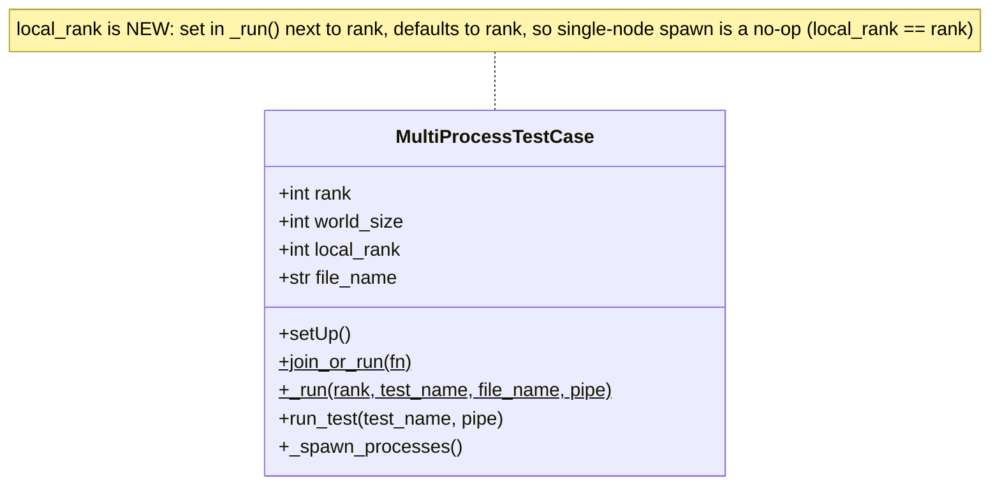
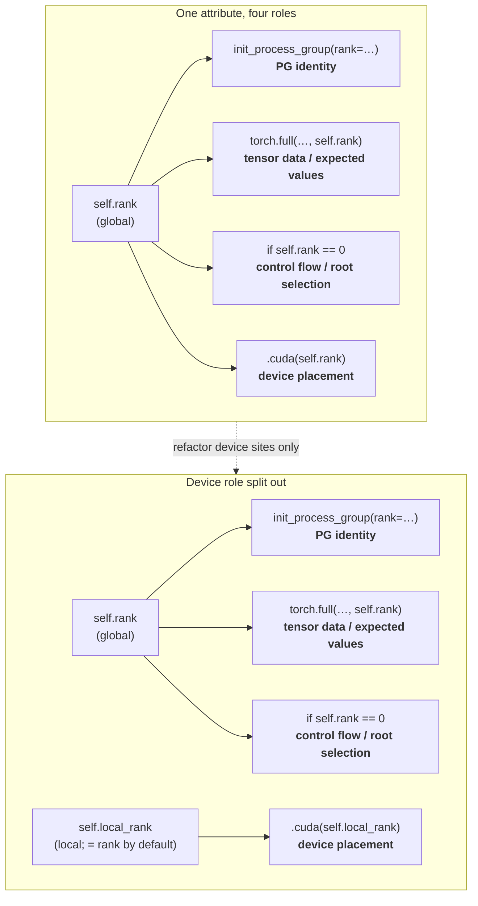
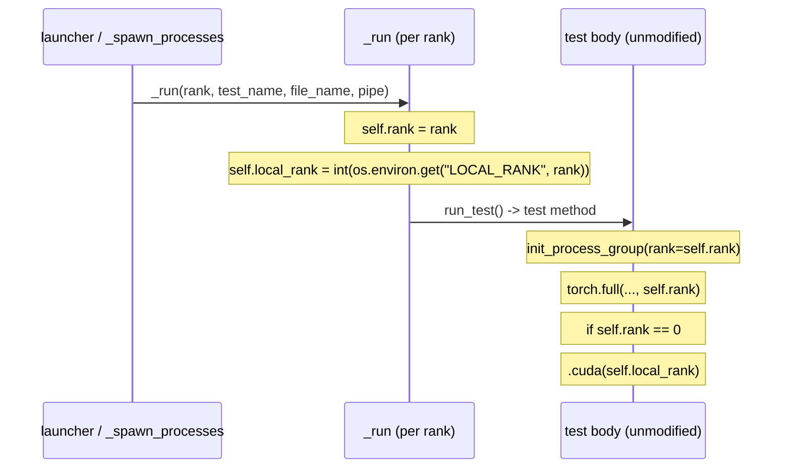

# [RFC] Cross Node Distributed Testing

**Authors:**
* @skpark-rh

## **Summary**
The current distributed testing infrastructure is designed for single node intra-node runs. The proposal is to change the distributed testing code to be more friendly to cross node wrappers.  This is to turn on cross node distributed testing capability for the open source community.

## **Motivation**
Currently the module `MultiProcessTestCase` only sets a global rank attribute in its setup (`_run`).  Every test that inherits this class has this constraint. Since the `MultiProcessTestCase` tests initialize their own independent process group (PG) and these tests assume that they are only run on a single node, a global rank is utilized for PG initialization and the corresponding tensor devices are set to the same rank.  Since there is no way to differentiate global rank and local rank, cross node tests are limited.  By creating a cross node friendly framework, the coverage of tests is increased and robustness of the distributed code is improved. 

## **Proposed Implementation**
Phase 1 is to add the attribute `local_rank` to `MultiProcessTestCase`. 
Phase 2 is to change every instance of `torch.device` to refer to `self.local_rank` instead of `self.rank`. 
Below are the UML diagrams that explain the design and the sequence diagram shows how individual tests will need to be updated.

## **Metrics**
Success is measured in these ways.

**Coverage**
1. Number of `MultiProcessTestCase` derived tests executable across >= 2 nodes (baseline: 0) and the fraction of device-placement call sites migrated from `self.rank` to `self.local_rank` (N of M).

**Correctness**
1. 100% of existing single-node distributed tests continue to pass with identical results. Confirming the `local_rank == rank` default is a no-op. 
2. Count of real distributed bugs surfaced by cross-node execution that single-node testing could not catch.

**Operational**
1. A cross-node CI lane is added. We track its wall-clock runtime and flaky-run rate over a rolling window to ensure the new coverage does not introduce unstable signals.

## **Drawbacks**
The blast radius of implementing phase 2 is enormous. All local tensor devices has to now refer to `self.local_rank` instead of `self.rank`. All tests that derive `MultiProcessTestCase` will need to be touched which will take time.  The migration is risky because mistakes are silent: since `local_rank == rank` on a single node, a mis-migrated site still passes existing CI and only misbehaves inter-nodally. This is a potential false positive or a false negative. This also introduces one more test design consideration where developers have to take into consideration the correct rank for each category (device placement, PG identity, and tensor data). The wrong choice will not surface until a cross-node run.  The change is additive and non-breaking but it depends on cross-node CI. We will need cross-node CI.

## **Alternatives**
<!-- What other designs have been considered? What is the impact of not doing this? -->
Three alternate designs
1. **Do nothing** - no cross-node testing coverage and relying on upstream issues of multi-node bugs. The impact of silent bugs and failures that cannot be covered by single-node test is severe.
2. **Separate interface** - Create a `MultiNodeTestCase` base class. This avoids touching existing tests and isolates migration risks. However, this forks the test hierarchy and only covers tests that explictly opt in. The impact is minimal coverage gain.
3. **Read env var** - Have every single instance of `MultiProcessTestCase` to read in the local rank and initialize tensors, process groups, and device placement manually. This is prone to error and introduces possible breaking mistakes.

Therefore, we chose to add `local_rank` to `MultiProcessTestCase` because it maximizes coverage while defaulting to a no-op on single node. The risk is minimal with a one time broad migration.

## **Prior Art**
The global-vs-local rank distinction this RFC adds to `MultiProcessTestCase` already exists in PyTorch's runtime. `torchrun` / `torch.distributed.elastic` set both RANK (global, used for process-group identity) and LOCAL_RANK (per-node, used for device placement), and PyTorch's own multi-node examples pair `init_process_group(rank=RANK)` with `set_device(LOCAL_RANK)`. This proposal brings the test harness in line with that established convention rather than inventing a new one — the runtime already separates these roles; the distributed tests are the piece that still conflates them.

## **How we teach this**
* **Terminology**: Reuse the runtime's existing names. Rank (global) and local rank (per-node) precisely because of `torchrun`'s established convention.
* **The One Rule**: Use `self.rank` for process-group identity, control flow, and tensor *data*. Use `self.local_rank` only for device placement (`.cuda(...)`, `set_device`, `torch.device`).
* **Docs**: No reorganization needed. A note in the distributed testing contributor docs and a docstring in `MultiProcessTestCase` explaining the two attributes will be needed.
* **Rollout**: Since `rank == local_rank` by default, existing authors don't have to learning anything until they write cross-node tests. Could be taught as an opt-in advance topic.

## **Unresolved questions**
* **Resolve in RFC**: 
  1. Attribute name (`local_rank` vs alternatives), and whether it's set via env (LOCAL_RANK) or from computation.
  2. Cross-node testing CI uptream.
* **Resolve during implementation**: 
  1. How to migrate device sites safely and at scale. How to detect a *missed* site (one still using `self.rank` for a device)?
* **Out-of-scope**: 
  1. The actual multi-node CI launcher or test harness that sets LOCAL_RANK and orchestrates nodes. Extending the same split across other base classes (DTensorTestBase, MultiThreadedTestCase). 
  2. `local_world_size` and `group_rank` support.

## Resolution
We decided to do it. X% of the engineering team actively approved of this change.

### Level of Support
Choose one of the following:
* 1: Overwhelming positive feedback.
* 2: Positive feedback.
* 3: Majority Acceptance, with conflicting Feedback.
* 4: Acceptance, with Little Feedback.
* 5: Unclear Resolution.
* 6: RFC Rejected.
* 7: RFC Rejected, with Conflicting Feedback.

#### Additional Context
Some people were in favor of it, but some people didn’t want it for project X.

### Next Steps
Will implement it. 

#### Tracking issue
<github issue URL>

#### Exceptions
Not implementing on project X now. Will revisit the decision in 1 year.
