<!--watch-latex-md

This document is processed by watch_latex_md.py program, see

  https://github.com/Quansight/pearu-sandbox/latex_in_markdown/

You can edit this document as you wish. You can also edit the LaTeX
data in img elements, but only the content of `latex-data`:

  1. To automatically update the LaTeX rendering in img element, edit
     the file while watch_latex_md.py is running.

  2. Never change the beginning (``) parts of the LaTeX img elements as these are
     used by the watch_latex_md.py script.

  3. Changes to other parts of the LaTeX img elements will be
     overwritten.

Enjoy LaTeXing!

watch-latex-md:no-force-rerender
-->

# Dimension reduction example

Consider a 3-dimensional array
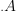
with shape
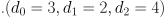:

**A dimension reduction** is an indexing operation that produces a new array with reduced number of dimensions but with the same set of array elements. 

A dimension reduction is specified by the **dimension selector function**
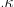
and the **partition** of a dimensions range 
 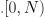.

For example, here is a list of all possible dimension selector functions for 
 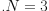:

Dimension selector represents dimensions (axes) permutations.

For example, here is a list of all partitions of a dimension range for 
 :

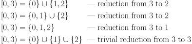

The partitions represents which dimensions will be collapsed to a
given reduced dimension.

Let us apply the first dimension reduction from 3 to 2 with identity dimension selector to the 3-dimensional array:

1. Compute the strides matrix

   

   so that 
   .
   
2. Compute the shape of reduced array:

    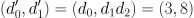

3. Construct the reduced array:

    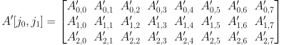

    such that 
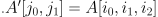:

    

To perceive the patterns of different reductions better, let's
consider the 3-dimensional array with concrete values:

Then there exists 24 combinations of dimension reductions, out of 18
are non-trivial that are shown below:

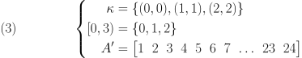

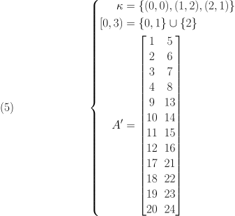

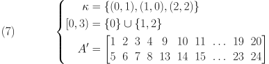

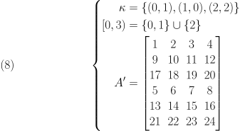

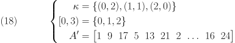

<!--EOF-->
