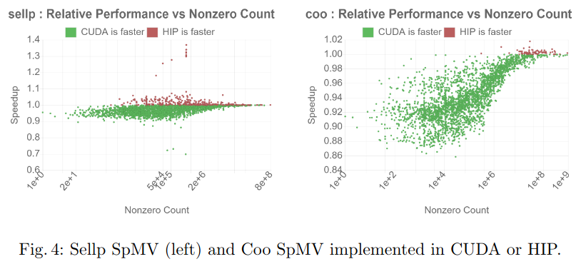
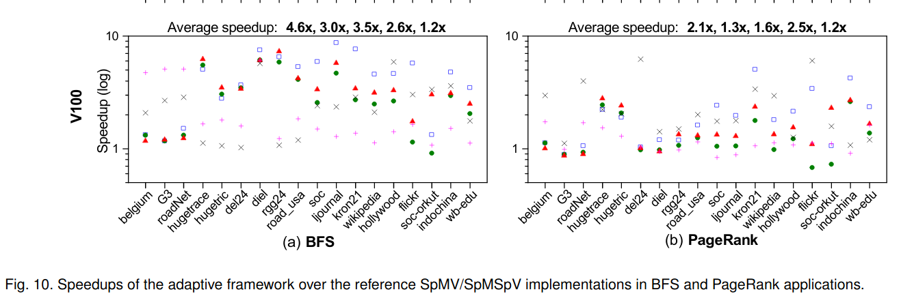

<!--watch-latex-md

This document is processed by watch_latex_md.py program, see

  https://github.com/Quansight/pearu-sandbox/latex_in_markdown/

You can edit this document as you wish. You can also edit the LaTeX
data in img elements, but only the content of `latex-data`:

  1. To automatically update the LaTeX rendering in img element, edit
     the file while watch_latex_md.py is running.

  2. Never change the beginning (``) parts of the LaTeX img elements as these are
     used by the watch_latex_md.py script.

  3. Changes to other parts of the LaTeX img elements will be
     overwritten.

Enjoy LaTeXing!

watch-latex-md:no-force-rerender
-->

# Literature

Since sparse tensor usage in deep learning is a new topic, in this document
we intend to collect various publications related to sparse tensor/matrix
computational techniques and how they can possibly be used in PyTorch.

<!-- markdown-toc start - Don't edit this section. Run M-x markdown-toc-generate-toc again -->
**Table of Contents**

- [Literature](#literature)
    - [Papers](#papers)
        - [Ginkgo: A Modern Linear Operator Algebra Framework for HighPerformance Computing](#ginkgo-a-modern-linear-operator-algebra-framework-for-highperformance-computing)
        - [Preparing Ginkgo for AMD GPUs –A Testimonial on Porting CUDA Code to HIP](#preparing-ginkgo-for-amd-gpus-a-testimonial-on-porting-cuda-code-to-hip)
        - [Adaptive SpMV/SpMSpV on GPUs forInput Vectors of Varied Sparsity](#adaptive-spmvspmspv-on-gpus-forinput-vectors-of-varied-sparsity)
        - [Sparse GPU Kernels for Deep Learning](#sparse-gpu-kernels-for-deep-learning)
        - [The State of Sparsity in Deep Neural Networks](#the-state-of-sparsity-in-deep-neural-networks)
        - [Exploring Sparsity in Recurrent  Neural  Networks](#exploring-sparsity-in-recurrent--neural--networks)
        - [EXPLOITING SPARSENESS IN DEEP NEURAL NETWORKS FOR LARGE VOCABULARY SPEECH RECOGNITION](#exploiting-sparseness-in-deep-neural-networks-for-large-vocabulary-speech-recognition)
        - [Batched Sparse Matrix Multiplication for Accelerating Graph Convolutional Networks](#batched-sparse-matrix-multiplication-for-accelerating-graph-convolutional-networks)
        - [Solving Sparse Linear Systems Faster than Matrix Multiplication](#solving-sparse-linear-systems-faster-than-matrix-multiplication)
        - [SPARSE LINEAR NETWORKS WITH A FIXED BUTTERFLY STRUCTURE: THEORY AND PRACTICE](#sparse-linear-networks-with-a-fixed-butterfly-structure-theory-and-practice)
        - [Efficient sparse matrix-vector multiplication on x86-based many-core processors](#efficient-sparse-matrix-vector-multiplication-on-x86-based-many-core-processors)
        - [High-Performance Sparse Matrix-Matrix Products on Intel KNL and Multicore Architectures](#high-performance-sparse-matrix-matrix-products-on-intel-knl-and-multicore-architectures)

<!-- markdown-toc end -->

## Papers

### Ginkgo: A Modern Linear Operator Algebra Framework for HighPerformance Computing

Link: https://arxiv.org/pdf/2006.16852.pdf

This paper describes the architecture of Ginkgo, a library implemented fast algorithms
for sparse linear algebra on GPUs. They show how C++ abstractions using runtime polymorphism
allow choosing between generic and hardware-specific algorithms that can be specially implemented
for various backends such as CUDA, HIP and openMP (see Fig. 1 in the paper for details).

Currently Ginkgo provides a list of Krylov solvers (BICG, BiCGSTAB, CG, CGS, FCG, GMRES) for
for iterative solutions of sparse matrices, along with various preconditioners.
The library has been designed from the ground up keeping in mind its usage within other frameworks
and libraries. Therefore it has a component based interface that allows combining various components
of say a solver and building one from the ground up (example in listing 3).

Ginkgo is licensed under the BSD-3 clause license.

Results reported between Gingko's SpMV and that from cuSPARSE and hipSPARSE show that Gingko
is faster in some cases. The tests are conducted on the matrices from SuiteSparse. It can be
seen that Gingko's algorithms cover most of the problems for a given slow down factor compared to
the fastest implementation for the given problem. The reporting of results does not convey the
actual speed of the kernels compared to HIP or CUSP but we do get an idea that Gingko is in 
general faster for most of the matrices in the problem set.

 

### Preparing Ginkgo for AMD GPUs –A Testimonial on Porting CUDA Code to HIP

Link: https://arxiv.org/pdf/2006.14290.pdf

This paper is about how the linear algebra routines in Ginkgo were ported to use HIP by
leveraging the extensible software architecture of Ginkgo as reported earlier. The author
states that Ginkgo is now the only library that supports various matrix formats (), linear
solvers and preconditiners on both CUDA and HIP platforms for sparse computation.

Further, they show that CUDA spMV is faster for most cases over HIP, as can be seen in the
figure below.

 

### Adaptive SpMV/SpMSpV on GPUs forInput Vectors of Varied Sparsity

Link: https://arxiv.org/pdf/2006.16767.pdf

This paper explores the SpMSpV algorithm, where the matrix and vector being worked on are both sparse.
They report speeding up the computation by use of the CSR format for storage of the sparse vector and 
using a machine-learning based approach for selecting appropriate comupute kernels depending on the
sparsity of the vector. Comparisons are done on K40, P100 and V100 GPUs.

### Sparse GPU Kernels for Deep Learning

Link: https://arxiv.org/pdf/2006.10901.pdf

This paper is about optimizing sparse matrix routines that appear in sparsified Deep Neural Networks.
For this purpose, the authors optimize two sparse routines that widely appear in DNNs: sparse matrix-dense
matrix multiplication and sampled dense-dense matrix multilication. The kernels are accelerated using
a new technique that does not require acceptable levels of sparsity for achieving good performance
on GPUs. Speedups of ~4x and ~2x are reported over cuSPARSE for SpMM and SDDMM respectively. They
also demonstrate Transformer and MobileNet models that are faster and more memory efficient than
their dense counter parts and yet preserve accuracy. The dense matrices are stored in row major
format and the sparse matrices in CSR.

A useful contribution is also a survey of the kind of data that is prevalent in Deep Learning
workloads. Fig. 1 shows that they are in general less sparse, have longer rows and lesser
variation in row length within a matrix than SuiteSparse. The datasets are those that are
used for training the ResNet and Transformer models. It is interesting to note that the 
SDDMM operation is useful in deep neural networks for a number of operations.

It useful to note that the design of the SpMM is done considering real SpMM kernels that
are found in models such as Transformer and EfficientNet. This major makes three major
contributions to the SpMM algorithm: subwarp tiling for assigning the same warp to
multiple rows, ROMA for better work distribution without zero padding and row swizzling
for better load balance.

Overall, a very good work for gaining insight into the actual workloads that exist
for deep learning applications.

### The State of Sparsity in Deep Neural Networks

Link: https://arxiv.org/abs/1902.09574

This paper is a prelude to the previous one (same author), and features a large scale study of the
the sparsity patterns and sparsity-accuracy tradeoffs that are achieved in training
DNNs such as Transformer and ResNet-50. They show that previously proposed complex compression
techniques achieve better accuracy when trading off for sparsity.

They propose four techniques for inducing sparsity in neural networks.

### Exploring Sparsity in Recurrent  Neural  Networks

Link: https://arxiv.org/abs/1704.05119

This paper explores a technique for reducing the model size in RNNs by pruning weights
during initial training of a network. The parameters of the network end up being sparse
while the accuracy is still comparable to the original dense neural network. Pruning
of the RNN thus yields a significant saving of memory and can also help in speed up
of inference time using fast sparse matrix multiply.

The models are trained on a speech recognition dataset of 2100 hours of English speech
data and a validation set of 3.5 hours of multi-speaker data. They use the Deep Speech 2
model for testing accuracy and sparsification of parameters. The pruning technique prunes
the weights of each layer by dropping weights using a simple heuristic for dropping weights
during the training phase and eventually achieves about 90% sparsity of the weight matrices.

They currently use cuSPARSE for SpMV computation. They specifically comment that SpMV in cuSPARSE
is suboptimal and that a better implementation that is capable of adapting to the sparse matrix
found in this case should lead to better device utilization.

### EXPLOITING SPARSENESS IN DEEP NEURAL NETWORKS FOR LARGE VOCABULARY SPEECH RECOGNITION

Link: https://www.microsoft.com/en-us/research/wp-content/uploads/2016/02/DNN-Sparse-ICASSP2012.pdf

This paper reports a drastic reduction in model size by sparsifying the model
parameters of a DNN used in speech recognition. Specifically, they use CD-HNN-DNN's
(Context Dependent-Hidden Markov Model-DNN) as speech recognizers. The DNN is used
for training activation layers that reveal phones in random speech, which then forms
an input to 'senones' which is basically combinining probabilities of the phones
to figure out the correct word being spoken. The direct modelling of this DNN
takes a huge number of parameters, which makes sparsification necessary to reduce
model size.

The sparse matrix is generated by keeping only the weights that whose magntitudes are
in the top _q_. This leads to a sparse representation with 15%-70% NNZs depending on
the required accuracy and calculation time. They use their own CSR-like representation
for this purpose.

### Batched Sparse Matrix Multiplication for Accelerating Graph Convolutional Networks

Link: https://arxiv.org/abs/1903.11409
Date: March 2019

This paper is about the usage of SpMM (Sparse Matrix-Dense Matrix) product used in
GCNs (Graph Convolutional Networks). GCNs process convolutional operations using graph
structures which are represented by sparse matrices, and the GPU implementation of
small and batched SpMM products does not lead to optimum GPU utilization. In order
to improve the performance of SpMM on small matrix sizes, this paper proposes a new
algorithm for small and batched SpMM on GPUs.

### Solving Sparse Linear Systems Faster than Matrix Multiplication

Link: https://arxiv.org/pdf/2007.10254.pdf

### SPARSE LINEAR NETWORKS WITH A FIXED BUTTERFLY STRUCTURE: THEORY AND PRACTICE

Link: https://arxiv.org/pdf/2007.08864.pdf

### Efficient sparse matrix-vector multiplication on x86-based many-core processors

Link: https://dl.acm.org/doi/10.1145/2464996.2465013

This paper presents an efficient implementation of SpMV using the intel KNC PCIe card.
They propose an improvement over the CSR format called ELLPACK Sparse Block (ESB). Using
this format they are able to obtain better utilization of SIMD units, reduce overhead
due to irreregular memory access and better load balance caused by non-uniform data structures.

### High-Performance Sparse Matrix-Matrix Products on Intel KNL and Multicore Architectures

Link: https://dl.acm.org/doi/abs/10.1145/3229710.3229720

TODO:

* https://ieeexplore.ieee.org/document/7092787
* https://ieeexplore.ieee.org/abstract/document/7965199?casa_token=jFN4uanr7p4AAAAA:jD4CKEczgvpg6bZ09NHFRSrQivmw8CzmP7ak2owWzr1nSqnGh1MIJYzl1OtMj-LOXVBljRDwIwzf
* https://ieeexplore.ieee.org/abstract/document/9136784
